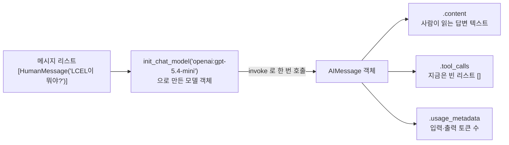

# 01. 모델 초기화와 첫 호출

`01_model_call.py` 단독 학습 문서입니다. 이 한 파일만으로 LangChain으로 모델을 부르는 전 과정을 익힐 수 있습니다.

## 무엇을 하는가

- `init_chat_model`로 모델 객체를 만듭니다.
- `invoke`로 한 번 호출합니다.
- 응답이 단순 문자열이 아니라 객체(`AIMessage`)임을 확인합니다.
- (선택) 모델 문자열만 바꿔 다른 공급사로 전환합니다.

## 왜 필요한가

모든 LangChain 애플리케이션의 출발점입니다. 모델을 만들고 한 번 부르는 이 동작이 이후의 메시지 누적, 체인, 구조화 출력, 도구 호출의 토대가 됩니다. 여기서 응답 객체의 구조를 미리 보아 두면, 다음 챕터에서 `tool_calls`가 채워지는 모습을 자연스럽게 받아들일 수 있습니다.

## 설계·구동 원리

- **공급사 추상화.** LangChain은 LLM 애플리케이션을 위한 표준 인터페이스를 제공합니다. `init_chat_model("벤더:모델명")`은 문자열 하나를 받아 그 공급사에 맞는 모델 객체를 돌려줍니다. 덕분에 `ChatOpenAI` 같은 벤더별 클래스를 직접 import하지 않아도 됩니다. 모델 문자열만 `openai:gpt-5.4-mini`에서 `google-genai:gemini-3.5-flash`로 바꾸면, 나머지 코드는 그대로 둔 채 공급사를 전환할 수 있습니다.
- **호출의 입력은 메시지 리스트.** `invoke`는 메시지의 리스트를 받습니다. 가장 단순한 형태는 `HumanMessage` 하나만 담은 리스트입니다.
- **응답은 객체.** `invoke`가 돌려주는 값은 문자열이 아니라 `AIMessage` 객체입니다. 사람이 읽는 답은 `.content`에 있고, 그 외에 `tool_calls`(지금은 비어 있음)와 `usage_metadata`(입력·출력 토큰 수)가 함께 들어 있습니다. 응답을 "구조를 가진 객체"로 다루는 감각이 이후 모든 챕터의 바탕입니다.

## 구동 흐름 (다이어그램)



**구동 원리.** 모델 객체는 `init_chat_model`이 `"벤더:모델명"` 문자열을 해석해 그 공급사에 맞는 클래스(예: `ChatOpenAI`)로 만들어 줍니다. 이 한 단계의 추상화 덕분에 우리 코드는 어느 공급사를 쓰는지 신경 쓰지 않고 똑같이 `invoke`만 부르면 됩니다. `invoke`에 넣는 것은 항상 "메시지 리스트"이고, 가장 단순한 형태는 `HumanMessage` 하나뿐인 리스트입니다. 돌아오는 값은 텍스트가 아니라 여러 칸으로 나뉜 `AIMessage` 객체이므로, 답 텍스트는 `.content`에서 꺼내고 도구 호출 제안은 `.tool_calls`(다음 챕터에서 채워짐), 토큰 사용량은 `.usage_metadata`에서 따로 읽습니다. 응답을 문자열이 아닌 "여러 정보를 담은 객체"로 다루는 이 감각이 이후 모든 예제의 토대입니다.

## 실행법

```bash
# 레포 루트(ai-agent-dev-lgens)에서
uv sync                       # 최초 1회 (의존성 설치)
cp .env.example .env          # 최초 1회, .env에 OPENAI_API_KEY 입력
uv run python 02_langchain_core/01_model_call.py
```

키가 없으면 안내만 출력하고 종료합니다. 문법·import 점검은 키 없이도 됩니다.

## 예상 출력

```
만든 모델 클래스: ChatOpenAI
응답 타입: AIMessage
본문(content): LCEL은 ... (한 문장 설명)
도구 호출(tool_calls): []
토큰 사용량(usage): {'input_tokens': ..., 'output_tokens': ..., 'total_tokens': ...}
```

## 체크포인트

- 모델 클래스 이름이 오류 없이 출력되면 모델 준비가 끝난 것입니다.
- `content`에 한국어 답변이 들어오면 호출에 성공한 것입니다.
- `content` 외에 `tool_calls`·`usage_metadata`가 함께 있으면 응답이 객체임을 이해한 것입니다.

## 더 해보기

- `HumanMessage` 대신 문자열 하나(`model.invoke("안녕")`)를 넣어 보고, 결과가 같은지 확인하십시오.
- `.env`에 `GOOGLE_API_KEY`를 넣고 파일 맨 아래 `optional_switch_vendor()` 주석을 풀어, 같은 코드가 Gemini에서 도는지 확인하십시오.
- `usage_metadata`의 토큰 수를 보고, 질문을 길게 바꾸면 입력 토큰이 어떻게 변하는지 관찰하십시오.

## 다음 예제

`02_messages_context` — 메시지로 역할을 정하고, 응답을 누적해 여러 턴의 맥락을 잇습니다.
