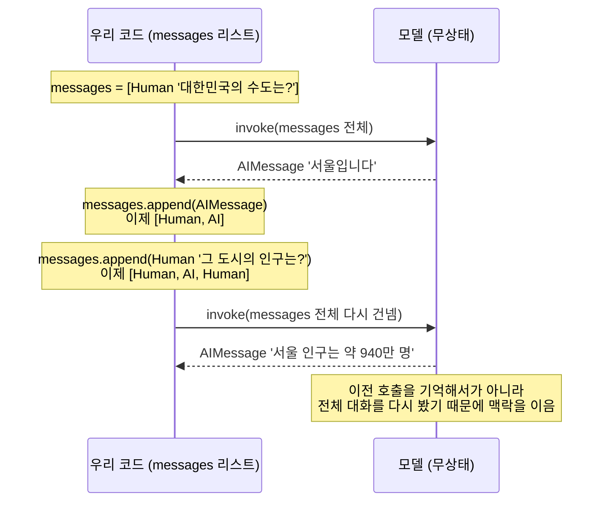

# 02. 메시지와 맥락 누적

`02_messages_context.py` 단독 학습 문서입니다.

## 무엇을 하는가

- `SystemMessage`로 모델의 역할·형식 규칙을 먼저 고정합니다.
- `HumanMessage`·`AIMessage`를 리스트로 쌓아 멀티턴 대화를 만듭니다.
- 응답을 누적해 다음 턴이 앞 맥락을 이어받는 것을 확인합니다.

## 왜 필요한가

대화형 AI는 한 번의 질문과 답으로 끝나지 않습니다. 앞에서 한 말을 다음 답에 반영해야 자연스러운 대화가 됩니다. 이 예제는 그 맥락이 어떻게 이어지는지를, 그리고 그 책임이 모델이 아니라 우리 코드에 있다는 사실을 보여 줍니다. 이 원리를 분명히 잡아 두면 뒤에서 단기 메모리를 따로 붙여야 하는 이유가 자연스럽게 이해됩니다.

## 설계·구동 원리

- **대화는 네 종류의 메시지로 표현됩니다.** `SystemMessage`(역할·규칙), `HumanMessage`(사용자 입력), `AIMessage`(모델 응답), `ToolMessage`(도구 결과). 이 예제에서는 앞의 셋을 직접 씁니다. Tool은 다음 챕터(도구 호출)에서 만납니다.
- **시스템 메시지로 역할을 고정합니다.** 메시지 리스트의 맨 앞에 `SystemMessage`를 두면 모델의 역할과 형식 규칙을 먼저 깔 수 있습니다. "한 단어로만 답하라"는 규칙을 주면 같은 질문에도 답이 짧아집니다. 시스템 메시지가 없으면 보통 더 길게 답합니다.
- **모델은 무상태입니다.** 모델은 호출 사이에 아무것도 기억하지 못합니다. 매 호출은 독립적이며, 모델은 이전 호출에서 무슨 말이 오갔는지 스스로 알지 못합니다. 마치 요청 하나를 처리하고 맥락을 들고 있지 않는 REST 핸들러와 같습니다.
- **맥락은 우리가 다시 건넵니다.** 그렇다면 어떻게 여러 턴이 이어질까요. 비결은 매 호출마다 지금까지의 대화 전체를 메시지 리스트로 다시 건네는 데 있습니다. 첫 응답(`AIMessage`)을 리스트에 그대로 누적하고, 다음 질문(`HumanMessage`)을 덧붙여 다시 `invoke`하면, 모델은 누적된 리스트를 처음부터 읽고 앞 맥락에 이어 답합니다. 맥락이 이어지는 것처럼 보이는 것은 모델이 기억해서가 아니라 우리가 매번 대화 전체를 다시 보여 주기 때문입니다.
- **누적은 결과 객체를 그대로 넣습니다.** `invoke`가 돌려준 결과 자체가 이미 `AIMessage`입니다. `.content`만 꺼내 새 객체로 감싸지 말고, 결과 객체를 그대로 `messages.append(...)` 하십시오.

## 구동 흐름 (다이어그램)

다음 다이어그램은 멀티턴 대화에서 우리 코드가 매 호출마다 대화 전체를 다시 건네는 모습을 보여 줍니다. 모델은 호출 사이에 아무것도 들고 있지 않습니다.



**구동 원리.** 모델은 REST 핸들러처럼 무상태입니다. 매 호출은 독립적이며, 모델은 직전 호출에서 무슨 말이 오갔는지 스스로 알지 못합니다. 그런데도 두 번째 답이 "그 도시"를 서울로 이어 받는 까닭은, 우리 코드가 첫 응답(`AIMessage`)을 `messages` 리스트에 그대로 누적한 다음 새 질문(`HumanMessage`)을 덧붙여 리스트 전체를 다시 `invoke`에 넘기기 때문입니다. 모델은 매번 리스트를 처음부터 읽으므로, 누적된 앞 대화를 보고 이어서 답합니다. 시스템 메시지를 리스트 맨 앞에 두면 그 역할·형식 규칙도 매 호출에 함께 전달되어 답의 태도를 고정합니다. 맥락이 이어지는 것처럼 보이는 것은 "모델의 기억"이 아니라 "우리가 매번 다시 보여 주는 리스트"의 효과입니다. 이 무상태 원리를 분명히 잡아 두면, 뒤 챕터에서 단기·장기 메모리라는 장치를 따로 붙여야 하는 이유가 자연스럽게 이해됩니다.

## 실행법

```bash
uv run python 02_langchain_core/02_messages_context.py
```

## 예상 출력

```
=== 시스템 메시지로 역할 고정 ===
[역할 고정] 한 단어 답: 서울
[역할 없음] 답: 대한민국의 수도는 서울입니다. ...

=== 응답 누적으로 멀티턴 맥락 잇기 ===
1턴 답: 대한민국의 수도는 서울입니다.
2턴 답(맥락 이어받음): 서울의 인구는 대략 940만 명 수준입니다. ...
```

## 체크포인트

- 역할 고정의 답이 짧아지면 시스템 메시지의 효과를 이해한 것입니다.
- "그 도시"가 서울로 이어지면 멀티턴 맥락 전달을 이해한 것입니다.
- 누적을 빠뜨리면 두 번째 답이 "그 도시"가 무엇인지 모른다는 점을 직접 확인해 보십시오.

## 더 해보기

- `multiturn_accumulation`에서 `messages.append(first)` 한 줄을 주석 처리해 보고, 두 번째 답이 어떻게 달라지는지 관찰하십시오.
- 시스템 메시지를 "항상 존댓말, 3문장 이내"로 바꿔 답의 형식 변화를 보십시오.
- 턴을 하나 더 늘려(3턴) 맥락이 계속 이어지는지 확인하십시오.

## 다음 예제

`03_params_streaming` — temperature·max_tokens로 답을 조절하고, 스트리밍으로 토큰 단위로 받습니다.
