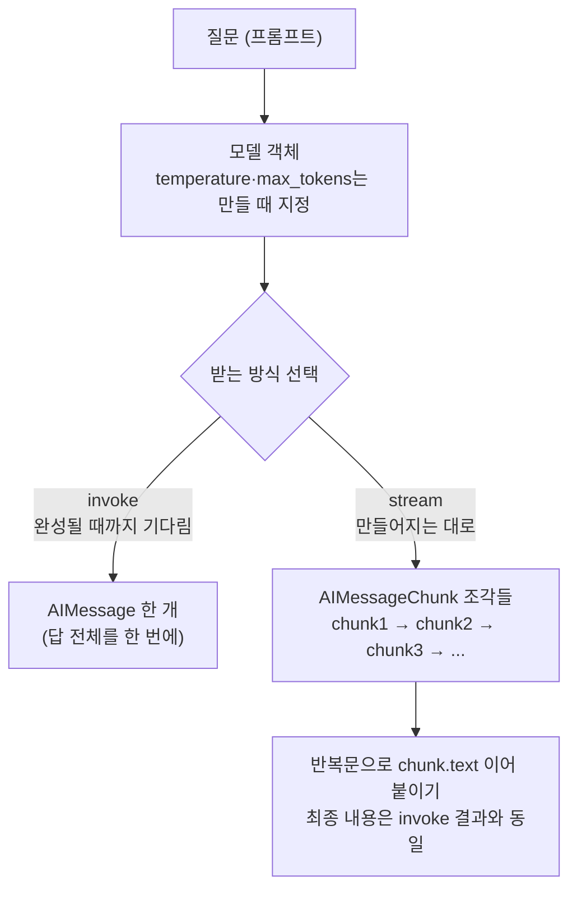

# 03. 모델 파라미터와 스트리밍

`03_params_streaming.py` 단독 학습 문서입니다.

## 무엇을 하는가

- `temperature`로 답의 다양성을 조절합니다.
- `max_tokens`로 답의 최대 길이를 제한합니다.
- `stream`으로 답을 토큰 단위로 흘려 받습니다.

## 왜 필요한가

같은 모델이라도 용도에 따라 답의 성격을 달리해야 합니다. 분류·추출에는 일관된 답이, 아이디어 발상에는 다양한 답이 필요합니다. 또 챗봇처럼 사람과 주고받는 화면에서는 답이 다 만들어질 때까지 빈 화면을 보여 주는 대신, 글자가 하나씩 나타나는 편이 훨씬 자연스럽습니다. 이 예제는 그 조절 손잡이와 출력 방식을 다룹니다.

## 설계·구동 원리

- **파라미터는 모델을 만들 때 지정합니다.** `temperature`, `max_tokens` 같은 설정은 `init_chat_model(MODEL, temperature=..., max_tokens=...)`처럼 모델 객체를 만들 때 넘깁니다.
- **temperature는 답의 무작위성입니다.** 값이 낮으면(예: 0.0) 답이 일관되고 반복적이며, 높으면(예: 1.2) 표현이 다양해집니다. 분류·추출처럼 정답이 정해진 작업에는 낮게, 카피·아이디어처럼 변주가 필요한 작업에는 높게 둡니다.
- **max_tokens는 출력 길이의 상한입니다.** 생성할 수 있는 출력 토큰 수를 제한해 비용과 길이를 통제합니다. 값이 작으면 답이 도중에 끊깁니다.
- **invoke와 stream의 차이.** `invoke`는 답이 다 만들어질 때까지 기다렸다가 응답 전체를 한 번에 돌려줍니다. `stream`은 토큰이 만들어지는 대로 작은 조각(`AIMessageChunk`)을 차례로 내놓는 이터레이터를 돌려줍니다. 반복문으로 각 조각의 `chunk.text`를 이어 출력하면, 답이 완성되기 전부터 글자가 화면에 나타납니다. 모델이 같은 답을 만든다는 점에서 최종 내용은 둘이 같고, 받는 방식만 다릅니다.
- **선택 기준은 단순합니다.** 스크립트 안에서 한 번 묻고 답을 변수에 담아 다음 처리에 넘기는 경우에는 `invoke`로 충분합니다. 사용자에게 답을 실시간으로 보여 줘야 하는 대화형 화면에서는 `stream`으로 체감 속도를 끌어올립니다.

## 구동 흐름 (다이어그램)

같은 모델·같은 질문이라도 받는 방식이 두 가지입니다. `invoke`는 완성된 답 하나를 한 번에 돌려주고, `stream`은 토큰 조각을 만들어지는 대로 차례로 내놓습니다.



**구동 원리.** `temperature`(답의 무작위성)와 `max_tokens`(출력 길이 상한)는 호출할 때가 아니라 `init_chat_model`로 모델을 만들 때 지정합니다. `temperature`가 낮으면 답이 일관되고, 높으면 표현이 다양해지므로, 분류·추출에는 낮게 카피·아이디어에는 높게 둡니다. 출력을 받는 방식은 두 가지입니다. `invoke`는 답이 다 만들어질 때까지 기다렸다가 `AIMessage` 하나를 통째로 돌려줍니다. `stream`은 토큰이 만들어지는 대로 작은 조각(`AIMessageChunk`)을 차례로 내놓는 이터레이터를 돌려주며, 반복문으로 각 조각의 `.text`를 이어 붙이면 글자가 흘러나오듯 화면에 나타납니다. 모델이 만드는 답 자체는 둘이 같고 받는 방식만 다르므로, 조각을 모두 이어 붙인 최종 텍스트는 `invoke` 결과와 일치합니다. 사용자에게 실시간으로 보여 줘야 하면 `stream`, 변수에 담아 다음 처리로 넘기면 `invoke`를 고릅니다.

## 실행법

```bash
uv run python 02_langchain_core/03_params_streaming.py
```

## 예상 출력

```
=== temperature ===
[temperature=0.0] 안녕하십니까, 회의를 시작하겠습니다.
[temperature=1.2] 다들 모이셨네요, 활기차게 회의 열어 볼까요!

=== max_tokens ===
[max_tokens=20] LangChain은 LLM 애플리케이션을 ...   (20토큰 부근에서 끊김)

=== 스트리밍 ===
[스트리밍] LangChain은 ... (글자가 흘러나오듯 한 조각씩 출력)
```

## 체크포인트

- 두 temperature 답의 표현 폭이 다르면 무작위성의 역할을 이해한 것입니다.
- `max_tokens=20` 답이 짧게 잘리면 길이 제한이 동작하는 것입니다.
- 스트리밍에서 글자가 흘러나오듯 출력되면 동작하는 것입니다.

## 더 해보기

- temperature를 0.7로 두고 같은 프롬프트를 여러 번 호출해, 답이 매번 얼마나 달라지는지 보십시오.
- `streaming_demo`의 프롬프트를 더 긴 질문으로 바꿔, 스트리밍의 체감 차이를 키워 보십시오.
- 스트리밍으로 받은 조각을 출력만 하지 말고 리스트에 모아, 마지막에 합친 전체 텍스트가 `invoke` 결과와 같은지 확인하십시오.

## 다음 예제

`04_lcel_chain` — 프롬프트를 양식으로 만들고 파이프로 모델과 연결합니다(LCEL).
