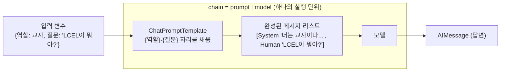

# 04. ChatPromptTemplate과 LCEL 체인

`04_lcel_chain.py` 단독 학습 문서입니다.

## 무엇을 하는가

- `ChatPromptTemplate`으로 변수 자리를 비워 둔 프롬프트 양식을 만듭니다.
- 파이프(`|`)로 프롬프트와 모델을 연결합니다(이것이 LCEL 체인).
- 같은 체인에 변수만 바꿔 재사용합니다.
- 본문의 리터럴 중괄호를 `{{ }}`로 이스케이프합니다.

## 왜 필요한가

같은 형태의 프롬프트를 입력만 바꿔 반복해서 쓰는 일이 많습니다. 매번 메시지를 손으로 만들면 실수가 생기고 코드가 지저분해집니다. 프롬프트를 재사용 가능한 양식으로 만들고, 그 양식과 모델을 하나의 흐름으로 묶으면 호출이 깔끔해지고 바꿔 끼우기 쉬워집니다. 이 조립 방식이 LangChain의 핵심 작성법입니다.

## 설계·구동 원리

- **프롬프트 양식.** `ChatPromptTemplate.from_messages([...])`는 `{변수}` 자리를 비워 둔 재사용 가능한 메시지 틀을 만듭니다. 값을 채워 `prompt.invoke({...})`를 호출하면 실제 메시지 리스트로 완성됩니다. 모델 호출 없이 "어떤 메시지가 만들어지는지"만 따로 확인할 수 있습니다.
- **파이프가 합성하는 것.** `prompt | model`은 "프롬프트로 메시지를 만들고, 그 메시지를 모델에 넣는" 두 단계를 하나로 합성합니다. 파이프는 왼쪽 단계의 출력이 오른쪽 단계의 입력이 되도록 연결합니다. 결과로 얻는 체인은 그 자체가 다시 `invoke`할 수 있는 하나의 실행 단위가 됩니다. 변수 값만 넘기면 양식 채우기와 모델 호출이 한 번에 일어납니다.
- **재사용.** 체인은 틀이므로 그대로 두고 입력만 바꿔 여러 번 호출합니다. 역할만 "교사"에서 "면접관"으로 바꿔도 답의 톤이 달라집니다.
- **중괄호 이스케이프.** 프롬프트 본문에 진짜 중괄호를 넣고 싶으면 두 번 겹쳐 `{{ }}`로 적습니다. 한 번만 적으면 변수 자리로 오인되어 `KeyError`가 납니다. JSON 형식을 예시로 주는 프롬프트에서 특히 자주 만나는 함정입니다.

## 구동 흐름 (다이어그램)

파이프(`|`)는 프롬프트와 모델을 하나의 실행 단위로 합성합니다. 입력은 변수 딕셔너리뿐이고, 양식 채우기와 모델 호출이 한 번에 일어납니다.



**구동 원리.** `ChatPromptTemplate.from_messages([...])`는 `{역할}`·`{질문}`처럼 자리를 비워 둔 메시지 틀을 만듭니다. 여기에 값을 채우면 실제 메시지 리스트로 완성됩니다. `prompt | model`은 이 두 단계, 즉 "양식으로 메시지를 만들고" "그 메시지를 모델에 넣는" 과정을 하나로 묶습니다. 파이프는 왼쪽 단계의 출력을 오른쪽 단계의 입력으로 흘려보내는 합성 연산자이고, 결과로 얻는 `chain`은 그 자체가 다시 `invoke`할 수 있는 하나의 실행 단위입니다. 그래서 변수 딕셔너리만 넘기면 양식 채우기부터 모델 호출까지 한 번에 일어납니다. 틀(체인)은 그대로 두고 입력만 바꿔 여러 번 재사용하므로, 역할만 "교사"에서 "면접관"으로 바꿔도 같은 체인이 다른 톤의 답을 냅니다. 본문에 진짜 중괄호가 필요하면 `{{ }}`로 두 번 겹쳐 적어, 변수 자리로 오인되지 않게 합니다.

## 실행법

```bash
uv run python 02_langchain_core/04_lcel_chain.py
```

## 예상 출력

```
=== 프롬프트 양식 만들기 ===
[양식이 만든 메시지]
  [system] 너는 교사이다. 쉽게 설명한다.
  [human] LCEL이 뭐야?

=== LCEL 체인 연결과 재사용 ===
[체인 답변] LCEL은 ... (한 문장 설명)

[재사용 — 역할만 교체]
  [교사] RAG는 ... (쉽게 풀어 설명)
  [면접관] RAG는 ... (평가하는 어조)

=== 중괄호 이스케이프 ===
[이스케이프된 양식의 답] {"answer": "파란색"}
```

## 체크포인트

- `{역할}`·`{질문}` 자리에 값이 채워진 메시지가 출력되면 양식을 이해한 것입니다.
- 프롬프트와 모델을 직접 잇지 않고 `chain` 하나로 호출되면 LCEL을 이해한 것입니다.
- 역할만 바꿨는데 답의 톤이 달라지면 체인 재사용을 이해한 것입니다.
- 이스케이프한 양식이 `KeyError` 없이 동작하면 중괄호 규칙을 이해한 것입니다.

## 더 해보기

- `escape_braces`에서 `{{ }}`를 `{ }`로 바꿔 실행해, `KeyError`가 나는지 직접 확인하십시오.
- 체인 뒤에 출력 파서를 더 붙여(예: 문자열만 뽑기) 파이프를 한 단계 늘려 보십시오.
- 프롬프트에 변수를 하나 더 추가(예: `{언어}`)하고 호출 인자도 함께 늘려 보십시오.

## 다음 예제

`05_structured_output` — 답을 자유 문장이 아니라 정해진 객체(Pydantic)로 받습니다.
