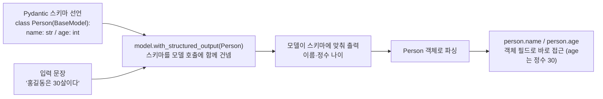

# 05. 구조화 출력 기본

`05_structured_output.py` 단독 학습 문서입니다.

## 무엇을 하는가

- 받고 싶은 데이터의 형태를 Pydantic 모델로 먼저 정의합니다.
- `with_structured_output`으로 모델이 그 형태에 맞춰 답하도록 제약합니다.
- `Field(description=...)`로 추출 정확도를 높입니다.
- `Optional`로 없을 수 있는 값을 안전하게 처리합니다.

## 왜 필요한가

모델의 답은 보통 자유 문장입니다. 그런데 코드가 그 답을 후속 처리에 쓰려면 "이름은 여기, 나이는 정수"처럼 정해진 형태여야 합니다. 자유 문장을 정규식으로 뜯는 방식은 깨지기 쉽습니다. 구조화 출력은 모델이 처음부터 정해진 형태로 답하게 만들어, 파싱 없이 객체로 바로 쓰게 해 줍니다.

## 설계·구동 원리

- **스키마를 먼저 선언합니다.** 받고 싶은 데이터의 형태를 Pydantic `BaseModel`로 정의합니다. 필드 이름과 타입(`name: str`, `age: int`)이 곧 "이런 모양으로 답하라"는 명세가 됩니다.
- **모델을 스키마에 맞춰 제약합니다.** `model.with_structured_output(Person)`은 그 스키마를 모델 호출에 함께 건네 출력을 정해진 형태로 강제하고, 돌아온 응답을 `Person` 객체로 파싱해 돌려줍니다. 반환값이 곧 객체이므로 문자열 파싱 없이 `person.name`, `person.age`로 바로 접근합니다. `age`가 문자열 `"30"`이 아니라 정수 `30`으로 들어오는 것이 핵심입니다.
- **Field 설명은 모델에게 주는 지시입니다.** `Field(description=...)`의 설명은 각 필드의 의미를 모델에게 알려 주는 문서로 함께 전달됩니다. "쉼표 없이 숫자만" 같은 구체적 설명이 추출 정확도를 끌어올립니다.
- **Optional은 지어내기를 막습니다.** 입력에 없을 수 있는 값을 필수 필드로 두면, 모델이 빈칸을 채우려 값을 지어낼 수 있습니다. `Optional[int]`에 기본값 `None`을 두면, 정보가 없을 때 모델이 `None`을 채워 안전하게 비워 둡니다.

## 구동 흐름 (다이어그램)

스키마를 먼저 선언하면, 모델은 자유 문장이 아니라 그 스키마에 맞춘 형태로 답하도록 제약됩니다. 반환값은 곧 파이썬 객체라 파싱이 필요 없습니다.



**구동 원리.** 먼저 받고 싶은 데이터의 형태를 Pydantic `BaseModel`로 선언합니다. 필드 이름과 타입(`name: str`, `age: int`)이 곧 "이런 모양으로 답하라"는 명세가 됩니다. `model.with_structured_output(Person)`은 이 스키마를 모델 호출에 함께 건네 출력을 정해진 형태로 강제하고, 돌아온 응답을 `Person` 객체로 파싱해 돌려줍니다. 그래서 반환값이 곧 객체이고, `person.name`·`person.age`로 바로 접근하며, `age`는 문자열 `"30"`이 아니라 정수 `30`으로 들어옵니다. `Field(description=...)`의 설명 글은 각 필드의 의미를 모델에게 알려 주는 문서로 함께 전달되어, "쉼표 없이 숫자만" 같은 구체적 지시가 추출 정확도를 끌어올립니다. 입력에 없을 수 있는 값을 필수 필드로 두면 모델이 빈칸을 채우려 값을 지어낼 수 있으므로, `Optional[int]`에 기본값 `None`을 두어 정보가 없을 때 안전하게 비워 둡니다. 이렇게 하면 자유 문장을 정규식으로 뜯는 깨지기 쉬운 후처리를 없애고, 모델의 답을 코드가 곧바로 쓰는 데이터로 받습니다.

## 실행법

```bash
uv run python 02_langchain_core/05_structured_output.py
```

## 예상 출력

```
=== 구조화 출력 기본 ===
이름: 홍길동 / 나이: 30 / 나이 타입: int

=== Field 설명으로 정확도 높이기 ===
제품: 노트북 / 가격: 1250000

=== Optional로 없는 값 안전 처리 ===
이름: 앤디 / 나이: None
```

## 체크포인트

- `age`가 정수 타입으로 나오면 구조화 출력에 성공한 것입니다.
- 가격이 쉼표 없는 정수로 나오면 `description` 지시가 먹힌 것입니다.
- 나이가 `None`으로 나오면 `Optional`이 안전하게 동작하는 것입니다.

## 더 해보기

- `Person`에 필드를 하나 더 추가(예: `city: str`)하고, 그 정보가 없는 입력을 넣어 보십시오.
- `field_descriptions`에서 `price`의 `description`을 지우고, 쉼표가 어떻게 처리되는지 비교하십시오.
- `optional_fields`에서 `age`를 다시 필수(`int`)로 바꿔, 정보가 없을 때 모델이 어떻게 반응하는지 관찰하십시오.

## 다음 예제

`06_structured_advanced` — `include_raw`로 원본 응답을 함께 받고, 중첩 스키마로 복잡한 데이터를 구조화합니다.
