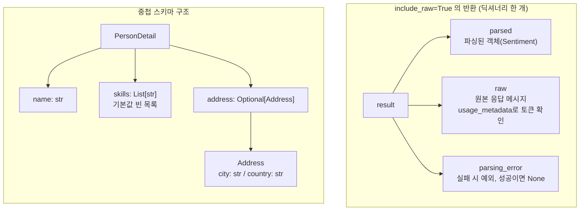

# 06. 구조화 출력 심화

`06_structured_advanced.py` 단독 학습 문서입니다. `05_structured_output`의 기본을 익힌 뒤에 보면 좋습니다.

## 무엇을 하는가

- `include_raw=True`로 파싱 결과와 원본 응답을 함께 받습니다.
- 스키마 안에 스키마를 넣어(중첩) 복잡한 데이터를 한 번에 구조화합니다.

## 왜 필요한가

구조화 출력을 실무에 쓰다 보면 두 가지가 더 필요해집니다. 첫째, 파싱된 객체뿐 아니라 원본 응답(토큰 사용량, 파싱 실패 원인)도 봐야 디버깅과 비용 관리가 됩니다. 둘째, 사람·주소·기술 목록처럼 한 객체가 다른 객체나 리스트를 품는 복잡한 데이터를 다뤄야 합니다. 이 예제는 그 두 가지를 채웁니다.

## 설계·구동 원리

- **include_raw는 세 가지를 함께 줍니다.** `with_structured_output(Schema, include_raw=True)`는 객체 대신 dict를 돌려줍니다. `parsed`에는 스키마로 파싱된 객체, `raw`에는 모델의 원본 응답 메시지(`usage_metadata`로 토큰 사용량 확인), `parsing_error`에는 파싱 실패 시 예외(성공이면 `None`)가 담깁니다. 핵심은 파싱이 실패해도 예외로 끊기지 않고 `parsing_error`에 담긴다는 점입니다. 덕분에 실패를 코드로 다루며 재시도하거나 원인을 로깅할 수 있습니다.
- **중첩 스키마.** Pydantic 모델의 필드 타입으로 다른 모델이나 리스트를 둘 수 있습니다. `PersonDetail`이 `List[str]` 기술 목록과 `Optional[Address]` 중첩 객체를 필드로 가지면, 모델은 한 번의 호출로 그 전체 구조를 채워 돌려줍니다. `with_structured_output`은 중첩 구조까지 스키마로 풀어 모델에 전달하므로, 평면 스키마와 똑같은 방식으로 복잡한 데이터를 받을 수 있습니다.
- **기본값으로 안전하게.** 리스트 필드에는 `default_factory=list`를, 없을 수 있는 중첩 객체에는 `Optional`과 `default=None`을 두어, 정보가 없을 때 빈 목록이나 `None`으로 안전하게 비워 둡니다.

## 구동 흐름 (다이어그램)

`include_raw=True`는 객체 대신 세 가지를 담은 딕셔너리를 돌려줍니다. 중첩 스키마는 한 모델이 다른 모델·리스트를 필드로 품는 구조입니다.



**구동 원리.** `with_structured_output(Schema, include_raw=True)`는 객체 하나가 아니라 `parsed`·`raw`·`parsing_error` 세 칸을 담은 딕셔너리를 돌려줍니다. `parsed`에는 스키마로 파싱된 객체, `raw`에는 모델의 원본 응답 메시지(여기서 `usage_metadata`로 토큰 사용량을 확인), `parsing_error`에는 파싱 실패 시 예외(성공이면 `None`)가 담깁니다. 핵심은 파싱이 실패해도 예외로 코드가 끊기지 않고 `parsing_error`에 담겨, 실패 원인을 로깅하거나 재시도하는 식으로 코드가 직접 다룰 수 있다는 점입니다. 중첩 스키마는 Pydantic 모델의 필드 타입 자리에 다른 모델(`Address`)이나 리스트(`List[str]`)를 두는 방식입니다. `PersonDetail`이 기술 목록과 주소 객체를 필드로 가지면, `with_structured_output`이 그 중첩 구조까지 풀어 모델에 전달하므로 모델은 한 번의 호출로 전체 구조를 채워 돌려줍니다. 리스트 필드에는 `default_factory=list`, 없을 수 있는 중첩 객체에는 `Optional`과 `default=None`을 두어, 정보가 없을 때 빈 목록이나 `None`으로 안전하게 비워 둡니다.

## 실행법

```bash
uv run python 02_langchain_core/06_structured_advanced.py
```

## 예상 출력

```
=== include_raw로 원본+파싱 동시 확보 ===
파싱 결과: label='positive'
파싱 오류: None
원본 토큰: {'input_tokens': ..., 'output_tokens': ..., 'total_tokens': ...}

=== 중첩 스키마 ===
이름: 김철수 / 기술: ['파이썬', '자바'] / 주소: city='서울' country='대한민국'
```

## 체크포인트

- `parsed`에 객체가, `raw`에 원본이 동시에 담기면 `include_raw`를 이해한 것입니다.
- `parsing_error`가 `None`이면 파싱이 정상이라는 뜻입니다.
- `skills`가 리스트로, `address`가 중첩 객체로 채워지면 중첩 스키마를 이해한 것입니다.

## 더 해보기

- `nested_schema`에 주소 정보가 없는 입력("김철수는 파이썬을 다룬다")을 넣어, `address`가 `None`으로 비워지는지 확인하십시오.
- `PersonDetail`에 `Address` 리스트(`List[Address]`)를 추가해, 여러 거주지를 받아 보십시오.
- `include_raw`의 `raw` 메시지에서 `usage_metadata` 외에 어떤 정보가 더 들어 있는지 출력해 보십시오.

## 다음 단계

이 챕터를 마치면 `03_tool_calling`으로 넘어갑니다. 지금 다룬 메시지 리스트에 도구 호출 제안(`tool_calls`)과 도구 실행 결과(`ToolMessage`)를 더 쌓아, 모델이 외부 시스템과 상호작용하게 만듭니다.
