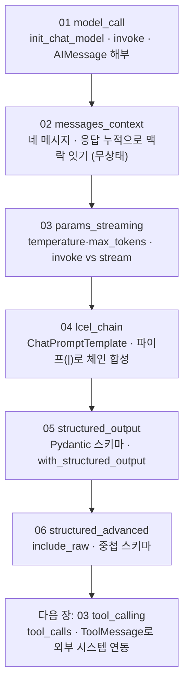

# 02. LangChain 핵심 구성요소

도구·그래프로 들어가기 전에 LangChain의 토대를 잡는 장입니다. 공급사에 무관한 표준 인터페이스로 모델을 부르고, 대화를 네 종류의 메시지로 표현하며, 응답을 누적해 맥락을 잇고, 프롬프트를 양식으로 재사용하고, 답을 정해진 형식(객체)으로 받는 것까지 다룹니다.

이 장은 **하나의 주제마다 독립 실행 파일 하나**로 구성됩니다. 각 `NN_topic.py`는 자기완결이라 단독으로 실행되며, 짝이 되는 `NN_topic.md`가 그 예제만으로 혼자 학습할 수 있는 설계·구동 원리를 담습니다. 번호 순서대로 따라가면 모델 호출에서 구조화 출력까지 개념이 점점 쌓입니다.

## 학습 목표

- LangChain이 표준 인터페이스로 무엇을 해결하는지 설명할 수 있다.
- `init_chat_model`로 모델을 초기화하고, 문자열만 바꿔 공급사를 전환할 수 있다.
- System·Human·AI·Tool 네 메시지로 대화를 구성하고, 응답을 누적해 맥락을 이을 수 있다.
- `temperature`·`max_tokens`로 답을 조절하고, `stream`으로 토큰 단위로 받을 수 있다.
- `ChatPromptTemplate`과 LCEL 파이프(`prompt | model`)로 재사용 가능한 체인을 조립할 수 있다.
- `with_structured_output`으로 답을 Pydantic 객체로 받아 후속 코드가 바로 쓰게 만들 수 있다.

## 실행 방법

```bash
# 레포 루트(ai-agent-dev-lgens)에서
uv sync                       # 최초 1회 (의존성 설치)
cp .env.example .env          # 최초 1회, .env에 OPENAI_API_KEY 입력

# 예제는 하나씩 단독으로 실행합니다.
uv run python 02_langchain_core/01_model_call.py
uv run python 02_langchain_core/02_messages_context.py
# ... 06까지 같은 방식
```

각 파일은 상단에 `load_dotenv()`·`MODEL` 상수·필요한 import·자체 모델 초기화를 모두 갖춰, 다른 파일에 의존하지 않습니다. 키가 없으면 안내만 출력하고 종료하므로, 문법·import 점검은 키 없이도 됩니다. 공급사를 바꾸려면 각 파일 상단의 `MODEL` 상수만 교체하면 됩니다(기본 `openai:gpt-5.4-mini`).

## 권장 학습 경로

번호 순서대로 보는 것을 권장합니다. 각 예제는 `NN_topic.py`(코드)와 `NN_topic.md`(설계·원리)가 짝을 이룹니다.

| 번호 | 예제 | 한 줄 요약 |
|------|------|-----------|
| 01 | `01_model_call` | 모델 초기화·`invoke`·응답 객체 들여다보기 (+선택: 벤더 전환) |
| 02 | `02_messages_context` | System 메시지로 역할 고정, 응답 누적으로 멀티턴 맥락 잇기 |
| 03 | `03_params_streaming` | `temperature`·`max_tokens`로 답 조절, `stream`으로 토큰 단위 출력 |
| 04 | `04_lcel_chain` | `ChatPromptTemplate`·LCEL 파이프·체인 재사용·중괄호 이스케이프 |
| 05 | `05_structured_output` | 구조화 출력 기본·`Field` 설명·`Optional` |
| 06 | `06_structured_advanced` | `include_raw`로 원본+파싱 동시 확보·중첩 스키마 |

01~04가 모델 호출의 기본기와 조립, 05~06이 답을 정해진 형식으로 받는 구조화 출력(심화)입니다.

## 챕터 전체 흐름 (다이어그램)

번호를 따라가면 모델 호출의 토대 위에 메시지·조절·조립·구조화가 차례로 쌓입니다.



## 핵심 점검

이 장이 성공인지 가르는 한 가지 기준은 **`02_messages_context`에서 두 번째 답이 첫 대화를 참조하는지**입니다.

- **맥락이 이어지는가.** 두 번째 답변이 첫 질문·답변을 참조하면 성공입니다. 처음부터 다시 설명한다면 응답을 `messages`에 누적했는지 봅니다.
- **응답을 직접 만들지 않았는가.** `invoke`가 돌려준 결과 자체가 `AIMessage`이므로, 그 객체를 그대로 누적합니다. `.content`만 꺼내 새 객체로 감싸지 않습니다.
- **네 메시지를 떠올릴 수 있는가.** System(역할·규칙)·Human(사용자 입력)·AI(모델 응답)·Tool(도구 결과). 이 장에서 앞의 셋을 직접 썼고, Tool은 다음 장(도구 호출)에서 만납니다.

## 흔한 실수 (증상별 진단)

| 증상 | 원인 | 해결 |
|------|------|------|
| 두 번째 답이 앞 대화를 모른다 | 응답을 리스트에 누적 안 함 | `messages.append(응답)` 한 줄 추가 |
| 메시지 종류 오류가 난다 | 응답을 새 `AIMessage`로 감쌈 | `invoke` 결과 객체를 그대로 누적 |
| `KeyError`가 난다(프롬프트) | 본문의 리터럴 `{ }`를 변수로 오인 | `{{ }}`로 이스케이프 |
| 구조화 출력에서 없는 값이 지어내진다 | 필수 필드로 둠 | `Optional` + 기본값으로 |

> 막힘은 대부분 모델 탓이 아니라 위 패턴입니다. 더 큰 모델로 바꾸기 전에 증상을 표에서 역추적하십시오.

## 더 해보기

- 각 `NN_topic.md`의 "더 해보기" 항목을 따라, 예제를 조금씩 바꿔 가며 동작을 관찰하십시오.
- `.env`에 `GOOGLE_API_KEY`를 넣고 각 파일의 `MODEL`을 `google-genai:gemini-3.5-flash`로 바꿔, 같은 코드가 다른 공급사에서 도는지 확인하십시오.

## 다음 장

`03_tool_calling` — 지금 만든 메시지 리스트에 **도구 호출 제안(tool_calls)과 도구 실행 결과(ToolMessage)**를 더 쌓아, 모델이 외부 시스템과 상호작용하게 만듭니다.
