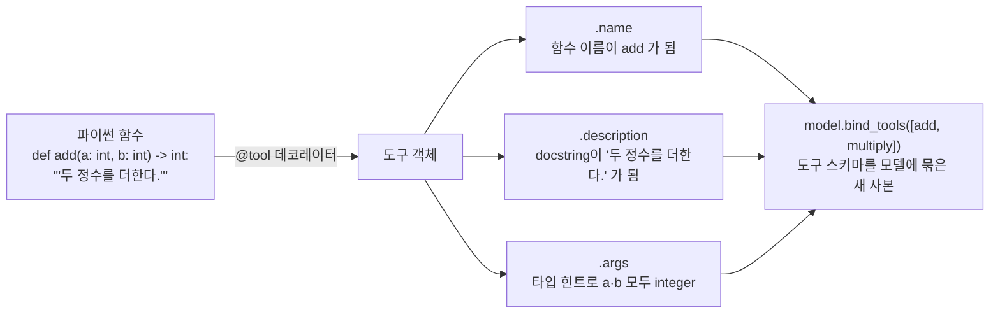

# 01. 도구 정의와 bind_tools

`01_define_and_bind.py` 단독 학습 문서입니다. 이 한 파일만으로 함수를 도구로 만들고 모델에 알려 주는 출발점을 익힐 수 있습니다.

## 무엇을 하는가

- `@tool`로 평범한 함수를 LangChain 도구로 바꿉니다.
- `@tool`이 함수의 이름·docstring·타입 힌트에서 도구 메타데이터를 자동으로 뽑는 것을 봅니다.
- 도구를 모델 없이 `.invoke`로 직접 실행해 봅니다.
- `bind_tools`로 모델에 "이런 도구들을 쓸 수 있다"고 알려 줍니다(아직 실행은 하지 않습니다).

## 왜 필요한가

도구 호출의 모든 것이 여기서 출발합니다. 모델이 외부 세계와 손을 잡으려면 먼저 "무엇을 할 수 있는지"를 알아야 합니다. 그 "무엇"을 코드로 표현한 것이 도구이고, 도구를 모델에 알려 주는 통로가 `bind_tools`입니다. 도구가 함수의 어떤 부분에서 만들어지는지 분명히 알아 두면, 다음 예제에서 모델이 왜 그 도구를 그 인자로 부르는지 자연스럽게 이해할 수 있습니다.

## 설계·구동 원리

- **`@tool`이 보는 세 가지.** `@tool` 데코레이터를 붙이면 일반 함수가 도구 객체로 바뀝니다. 이때 함수 이름은 도구 이름(`.name`)이 되고, docstring은 도구 설명(`.description`)이 되며, 타입 힌트는 인자 스키마(`.args`)가 됩니다. 모델이 실제로 보는 것은 함수 "본문"이 아니라 이 세 가지뿐입니다. 따라서 docstring은 단순 주석이 아니라 모델이 "이 도구를 언제 쓸지" 판단하는 유일한 근거이고, 타입 힌트는 모델이 인자를 채울 형식의 명세입니다.
- **도구는 단독으로도 실행됩니다.** `@tool`로 감싼 함수는 `.invoke({인자})`로 모델 없이 직접 부를 수 있습니다. 모델을 붙이기 전에 도구 자체가 잘 동작하는지 단위 테스트하듯 점검할 때 유용합니다.
- **`bind_tools`는 알려 줄 뿐 실행하지 않습니다.** `bind_tools([...])`는 도구 목록을 모델에 묶어, 매 호출마다 도구들의 스키마를 함께 보내도록 합니다. 원본 모델은 그대로 두고 도구가 묶인 새 사본을 돌려줍니다. 이 단계는 도구를 실행하지 않습니다. 묶인 모델을 `invoke`해야 비로소 모델이 `tool_calls`로 호출을 제안합니다(다음 예제 02).

## 구동 흐름 (다이어그램)

`@tool`은 함수의 세 부분만 추려 모델에 노출하고, `bind_tools`는 그 스키마를 모델에 묶습니다.



**구동 원리.** `@tool`은 함수를 도구 객체로 바꾸면서 이름·docstring·타입 힌트라는 세 부분만 추려 모델에 노출합니다. 함수 본문은 모델에 보이지 않으므로, 모델이 도구를 고르는 근거는 오직 이름과 설명, 인자 형식뿐입니다. `bind_tools([add, multiply])`는 이렇게 만든 도구들의 스키마를 모델에 묶어, 앞으로 그 모델을 `invoke`할 때마다 도구 목록이 함께 전달되게 합니다. 묶기는 원본 모델을 바꾸지 않고 새 사본을 돌려주므로, 도구를 묶은 모델과 묶지 않은 모델을 동시에 둘 수 있습니다. 이 단계까지는 어떤 도구도 실행되지 않습니다. 실행은 묶인 모델을 호출해 `tool_calls`를 받은 뒤, 우리 코드가 직접 맡습니다.

## 실행법

```bash
# 레포 루트(ai-agent-dev-lgens)에서
uv sync                       # 최초 1회 (의존성 설치)
cp .env.example .env          # 최초 1회, .env에 OPENAI_API_KEY 입력
uv run python 03_tool_calling/01_define_and_bind.py
```

STEP 1·2는 모델 없이도 동작합니다. STEP 3의 `bind_tools`는 모델 객체가 필요하므로, 키가 없으면 안내만 출력하고 STEP 3을 건너뜁니다.

## 예상 출력

```
=== STEP 1: 도구 메타데이터 관찰 (모델 없이) ===
[name] add
[desc] 두 정수를 더한다.
[args] {'a': {'title': 'A', 'type': 'integer'}, 'b': {'title': 'B', 'type': 'integer'}}

=== STEP 2: 도구 직접 실행 (모델 없이) ===
[direct] 8

=== STEP 3: bind_tools로 도구 알려 주기 ===
도구를 묶은 모델: RunnableBinding
```

## 체크포인트

- `name`·`description`·`args`가 함수에서 자동 추출되어 출력되면 메타데이터 추출을 이해한 것입니다.
- 모델 없이도 `add`가 8을 돌려주면 도구 자체는 준비된 것입니다.
- `bind_tools`가 오류 없이 객체를 돌려주면 모델에 도구를 알려 줄 준비가 끝난 것입니다.

## 흔한 실수

- **docstring을 비워 둔다.** 설명이 없으면 모델이 도구의 쓸모를 모릅니다. "무슨 일을 하는지, 언제 쓰는지"를 분명히 적습니다.
- **타입 힌트를 생략한다.** 타입 힌트가 없으면 인자 스키마가 비어, 모델이 인자를 어떤 형식으로 채울지 알기 어렵습니다.

## 더 해보기

- `add`의 docstring을 지우고 STEP 1을 다시 실행해, `.description`이 어떻게 비는지 확인하십시오.
- 도구를 하나 더 정의(예: `subtract`)하고 `bind_tools`에 추가해, 묶을 도구 수를 늘려 보십시오.
- `.env`에 `GOOGLE_API_KEY`를 넣고 `MODEL`을 `google-genai:gemini-3.5-flash`로 바꿔, 같은 코드가 다른 공급사에서 도는지 확인하십시오.

## 다음 예제

`02_tool_calls_anatomy` — 묶은 모델을 호출해 `tool_calls`를 받고, 그 구조를 해부한 뒤 결과를 되돌려 한 번의 왕복을 완성합니다.
