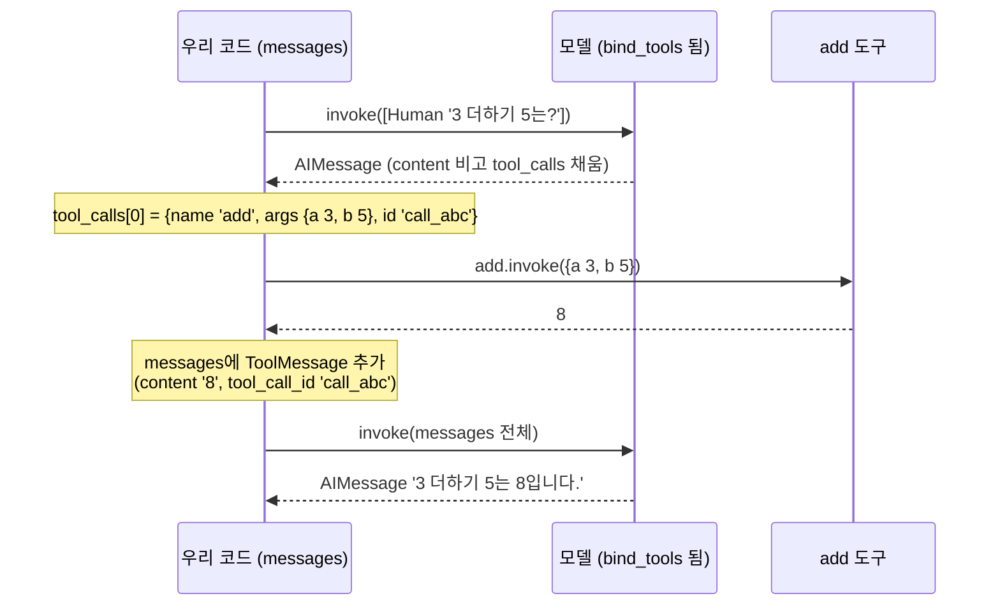

# 02. tool_calls 해부와 한 번의 왕복

`02_tool_calls_anatomy.py` 단독 학습 문서입니다.

## 무엇을 하는가

- 도구가 필요한 질문에 모델이 답(`content`)이 아니라 `tool_calls`를 돌려주는 것을 봅니다(실행이 아니라 제안).
- `tool_calls` 한 건을 뜯어 `name`·`args`·`id` 세 필드를 읽습니다.
- 모델이 요청한 도구를 코드가 손으로 실행합니다.
- 실행 결과를 `ToolMessage`로 되돌리고, `tool_call_id`로 호출과 결과를 짝지어 최종 답을 받습니다.

## 왜 필요한가

도구 호출의 한 사이클이 여기서 온전히 드러납니다. 모델이 도구를 "제안"하고, 코드가 "실행"하고, 결과를 "되돌리면", 모델이 "최종 답"을 냅니다. 이 네 단계와 그 사이를 잇는 `tool_calls`의 세 필드를 손으로 한 번 따라가 보면, 다음 예제의 수동 루프가 결국 이 왕복의 반복임을 자연스럽게 받아들일 수 있습니다.

## 설계·구동 원리

- **제안과 실행의 분리.** 계산이 필요한 질문을 던지면 모델은 답을 직접 쓰지 않고 "이 도구를 이렇게 불러 달라"고 제안합니다. 이때 `content`는 비어 있고 의도는 `tool_calls`에 담깁니다. 모델은 도구를 실행하지 않습니다. 실제 함수를 돌리는 일은 우리 코드의 몫입니다. 이 분리가 검증·권한 경계·감사라는 통제권의 출발점입니다. 자격 증명(API 키 등)은 도구 코드 쪽에만 두고, 위험한 호출은 실행 전에 코드가 점검할 수 있습니다.
- **`tool_calls`의 세 필드.** 모델이 평범한 문장으로 요청을 적었다면 우리가 다시 파싱해야 하지만, `tool_calls`는 처음부터 구조화된 객체(딕셔너리)라 파싱이 필요 없습니다. 한 항목은 `name`(부를 도구 이름), `args`(채워 넣은 인자 딕셔너리), `id`(이 호출을 식별하는 고유 값)를 담습니다. 코드는 `call["name"]`으로 도구를 찾고 `call["args"]`를 그대로 넘기면 됩니다.
- **실행은 이름으로 도구를 찾아서.** 요청에는 도구 "이름"만 들어 있으므로, `{도구이름: 도구객체}` 사전을 미리 만들어 이름으로 실물을 찾습니다. 고른 도구에 `args`를 넣어 실행하면 결과가 나옵니다. 도구를 한 번 실행했다고 모델이 결과를 알아서 가져가지는 않습니다. 되돌리는 책임은 코드에 있습니다.
- **`ToolMessage`와 `tool_call_id` 짝짓기.** 실행 결과를 `ToolMessage(content=str(결과), tool_call_id=...)`로 담아 메시지 목록에 쌓고 다시 `invoke`해야 모델이 결과를 봅니다. 이때 `tool_call_id`에는 모델이 보낸 `call["id"]`를 글자 그대로 넣어야 합니다. 이 id는 "이 결과가 어느 호출의 답인가"를 묶는 송장 번호와 같아, 여러 호출이 한 응답에 담길 때 특히 결정적입니다.

## 구동 흐름 (다이어그램)

한 질문이 제안·실행·되돌림·최종 답의 네 단계를 거치는 한 사이클입니다.



**구동 원리.** 도구가 묶인 모델에 계산 질문을 넘기면, 모델은 답을 직접 쓰지 않고 `tool_calls`에 호출 제안을 담아 돌려줍니다. 이 제안은 구조화된 객체라 `call["name"]`·`call["args"]`·`call["id"]`로 곧장 읽을 수 있습니다. 코드는 이름으로 실제 도구를 찾아 `args`를 넣어 실행하고, 그 결과를 `ToolMessage`로 감쌉니다. 이때 `tool_call_id`에 모델이 준 `id`를 그대로 넣어, 어느 호출의 답인지 짝을 맞춥니다. 모델의 제안(`ai`)과 그 결과(`ToolMessage`)를 모두 쌓은 메시지 목록으로 다시 `invoke`하면, 모델은 이제 실행 결과를 보고 자연어 최종 답을 작성합니다. 제안·실행·되돌림·최종 답으로 이어지는 이 한 사이클이 도구를 쓰는 Agent의 기본 단위입니다.

## 실행법

```bash
uv run python 03_tool_calling/02_tool_calls_anatomy.py
```

## 예상 출력

```
=== STEP 1: tool_calls 관찰 ===
[content]    ''
[tool_calls] [{'name': 'add', 'args': {'a': 3, 'b': 5}, 'id': 'call_abc', 'type': 'tool_call'}]

=== STEP 2: tool_call 한 건 해부 (name·args·id) ===
[call name] add
[call args] {'a': 3, 'b': 5}
[call id]   call_abc

=== STEP 3: 요청한 도구 손으로 실행 ===
[실행 결과] 8

=== STEP 4: ToolMessage로 결과 되돌려 최종 답 받기 ===
[final] 3 더하기 5는 8입니다.
```

## 체크포인트

- `content`가 비고 `tool_calls`에 호출 요청이 담기면 제안과 실행의 분리를 이해한 것입니다.
- `name`·`args`·`id` 세 필드가 보이면 `tool_calls` 구조를 이해한 것입니다.
- `ToolMessage`로 결과를 되돌렸을 때 비로소 자연어 답이 나오면 한 번의 왕복을 완성한 것입니다.

## 흔한 실수

- **`tool_call_id`를 호출 `id`와 안 맞춘다.** id가 어긋나면 모델이 결과를 못 받은 것으로 보고 같은 도구를 다시 부릅니다. `call["id"]`를 글자 그대로 넣습니다.
- **결과를 되돌리지 않는다.** 도구를 한 번 실행했다고 모델이 결과를 가져가지 않습니다. `ToolMessage`로 쌓고 다시 `invoke`해야 모델이 봅니다.
- **빈 `tool_calls`를 오류로 오해한다.** 외부 정보가 필요 없는 질문이면 `tool_calls`가 비고 `content`에 답이 바로 들어옵니다. 정상 동작입니다.

## 더 해보기

- STEP 4에서 `tool_call_id`에 일부러 다른 문자열을 넣어 실행해, 최종 답이 어떻게 어긋나는지 확인하십시오.
- 질문을 "안녕, 오늘 기분 어때?"처럼 도구가 필요 없는 형태로 바꿔, `tool_calls`가 비고 `content`에 답이 바로 들어오는지 관찰하십시오.

## 다음 예제

`03_manual_loop` — 이 한 번의 왕복을 `tool_calls`가 빌 때까지 도는 반복으로 일반화하고, 무한 반복을 막는 안전판을 더합니다.
