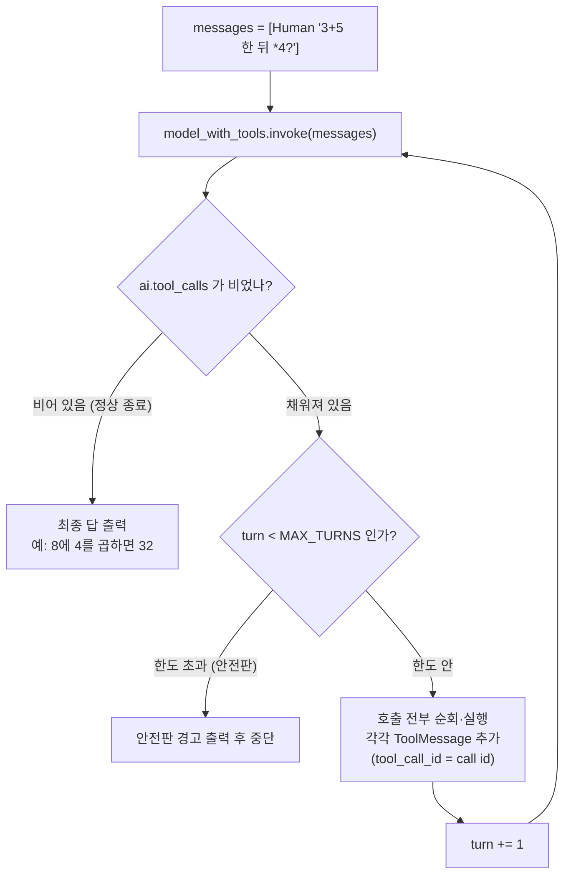

# 03. 수동 루프와 안전판

`03_manual_loop.py` 단독 학습 문서입니다.

## 무엇을 하는가

- 뒤 계산이 앞 결과에 의존하는 다단계 질문은 한 번의 왕복으로 끝나지 않는 것을 봅니다.
- `tool_calls`가 빌 때까지 도는 수동 루프로 여러 바퀴를 처리합니다.
- 정상 종료 조건(`tool_calls`가 빔)과 비정상 대비 안전판(`MAX_TURNS`)을 둘 다 둡니다.

## 왜 필요한가

실무 질문은 도구 한 번으로 끝나지 않는 경우가 많습니다. "더한 결과에 다시 곱하라"처럼 뒤 단계가 앞 결과를 입력으로 받는 질문이 그렇습니다. 모델은 앞 결과를 본 뒤에야 다음 인자를 채울 수 있으므로, 한 번에 모든 도구를 부를 수 없습니다. 그래서 앞 예제의 왕복을 "더 부를 도구가 없을 때까지" 반복으로 일반화해야 합니다. 이 수동 루프가 곧 Agent 실행 루프의 뼈대이며, 여기서 안전판의 필요성까지 익혀 두면 뒤 장의 프레임워크가 왜 같은 보호를 기본으로 제공하는지 이해할 수 있습니다.

## 설계·구동 원리

- **다단계 질문은 여러 바퀴가 필요합니다.** "3 더하기 5를 한 다음 그 결과에 4를 곱하라"는 질문에서, 모델은 덧셈 결과(8)를 본 뒤에야 곱셈의 인자(`8 * 4`)를 채울 수 있습니다. 둘째 호출의 인자가 첫째 결과에 의존하므로, 한 응답에 두 도구를 다 담을 수 없습니다.
- **종료 조건: `tool_calls`가 빔.** 매 바퀴마다 모델의 제안을 실행해 `ToolMessage`로 되돌리고 다시 `invoke`합니다. 모델이 더 부를 도구가 없다고 판단하면 `tool_calls`가 비고 `content`에 최종 답이 들어옵니다. 이때 `while ai.tool_calls`의 조건이 거짓이 되어 루프를 정상적으로 빠져나옵니다.
- **안전판: 최대 반복 횟수.** 모델이 끝내 도구만 계속 부르며 멈추지 않을 수도 있습니다. 종료 조건만 믿으면 `while`이 끝없이 돌며 비용과 시간을 소진합니다. 그래서 `MAX_TURNS` 같은 최대 반복 횟수를 함께 둡니다. 종료 조건은 "정상적으로 끝났을 때", 안전판은 "정상적으로 끝나지 않을 때" 작동하므로, 둘은 막는 상황이 달라 어느 하나로 다른 하나를 대신할 수 없습니다.
- **흔한 비정상의 원인.** 결과를 못 받은 것처럼 같은 도구를 반복한다면, 십중팔구 `tool_call_id`가 호출 `id`와 어긋난 것입니다. 무한 루프가 의심되면 안전판으로 멈추기 전에 `tool_call_id` 짝부터 확인합니다.

## 구동 흐름 (다이어그램)

루프는 매 바퀴 누적된 메시지를 모델에 보여 주고, `tool_calls`가 빌 때 종료합니다. 안전판은 그 바깥에서 반복 횟수를 지킵니다.



**구동 원리.** 첫 호출에서 모델은 덧셈 도구를 제안합니다. 코드는 그것을 실행해 8을 `ToolMessage`로 되돌리고 다시 `invoke`합니다. 둘째 바퀴에서 모델은 누적된 메시지(질문 + 덧셈 제안 + 덧셈 결과)를 모두 보고, 이제 곱셈 도구를 `8 * 4`로 제안합니다. 코드가 32를 되돌리면 셋째 바퀴에서 모델은 더 부를 도구가 없다고 판단해 최종 답을 냅니다. 이때 `tool_calls`가 비어 `while` 조건이 거짓이 되고 루프가 정상 종료합니다. `while ai.tool_calls and turn < MAX_TURNS`라는 조건은 두 가지를 함께 지킵니다. 앞 절반(`ai.tool_calls`)은 정상 종료를, 뒤 절반(`turn < MAX_TURNS`)은 비정상 폭주를 막습니다. 매 바퀴 모델에 누적 메시지 전체를 다시 보여 주므로, 모델은 앞 결과를 보고 다음 도구를 정합니다. 이 "더 부를 도구가 없을 때까지의 반복"이 직접 구현하는 Agent 루프의 핵심입니다.

## 실행법

```bash
uv run python 03_tool_calling/03_manual_loop.py
```

## 예상 출력

```
=== 수동 루프 (다단계 도구 호출 + MAX_TURNS 안전판) ===
[first call] [{'name': 'add', 'args': {'a': 3, 'b': 5}, 'id': 'call_a', 'type': 'tool_call'}]
[final] 3 더하기 5는 8이고, 거기에 4를 곱하면 32입니다.
```

## 체크포인트

- 덧셈 호출, 결과 되돌림, 곱셈 호출, 결과 되돌림 순서를 거쳐 32가 나오면 루프가 완성된 것입니다.
- `while`의 조건에서 `ai.tool_calls`(종료 조건)와 `turn < MAX_TURNS`(안전판)를 둘 다 짚을 수 있으면 둘의 역할을 이해한 것입니다.

## 흔한 실수

- **안전판이 없다.** 종료 조건만 두면 모델이 멈추지 않을 때 무한 반복에 빠집니다. `MAX_TURNS`를 항상 함께 둡니다.
- **안전판만 믿는다.** 안전판만 두고 종료 조건이 부실하면 정상 종료를 놓쳐 불필요하게 반복합니다.
- **루프가 같은 도구를 반복한다.** 먼저 `tool_call_id`가 호출 `id`와 맞는지 확인합니다. 결과를 못 받은 것으로 인식하면 같은 도구를 다시 부릅니다.

## 더 해보기

- `MAX_TURNS`를 1로 줄여 실행해, 안전판 경고가 출력되는지 확인하십시오.
- 질문을 "10 더하기 20을 한 다음 그 결과를 2로 나누고 다시 3을 곱하면?"처럼 더 깊게 바꿔, 루프가 몇 바퀴를 도는지 관찰하십시오.
- 도구 실행부 `messages.append(ToolMessage(...))`에서 `tool_call_id`를 일부러 빈 문자열로 두고, 루프가 반복에 빠지는지 직접 확인하십시오.

## 다음 예제

`04_parallel_calls` — 한 응답에 여러 호출이 동시에 담기는 경우를 다루고, `parallel_tool_calls`로 그 병렬 여부를 제어합니다.
