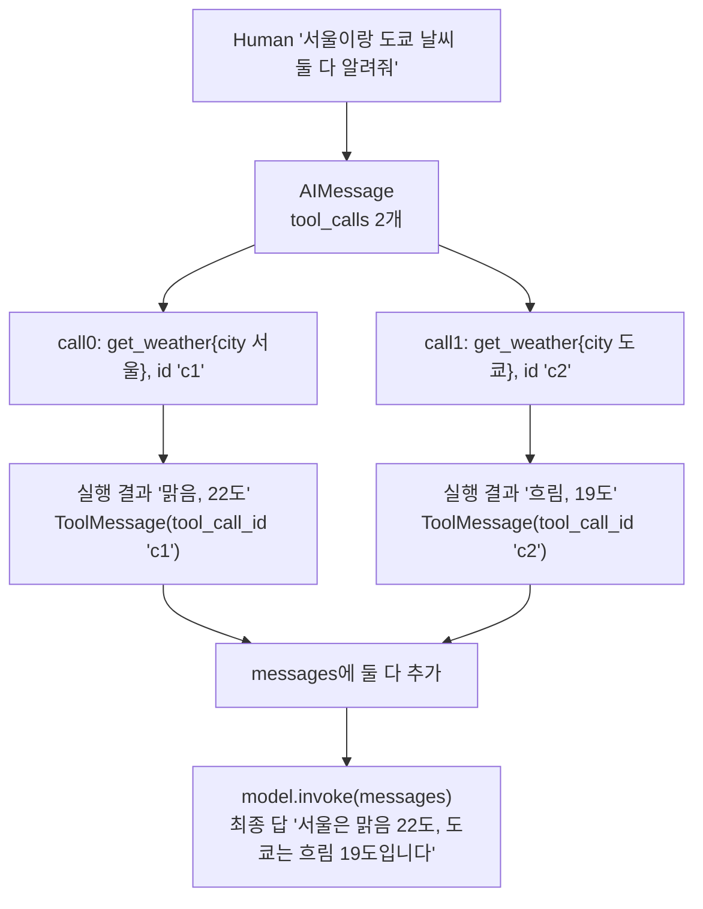

# 04. 다중·병렬 호출

`04_parallel_calls.py` 단독 학습 문서입니다.

## 무엇을 하는가

- 서로 무관한 질문은 한 응답에 여러 `tool_calls`가 담길 수 있는 것을 봅니다(개수 확인).
- 호출이 몇 개든 전부 순회해 실행하고, 각각에 `ToolMessage`를 되돌립니다(하나라도 빠뜨리면 안 됩니다).
- `parallel_tool_calls`로 한 응답에 여러 호출을 담을지 하나만 담을지 제어합니다.

## 왜 필요한가

앞 예제의 다단계 질문과 달리, 서로 의존하지 않는 질문은 모델이 한 응답에 여러 호출을 한꺼번에 담습니다. "서울과 도쿄 날씨를 둘 다 알려 달라"가 그렇습니다. 이때 호출 하나만 처리하면 나머지 결과가 빠져 답이 어긋납니다. 호출이 몇 개든 전부 순회하는 습관과, 병렬 호출 자체를 켜고 끄는 제어를 익혀 두면 외부 자원 경합 같은 실무 상황에 대비할 수 있습니다.

## 설계·구동 원리

- **무관한 질문은 한 응답에 여러 호출.** 둘째 호출의 인자가 첫째 결과에 의존하지 않으면, 모델은 두 호출을 한 응답에 함께 담습니다(병렬 호출). 03의 다단계 질문이 여러 바퀴로 나뉘던 것과 대비됩니다. `len(ai.tool_calls)`로 개수를 직접 확인할 수 있습니다.
- **전부 순회해 전부 되돌리기.** 호출이 몇 개든 `for call in ai.tool_calls`로 전부 순회하며 각각 실행하고, 각각에 대응하는 `ToolMessage`를 되돌려야 합니다. 하나라도 빠뜨리면 모델은 답이 안 온 요청을 기다리며 최종 답을 못 냅니다. 각 `ToolMessage`의 `tool_call_id`를 그 호출의 `id`와 맞춰, 어느 결과가 어느 호출의 답인지 짝지웁니다. 여기서 `id`의 쓸모가 분명해집니다.
- **`parallel_tool_calls`로 병렬 제어.** 기본값은 병렬 허용(`True`)이라 무관한 호출은 한 응답에 여러 개가 담깁니다. `bind_tools([...], parallel_tool_calls=False)`를 주면 모델이 한 번에 도구를 하나만 부르도록 제약합니다. 호출 순서를 강제하거나 외부 자원 경합(같은 파일 동시 수정 등)을 피하고 싶을 때 씁니다. `False`는 호출을 여러 라운드로 나누므로, 실제 답을 끝내려면 수동 루프(예제 03)로 여러 번 되돌려야 합니다.

## 구동 흐름 (다이어그램)

한 응답에 담긴 여러 호출을 전부 순회하며 각각 실행하고, 각각에 `ToolMessage`를 되돌립니다.



**구동 원리.** 서로 의존하지 않는 두 질문을 받으면 모델은 한 응답에 두 호출을 함께 담습니다. 각 호출은 고유한 `id`를 갖고, 코드는 `for`로 모든 호출을 순회하며 하나씩 실행합니다. 실행 결과는 각각 `ToolMessage`로 감싸되, `tool_call_id`에 그 호출의 `id`를 넣어 어느 결과가 어느 호출의 답인지 묶습니다. 두 결과를 모두 메시지 목록에 쌓은 뒤 다시 `invoke`하면, 모델은 두 결과를 한 답에 모읍니다. 만약 호출 하나만 되돌리면 모델은 나머지 요청의 답을 기다리며 최종 답을 내지 못합니다. 그래서 `len(tool_calls)`와 되돌린 `ToolMessage` 개수가 같아야 합니다. 병렬을 막아야 할 때는 `parallel_tool_calls=False`로 한 번에 하나씩만 부르게 하고, 그 경우 호출이 여러 라운드로 나뉘므로 수동 루프로 끝까지 되돌립니다.

## 실행법

```bash
uv run python 03_tool_calling/04_parallel_calls.py
```

## 예상 출력

```
=== STEP 1: 여러 tool_calls 개수 확인 ===
[num calls] 2
  - {'city': '서울'}
  - {'city': '도쿄'}

=== STEP 2: 여러 호출 전부 순회 ===
  - {'city': '서울'} -> 맑음, 22도
  - {'city': '도쿄'} -> 흐림, 19도
[final] 서울은 맑음 22도, 도쿄는 흐림 19도입니다.

=== STEP 3: parallel_tool_calls 제어 ===
[parallel=on]  호출 수: 3
[parallel=off] 호출 수: 1
```

## 체크포인트

- 호출이 2개로 잡히면 무관한 질문이 병렬로 담기는 것을 이해한 것입니다.
- `len(tool_calls)`와 붙인 `ToolMessage` 개수가 같고 두 도시 날씨가 한 답에 모이면 전부 순회를 이해한 것입니다.
- `on`에서는 여러 호출, `off`에서는 1개로 줄어들면 병렬 제어가 동작하는 것입니다.

## 흔한 실수

- **`ai.tool_calls[0]` 하나만 처리한다.** 호출이 여러 개인데 첫 번째만 실행하면 나머지 결과가 빠집니다. `for`로 전부 순회합니다.
- **`ToolMessage` 개수를 안 맞춘다.** 되돌린 `ToolMessage` 수가 호출 수보다 적으면 모델이 최종 답을 못 냅니다.
- **`off`를 한 번 호출로 끝낸다.** `parallel_tool_calls=False`는 호출을 여러 라운드로 나누므로 수동 루프로 끝까지 되돌려야 합니다.

## 더 해보기

- 질문을 "서울 날씨를 알아낸 다음 그것과 도쿄를 비교해 줘"처럼 앞 결과에 의존하는 형태로 바꿔, 한 응답에 두 호출이 한꺼번에 담기지 않고 여러 바퀴로 나뉘는지 관찰하십시오.
- STEP 2를 `ai.tool_calls[0]` 하나만 처리하도록 바꿔, 최종 답에서 한 도시가 빠지는지 확인하십시오.
- STEP 3의 `off` 결과를 수동 루프(예제 03)에 연결해, 여러 라운드를 거쳐 세 도시 답이 모두 모이게 만들어 보십시오.

## 다음 예제

`05_tool_error` — 도구 실행이 실패할 때 예외로 루프를 깨는 대신, 실패도 하나의 관찰로 모델에 돌려주어 회복하게 만듭니다.
