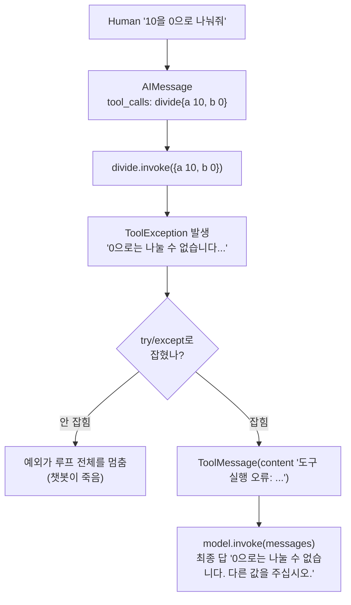

# 05. 도구 에러를 관찰로 돌려주기

`05_tool_error.py` 단독 학습 문서입니다.

## 무엇을 하는가

- 도구 안에서 의도적으로 `ToolException`을 던져, 잘못된 입력을 명확히 알립니다.
- 예외를 잡지 않으면 루프 전체가 멈춘다는 위험을 이해합니다.
- `try/except`로 예외를 잡아 실패 메시지를 `ToolMessage` 내용으로 되돌리면, 모델이 스스로 회복하는 것을 봅니다.

## 왜 필요한가

가장 실무적인 주제가 에러 처리입니다. 도구 안에서 외부 호출이 예외를 던지는데 그것을 잡지 않으면 Agent 루프 전체가 멈춰 섭니다. 사용자 입장에서는 챗봇이 갑자기 죽은 셈입니다. 실패를 예외로 터뜨려 루프를 깨는 대신 하나의 "관찰"로 모델에 돌려주는 감각은, 도구가 많아지는 실무 Agent에서 안정성을 좌우합니다.

## 설계·구동 원리

- **`ToolException`으로 의도적 실패를 알립니다.** 도구는 잘못된 입력(예: 0으로 나누기)을 만나면 `raise ToolException("...")`으로 "이 호출은 잘못됐다"고 명확히 알립니다. 평범한 예외와 달리, 이 예외는 모델이 다룰 수 있는 메시지를 함께 담습니다.
- **예외를 안 잡으면 루프가 멈춥니다.** 도구 실행 중 예외를 잡지 않으면 그 예외가 루프 전체를 멈춰 세웁니다. 그래서 실행부를 `try/except`로 감싸야 합니다.
- **실패를 관찰로 되돌립니다.** `except ToolException as e`로 예외를 잡아, 오류 메시지를 `ToolMessage` 내용으로 되돌립니다. 그러면 실패조차 하나의 관찰 결과가 되어 모델에게 전달됩니다. 모델은 그 메시지를 읽고 사용자에게 상황을 설명하거나 다른 인자로 다시 시도합니다. 결과가 비어 있을 때도 빈 문자열 대신 "찾지 못했습니다" 같은 안내를 돌려주면 모델이 다음 행동을 정하기 쉬워집니다.
- **도구가 많아지면 미들웨어로.** 도구마다 `try/except`를 직접 쓰는 것은 도구가 몇 개 안 될 때, 그리고 도구별로 실패 메시지를 다르게 안내하고 싶을 때 적합합니다. 도구가 늘어나면 LangChain은 도구 호출을 감싸 예외를 일괄로 `ToolMessage`로 변환하는 미들웨어 방식을 권장합니다. 처음에는 `try/except`로 감을 익히고, 도구가 늘어나면 미들웨어로 옮겨 가는 흐름이 자연스럽습니다.

## 구동 흐름 (다이어그램)

도구가 던진 예외를 코드가 잡아 실패 메시지를 `ToolMessage`로 되돌리면, 모델은 그 관찰을 보고 회복합니다.



**구동 원리.** 0으로 나누기를 유도하는 질문에 모델은 `divide` 도구를 `b=0`으로 제안합니다. 도구는 0을 만나 `ToolException`을 던집니다. 이 예외를 `try/except`로 감싸지 않았다면 그대로 루프를 멈춰 세웠을 것입니다. 대신 코드는 예외를 잡아 그 메시지를 `ToolMessage` 내용에 담아 모델에 되돌립니다. 모델은 이 실패를 하나의 관찰로 받아들여, "0으로는 나눌 수 없다"는 취지의 답을 자연어로 정리하거나 사용자에게 다른 값을 요청합니다. 핵심은 실패를 예외로 터뜨려 루프를 깨는 것이 아니라, 실패도 결과의 한 종류로 모델에게 돌려준다는 점입니다. 이 패턴 덕분에 Agent는 도구가 실패해도 멈추지 않고 다음 행동을 이어 갈 수 있습니다.

## 실행법

```bash
uv run python 03_tool_calling/05_tool_error.py
```

## 예상 출력

```
=== 도구 에러 처리와 회복 (ToolException을 ToolMessage로 되돌림) ===
  - 도구 오류를 모델에게 전달: 도구 실행 오류: 0으로는 나눌 수 없습니다. 두 번째 수를 0이 아닌 값으로 주십시오.
[final] 0으로는 나눌 수 없습니다. 0이 아닌 다른 수를 알려 주시면 다시 계산하겠습니다.
```

## 체크포인트

- 프로그램이 예외로 죽지 않으면 `try/except`로 실패를 잡은 것입니다.
- 오류 메시지가 모델의 최종 답에 반영되어 회복되면 실패를 관찰로 돌려주는 패턴을 이해한 것입니다.

## 흔한 실수

- **예외를 안 잡는다.** 도구 실행부를 `try/except`로 감싸지 않으면 첫 실패에서 루프가 멈춥니다.
- **빈 문자열을 돌려준다.** 결과가 없을 때 빈 문자열을 되돌리면 모델이 무슨 일이 있었는지 모릅니다. "찾지 못했습니다" 같은 안내를 담습니다.
- **모든 예외를 같은 메시지로 뭉친다.** 도구별로 실패 원인이 다르면 안내도 구체적으로 적어, 모델이 다음 행동을 정하기 쉽게 합니다.

## 더 해보기

- `divide`의 `ToolException` 메시지를 더 구체적으로 바꿔, 모델의 최종 답이 어떻게 달라지는지 관찰하십시오.
- 실행부의 `try/except`를 잠시 지우고 실행해, 0으로 나누기에서 프로그램이 멈추는지 직접 확인하십시오.
- 결과가 비었을 때 빈 문자열 대신 "찾지 못했습니다"를 돌려주는 도구를 하나 더 만들어, 모델의 다음 행동을 비교해 보십시오.

## 다음 예제

`06_tool_choice` — 도구를 쓸지 말지 모델의 판단에 맡기는 대신, `tool_choice`로 사용을 강제·금지·지정합니다.
