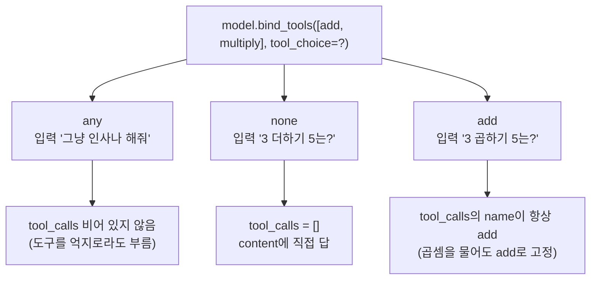

# 06. tool_choice로 사용 강제·금지·지정

`06_tool_choice.py` 단독 학습 문서입니다.

## 무엇을 하는가

- `tool_choice="any"`: 도구가 필요 없어 보이는 입력에도 반드시 하나는 부르도록 강제합니다.
- `tool_choice="none"`: 계산 질문이어도 도구를 전혀 부르지 못하게 막습니다.
- `tool_choice="<도구명>"`: 특정 도구 하나만 쓰도록 못박습니다.

## 왜 필요한가

기본값에서는 모델이 "도구가 필요한지"를 스스로 판단합니다. 그러나 특정 단계에서는 반드시 도구를 쓰게 하거나(예: 검색을 거치도록), 반대로 도구를 쓰지 못하게 하거나(예: 일반 대화만), 정해진 도구만 쓰게 해야 할 때가 있습니다. `tool_choice`는 이 통제권을 코드 쪽에 둡니다. 강제가 의도와 어긋난 호출을 만들 수도 있다는 점까지 함께 알아 두면 신중히 쓸 수 있습니다.

## 설계·구동 원리

- **`"any"` — 무엇이든 반드시 하나는.** 도구가 필요 없어 보이는 입력("그냥 인사나 해줘")에도 모델이 억지로 도구를 부르려 시도하게 만듭니다. 모든 응답에 도구 호출을 보장해야 하는 흐름에서 씁니다.
- **`"none"` — 전혀 부르지 못하게.** 계산 질문("3 더하기 5는?")이어도 도구 없이 모델이 직접 답하도록 막습니다. `tool_calls`는 빈 리스트가 되고 `content`에 답이 들어옵니다. 도구를 묶어 둔 채로 잠시 일반 대화만 시키고 싶을 때 씁니다.
- **`"<도구명>"` — 특정 도구만.** 도구 이름을 직접 지정하면 그 도구만 강제됩니다. 곱셈을 물어도 `tool_choice="add"`면 모델이 `add`만 부르도록 못박힙니다. 정해진 단계에서 한 도구만 거치게 할 때 유용합니다.
- **강제의 위험.** 강제는 의도와 어긋난 도구를 부르게 만들 수 있습니다. 곱셈 질문에 `add`를 강제하면 모델이 엉뚱한 인자로 `add`를 부를 수 있습니다. 도구가 꼭 필요한 맥락에서만 신중히 씁니다.

## 구동 흐름 (다이어그램)

같은 모델에 `tool_choice` 값만 달리 주면, 같은 입력에도 호출 동작이 달라집니다.



**구동 원리.** `tool_choice`는 `bind_tools`에 함께 넘기는 설정으로, 모델이 도구를 부를지 말지에 대한 자유도를 코드가 정합니다. 기본값(자동)에서는 모델이 입력을 보고 도구 필요 여부를 판단하지만, `"any"`는 그 판단을 무시하고 어떤 도구든 반드시 하나는 부르게 합니다. `"none"`은 반대로 도구를 전혀 부르지 못하게 막아, 계산 질문에도 `tool_calls`가 비고 `content`에 답이 바로 들어옵니다. 도구 이름을 직접 주면 그 도구만 강제되어, 입력이 다른 도구를 가리켜도 지정한 도구의 `name`으로 고정됩니다. 세 값 모두 같은 모델에 설정만 달리 주는 것이므로, 같은 입력에도 호출 동작이 달라지는 것을 한자리에서 비교할 수 있습니다. 강제는 통제권을 주는 만큼 의도와 어긋난 호출을 부를 수도 있으니, 흐름상 도구가 꼭 필요한 자리에서만 씁니다.

## 실행법

```bash
uv run python 03_tool_calling/06_tool_choice.py
```

## 예상 출력

```
=== STEP 1: tool_choice='any' 강제 ===
[any] tool_calls: [{'name': 'add', 'args': {...}, 'id': '...', 'type': 'tool_call'}]

=== STEP 2: tool_choice='none' 금지 ===
[none] tool_calls: []
[none] content: 3 더하기 5는 8입니다.

=== STEP 3: tool_choice='add' 특정 도구 지정 ===
[add only] tool_calls: [{'name': 'add', 'args': {...}, 'id': '...', 'type': 'tool_call'}]
```

## 체크포인트

- 인사 같은 입력에도 `tool_calls`가 비어 있지 않으면 `"any"` 강제가 동작하는 것입니다.
- `tool_calls`가 빈 리스트이고 `content`에 직접 답이 들어오면 `"none"` 금지가 동작하는 것입니다.
- 곱셈을 물어도 `name`이 `add`로 고정되어 나오면 특정 도구 강제를 이해한 것입니다.

## 흔한 실수

- **`"any"`를 일반 챗봇에 상시 켠다.** 모든 응답에 도구가 강제되어, 인사에도 엉뚱한 호출이 섞입니다. 도구가 꼭 필요한 흐름에서만 켭니다.
- **존재하지 않는 도구명을 지정한다.** `tool_choice`에 묶지 않은 이름을 주면 오류가 납니다. `bind_tools`에 넘긴 도구 중에서 고릅니다.
- **`"none"`을 두고 도구 결과를 기대한다.** 금지 상태에서는 `tool_calls`가 비므로, 도구 결과가 필요한 흐름에서는 쓰지 않습니다.

## 더 해보기

- STEP 3의 `tool_choice`를 `"multiply"`로 바꿔, 덧셈 질문에도 `multiply`가 강제되는지 확인하십시오.
- `tool_choice="any"`로 두고 입력을 여러 가지(인사·질문·요청)로 바꿔, 어떤 도구를 고르는지 관찰하십시오.
- 기본값(자동, `tool_choice` 생략)과 `"any"`를 같은 인사 입력으로 비교해, 자유 판단과 강제의 차이를 직접 보십시오.

## 다음 장

`04_custom_tool` — 이 장에서는 단순한 도구로 호출의 뼈대를 익혔습니다. 다음 장에서는 모델이 잘 부르는 도구를 설계합니다. Pydantic 스키마와 `Field(description=...)`로 인자의 의미를 못 박아 "인자가 틀리게 채워지는" 조용한 버그를 막고, 시스템 프롬프트와 승인 게이트까지 더합니다.
