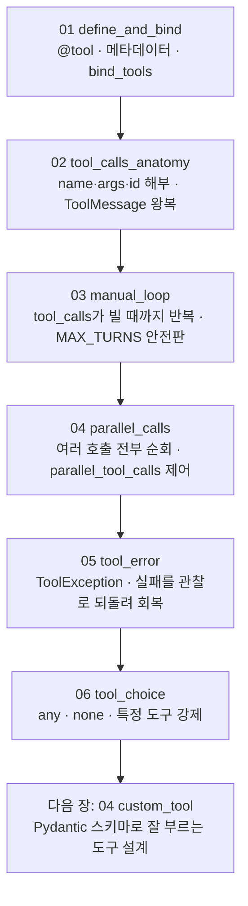

# 03. 도구 호출 (Tool Calling)

앞 장에서 모델을 부르고 메시지를 누적했다면, 이 장에서는 모델이 외부 세계와 손을 잡게 만듭니다. 핵심은 한 가지입니다. 모델은 도구를 **직접 실행하지 않고 "이 도구를 이렇게 불러 달라"고 제안만 합니다.** 실제로 함수를 돌리고 그 결과를 다시 모델에 돌려주는 일은 전적으로 우리 코드의 몫입니다. 함수를 도구로 바꾸는 `@tool`부터, 모델에 도구를 알려 주는 `bind_tools`, 제안이 담기는 `tool_calls` 구조, 결과를 되돌리는 `ToolMessage`, 그 왕복을 반복으로 일반화하는 수동 루프, 다중·병렬 호출, 도구 에러 회복, `tool_choice`로 사용을 강제·금지하는 것까지 한 예제씩 쌓아 올립니다.

이 장은 **하나의 주제마다 독립 실행 파일 하나**로 구성됩니다. 각 `NN_topic.py`는 자기완결이라 단독으로 실행되며, 짝이 되는 `NN_topic.md`가 그 예제만으로 혼자 학습할 수 있는 설계·구동 원리를 담습니다. 번호 순서대로 따라가면 도구 하나를 정의하는 것에서 수동 루프·병렬 제어·에러 회복·`tool_choice`까지 개념이 점점 쌓입니다.

## 학습 목표

- 도구 호출이 모델의 "실행"이 아니라 "제안"임을 설명하고, 제안과 실행을 나눌 때 생기는 통제권(검증·권한 경계·감사)을 말할 수 있다.
- `@tool`로 함수를 도구로 바꾸고, 함수의 이름·docstring·타입 힌트가 어떻게 도구 메타데이터(스키마)가 되는지 설명할 수 있다.
- `bind_tools`로 모델에 도구 목록을 알려 주고, 응답의 `tool_calls`에서 `name`·`args`·`id` 세 필드를 읽을 수 있다.
- 도구를 실행한 결과를 `ToolMessage`로 되돌리고, `tool_call_id`로 결과와 호출을 짝지어 한 번의 왕복을 완성할 수 있다.
- `tool_calls`가 빌 때까지 도는 수동 루프로 다단계 질문을 처리하고, 무한 루프를 막는 안전판(`MAX_TURNS`)의 필요성을 안다.
- 한 응답에 담긴 여러 호출을 전부 순회하고, `parallel_tool_calls`로 병렬 여부를 제어할 수 있다.
- 도구 에러를 예외가 아니라 관찰(`ToolMessage` 내용)로 되돌려 모델이 스스로 회복하게 하고, `tool_choice`로 도구 사용을 강제·금지·지정할 수 있다.

## 실행 방법

```bash
# 레포 루트(ai-agent-dev-lgens)에서
uv sync                       # 최초 1회 (의존성 설치)
cp .env.example .env          # 최초 1회, .env에 OPENAI_API_KEY 입력

# 예제는 하나씩 단독으로 실행합니다.
uv run python 03_tool_calling/01_define_and_bind.py
uv run python 03_tool_calling/02_tool_calls_anatomy.py
# ... 06까지 같은 방식
```

각 파일은 상단에 `load_dotenv()`·`MODEL` 상수·필요한 import·자체 모델 초기화를 모두 갖춰, 다른 파일에 의존하지 않습니다. 키가 없으면 안내만 출력하고 종료하므로, 문법·import 점검은 키 없이도 됩니다(특히 `01`의 STEP 1·2는 모델 없이도 도구 메타데이터와 직접 실행을 보여 줍니다). 공급사를 바꾸려면 각 파일 상단의 `MODEL` 상수만 교체하면 됩니다(기본 `openai:gpt-5.4-mini`).

## 권장 학습 경로

번호 순서대로 보는 것을 권장합니다. 각 예제는 `NN_topic.py`(코드)와 `NN_topic.md`(설계·원리)가 짝을 이룹니다.

| 번호 | 예제 | 한 줄 요약 |
|------|------|-----------|
| 01 | `01_define_and_bind` | `@tool`로 도구 정의·메타데이터 관찰·직접 실행·`bind_tools` |
| 02 | `02_tool_calls_anatomy` | `tool_calls`의 `name`·`args`·`id` 해부, `ToolMessage`로 한 번의 왕복 완성 |
| 03 | `03_manual_loop` | 다단계 질문을 `tool_calls`가 빌 때까지 도는 수동 루프 + `MAX_TURNS` 안전판 |
| 04 | `04_parallel_calls` | 여러 호출 전부 순회, `parallel_tool_calls`로 병렬 제어 |
| 05 | `05_tool_error` | `ToolException`을 `try/except`로 잡아 실패를 관찰로 되돌려 회복 |
| 06 | `06_tool_choice` | `tool_choice`로 도구 사용을 강제(`any`)·금지(`none`)·지정(`<도구명>`) |

01~02가 도구 호출 한 사이클의 뼈대, 03~04가 그 사이클의 반복과 다중 호출, 05~06이 안전과 통제(심화)입니다.

## 챕터 전체 흐름 (다이어그램)

번호를 따라가면 도구 한 개를 정의하는 것에서 한 사이클, 그 반복, 다중 호출, 안전·통제로 개념이 쌓입니다.



## 핵심 점검

이 장이 성공인지 가르는 한 가지 기준은 **`02`에서 도구 실행 결과를 `ToolMessage`로 되돌렸을 때 모델이 비로소 자연어 최종 답을 내는지**입니다.

- **제안과 실행이 분리되어 있는가.** `02`의 STEP 1에서 모델은 답(`content`)을 쓰지 않고 `tool_calls`만 돌려줍니다. 이것은 모델이 도구를 "실행"한 것이 아니라 "제안"한 것입니다. 실제 함수를 돌리는 일은 STEP 3에서 우리 코드가 합니다. 이 분리가 검증·권한 경계·감사라는 통제권의 출발점입니다. 자격 증명은 도구 코드 쪽에만 두고, 위험한 호출(대량 발주·결제·삭제)은 실행 전에 코드가 점검할 수 있습니다.
- **결과를 모델에 돌려주는 책임이 코드에 있는가.** 도구를 한 번 실행했다고 모델이 그 결과를 알아서 가져가지 않습니다. `02`의 STEP 4처럼 결과를 `ToolMessage`로 담아 메시지 목록에 쌓고 다시 `invoke`해야 모델이 결과를 봅니다.
- **`tool_call_id`로 짝을 맞췄는가.** `ToolMessage(tool_call_id=...)`에는 모델이 보낸 `call["id"]`를 글자 그대로 넣어야 합니다. 이 id는 "이 결과가 어느 호출의 답인가"를 묶는 송장 번호와 같아, 여러 호출이 한 응답에 담기는 `04`의 병렬 상황에서 특히 결정적입니다.
- **루프의 종료 조건과 안전판을 둘 다 떠올릴 수 있는가.** `03`의 수동 루프는 `tool_calls`가 빌 때 정상 종료합니다. 그러나 모델이 도구만 계속 부르며 멈추지 않는 비정상 상황도 있으므로, 최대 반복 횟수(`MAX_TURNS`) 안전판을 함께 둡니다. 둘은 막는 상황이 다르므로 어느 하나가 다른 하나를 대신하지 못합니다.
- **네 번째 메시지 — Tool을 만났는가.** 앞 장에서 System·Human·AI 셋을 썼고, 이 장에서 `ToolMessage`를 더해 네 종류를 모두 채웠습니다. 도구를 쓰는 Agent의 한 사이클(모델이 제안하고, 코드가 실행하고, 결과를 돌려주면, 모델이 다시 판단하는 흐름)이 여기서 완성됩니다.

## 흔한 실수 (증상별 진단)

도구 호출은 개념이 단순한 만큼 막상 돌려 보면 **에러로 멈추기보다 조용히 어긋나는** 경우가 더 많습니다. 코드는 멀쩡히 끝나는데 답만 이상하니 더 까다롭습니다. 다행히 막힘은 아래 몇 가지 증상으로 거의 수렴하고, 증상이 곧 사이클의 끊긴 단계를 가리킵니다.

| 증상 | 원인 | 해결 |
|------|------|------|
| 도구가 안 불린다 / `tool_calls`가 비어 있다 | docstring이 모호해 모델이 쓸 상황인 줄 모름, 또는 질문이 도구를 요구하지 않음 | docstring을 "언제 쓰는지" 행동 지시로 명확히, 도구가 꼭 필요한 질문으로 시험(`01`) |
| `tool_calls`가 비어도 오류로 오해한다 | 빈 `tool_calls`는 정상 — 외부 정보가 필요 없는 질문이면 모델이 바로 답함 | 오류가 아님을 이해. `content`에 답이 들어왔는지 확인(`02`) |
| 인자가 틀리게 채워진다 (값이 뒤바뀜·엉뚱함) | 모델은 형식만 맞출 뿐 값의 의미를 보장하지 않음 | `Field(description=...)`로 각 인자의 의미·예시를 못 박음 (다음 장 `04_custom_tool`에서 깊이 다룸) |
| 결과가 최종 답에 반영되지 않는다 | `ToolMessage`의 `tool_call_id`가 호출 `id`와 어긋남 | `call["id"]`를 그대로 `tool_call_id`에 넣어 글자 단위로 일치(`02`) |
| 호출이 여러 개인데 일부 결과가 빠진다 | `ai.tool_calls[0]` 하나만 처리함 | `for call in ai.tool_calls`로 전부 순회, `len(tool_calls)`와 붙인 `ToolMessage` 개수가 같은지 확인(`04`) |
| 도구가 예외를 던지자 프로그램이 죽는다 | 예외를 잡지 않아 루프 전체가 멈춤 | `try/except`로 잡아 실패 메시지를 `ToolMessage` 내용으로 되돌려 "관찰"로 전달(`05`) |
| 루프가 같은 도구를 끝없이 반복한다 | 결과를 못 받아(주로 `tool_call_id` 불일치) 모델이 재요청, 또는 안전판 없음 | 먼저 `tool_call_id` 짝을 확인, 그래도 멈추지 않으면 `MAX_TURNS` 안전판 추가(`03`) |

> 막힘은 대부분 모델 탓이 아니라 위 패턴입니다. "왜 안 되지?" 대신 "사이클의 몇 번째 단계에서 끊겼지?"라고 물으면 점검할 곳이 좁혀집니다. 다음 네 단계를 순서대로 찍으면 블랙박스가 드러납니다. 첫째 `print(ai.tool_calls)`로 도구를 부르긴 했는지, 둘째 `print(result)`로 실행이 값을 돌려줬는지, 셋째 `tool_call_id`와 `call["id"]`를 비교해 짝이 맞는지, 넷째 `messages` 내용에서 `ai`와 모든 `ToolMessage`가 빠짐없이 들었는지 확인합니다. 더 큰 모델로 바꾸기 전에 증상을 표에서 역추적하십시오.

## 더 해보기

- 각 `NN_topic.md`의 "더 해보기" 항목을 따라, 예제를 조금씩 바꿔 가며 동작을 관찰하십시오.
- `.env`에 `GOOGLE_API_KEY`를 넣고 각 파일의 `MODEL`을 `google-genai:gemini-3.5-flash`로 바꿔, 같은 도구 호출 코드가 다른 공급사에서도 도는지 확인하십시오.

## 다음 장

`04_custom_tool` — 이 장에서는 단순한 도구로 호출의 뼈대를 익혔습니다. 다음 장에서는 **모델이 잘 부르는 도구를 설계**합니다. Pydantic 스키마와 `Field(description=...)`로 인자의 의미를 못 박아 "인자가 틀리게 채워지는" 조용한 버그를 막고, 실패도 하나의 관찰로 돌려주는 도구를 만듭니다.
