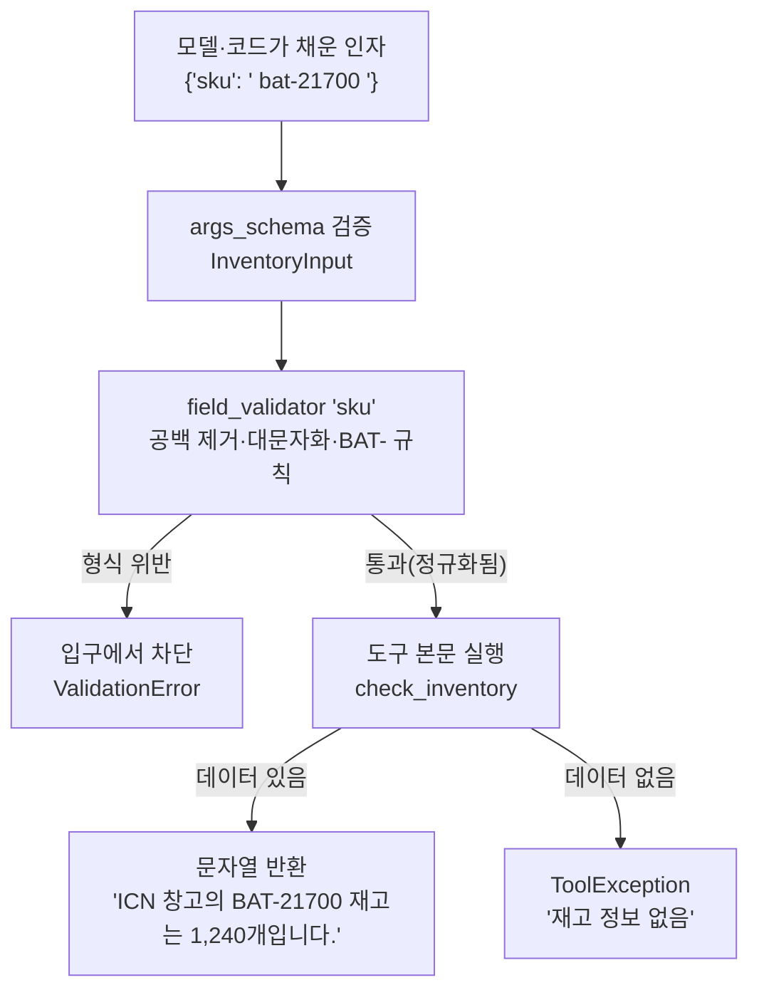

# 01. @tool과 Pydantic args_schema

`01_tool_with_schema.py` 단독 학습 문서입니다. 이 한 파일만으로 모델이 잘 부르는 도구를 정의하고, 잘못된 입력을 도구 입구에서 막는 법을 익힐 수 있습니다.

## 무엇을 하는가

- `@tool`로 일반 파이썬 함수를 LangChain 도구로 바꿉니다.
- 모델이 보는 것은 함수 본문이 아니라 이름·설명·인자 스키마 세 가지뿐임을 확인합니다.
- `args_schema`(Pydantic `BaseModel`)로 인자의 타입·기본값·의미를 명세합니다.
- `field_validator`로 업무 규칙(형식·정규화)을 도구 입구에서 강제합니다.

## 왜 필요한가

도구는 모델에게 능력을 주는 단위입니다. 그런데 모델은 도구의 구현 코드를 보지 못합니다. `@tool`이 추려 넘기는 것은 이름·설명(docstring)·인자 스키마뿐입니다. 그래서 이 세 가지를 잘 적는 일이 곧 "모델이 잘 부르는 도구"의 조건입니다. 또한 모델이 채워 보내는 인자는 늘 옳지 않으므로, 잘못된 입력이 본문 로직에 닿기 전에 입구에서 막아야 안정적입니다. `args_schema`와 `field_validator`가 그 입구의 검문소입니다.

## 설계·구동 원리

- **모델은 명세서만 본다.** `@tool`은 함수의 이름·docstring·인자 스키마만 추려 모델에게 전달합니다. 함수 본문은 보이지 않습니다. 그래서 docstring은 주석이 아니라 모델이 도구를 고르는 유일한 근거이며, "조회한다"가 아니라 "재고 수량을 알아야 할 때 사용한다"처럼 언제 쓰는지를 행동 지시문으로 적습니다.
- **인자는 스키마로 명세한다.** 인자가 둘 이상이거나 기본값·제약·설명이 필요하면, Pydantic `BaseModel`을 `args_schema`로 넘깁니다. `Field(description=...)`의 설명이 각 인자의 의미를 모델에게 알려 주는 문서가 되고, `Field(default=...)`가 기본값을 정합니다. 스키마의 필드 이름과 함수 시그니처의 인자 이름은 일치해야 모델이 채운 값이 함수에 제대로 전달됩니다.
- **입구에서 막는다.** `field_validator`는 도구 본문에 닿기 전 입구에서 실행됩니다. "제품 코드는 `BAT-`로 시작" 같은 업무 규칙을 여기에 모아 두면, 형식이 틀린 입력은 본문 로직을 보기도 전에 차단되고, 정상 입력은 정규화(공백 제거·대문자화)를 거쳐 통과합니다.
- **실패도 관찰 결과로 돌려준다.** 형식은 맞지만 데이터가 없을 때는 예외로 루프를 죽이지 않고 `ToolException`으로 사유를 돌려줍니다. 그러면 모델이 그 메시지를 읽고 인자를 고쳐 재시도하거나 사용자에게 되물을 수 있습니다.

## 구동 흐름 (다이어그램)

입력은 도구 본문에 닿기 전 `args_schema`의 검문소를 통과해야 합니다. 형식이 틀리면 입구에서 막히고, 정상 입력만 정규화를 거쳐 본문으로 들어갑니다.



**구동 원리.** `@tool("check_inventory", args_schema=InventoryInput)`은 함수를 도구로 바꾸면서, 모델에게 보여 줄 명세서를 이름(`check_inventory`)·설명(docstring)·인자 스키마(`InventoryInput`)로 구성합니다. 모델은 이 명세서만 보고 도구를 고르고 인자를 채웁니다. 채워진 인자가 도구로 들어오면, 본문이 실행되기 전에 먼저 `InventoryInput`의 검증을 거칩니다. `field_validator`가 `sku`를 받아 공백을 지우고 대문자로 바꾼 뒤, `BAT-`로 시작하지 않으면 `ValueError`를 던져 입구에서 차단합니다. 통과한 값은 정규화된 형태로 본문에 전달되므로, 본문은 "이미 깨끗한 입력"만 다룹니다. 본문에서 데이터가 없을 때는 그냥 죽지 않고 `ToolException`으로 사유를 돌려주어, 모델이 그 실패를 읽고 회복할 수 있게 합니다. 이렇게 명세(모델이 부르는 근거)와 검증(입구에서 막는 안전망)을 한 도구 안에 함께 둡니다.

## 실행법

```bash
# 레포 루트(ai-agent-dev-lgens)에서
uv sync                       # 최초 1회 (의존성 설치)
uv run python 04_custom_tool/01_tool_with_schema.py
```

이 예제는 LLM을 호출하지 않으므로 API 키 없이도 처음부터 끝까지 동작합니다.

## 예상 출력

```
=== 도구의 정체 (name·description·args) ===
[name]        check_inventory
[description] 지정한 창고의 제품 재고 수량을 조회한다. ...
[args]        {'sku': {...}, 'warehouse': {...}}

=== args_schema 입구 검증 ===
[검증 차단] 1 validation error for InventoryInput ... 제품 코드는 'BAT-'로 시작해야 합니다
[정상 호출] ICN 창고의 BAT-21700 재고는 1,240개입니다.
[데이터 없음] 재고 정보 없음: sku=BAT-21700, warehouse=GWJ
```

## 체크포인트

- `name`·`description`·`args`가 모두 출력되면, 도구가 모델에 어떻게 보이는지 이해한 것입니다.
- 잘못된 `sku`가 입구에서 막히고 정상 입력만 정규화 후 통과하면, `args_schema` 검증을 이해한 것입니다.
- 없는 데이터가 `ToolException`으로 회신되면, 실패를 관찰 결과로 돌려주는 설계를 이해한 것입니다.

## 더 해보기

- `InventoryInput`에 필드를 하나 더 추가(예: `qty_threshold: int = Field(default=0, ...)`)하고, 본문에서 그 값을 쓰도록 바꿔 보십시오.
- `field_validator`의 규칙을 바꿔(예: `BAT-` 대신 `CELL-`) 같은 입력이 어떻게 막히는지 확인하십시오.
- docstring을 한 줄로 줄였다가 다시 늘려 보고, `check_inventory.description`이 어떻게 달라지는지 보십시오.

## 다음 예제

`02_description_routing` — 함수 본문이 같아도 description만 바꾸면 모델의 도구 선택(라우팅)이 어떻게 달라지는지 좋은 예와 빈약한 예로 비교합니다.
