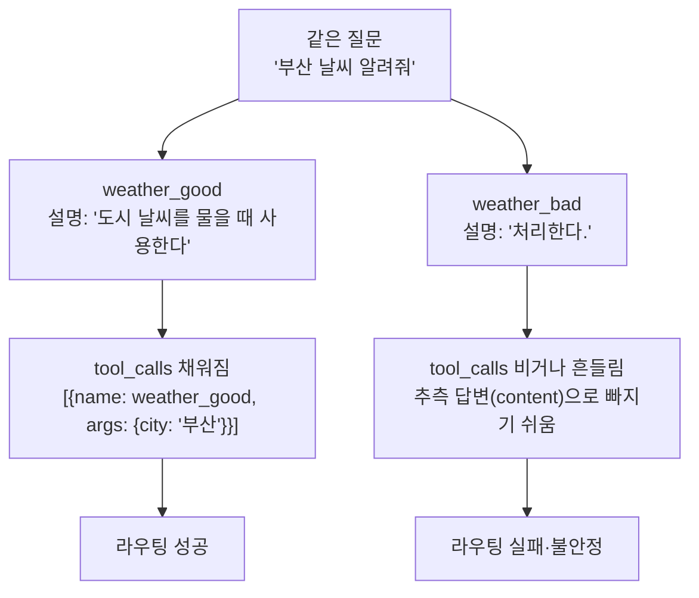

# 02. description이 도구 선택을 좌우한다

`02_description_routing.py` 단독 학습 문서입니다.

## 무엇을 하는가

- 동작이 똑같은 두 도구를 만들되, 하나는 좋은 설명을, 하나는 빈약한 설명을 답니다.
- 같은 질문("부산 날씨 알려줘")을 두 도구에 각각 던져 `tool_calls`를 비교합니다.
- 함수 본문이 같아도 `description`만으로 라우팅이 갈린다는 점을 직접 확인합니다.

## 왜 필요한가

도구를 붙여도 모델이 부르지 않거나, 엉뚱한 도구를 부르는 일이 흔합니다. 원인은 대개 모델 성능이 아니라 설명입니다. 모델은 함수 본문을 보지 못하고 docstring(description)만으로 "이 도구를 언제 쓰는가"를 판단합니다. 그래서 설명을 어떻게 쓰는지가 도구의 성패를 가릅니다. 이 차이를 같은 동작·다른 설명의 두 도구로 눈으로 보면, 이후 모든 도구 설계의 기준이 잡힙니다.

## 설계·구동 원리

- **모델은 docstring으로만 고른다.** `@tool`이 모델에게 넘기는 것은 이름·docstring·인자 스키마뿐입니다. 본문이 아무리 정교해도 설명이 부실하면 모델은 그 도구를 언제 써야 할지 모릅니다.
- **좋은 설명은 "언제 쓰는지"를 행동 지시문으로 적는다.** `weather_good`의 설명은 "특정 도시의 현재 날씨를 조회한다"에 더해 "사용자가 도시 날씨를 물을 때 사용한다"까지 못 박습니다. 모델은 질문 의도와 이 지시문을 매칭해 도구를 정확히 부릅니다.
- **빈약한 설명은 라우팅을 흔든다.** `weather_bad`의 설명은 "처리한다." 한 줄뿐입니다. 무엇을·언제 쓰는지가 없어, 모델은 도구를 부르지 못하고 추측 답변을 내거나(빈 `tool_calls`) 호출이 호출마다 흔들립니다.
- **`bind_tools`는 알림이고 `tool_calls`는 제안이다.** `bind_tools`는 "이 도구들을 쓸 수 있다"고 알릴 뿐 실행하지 않습니다. 모델은 `tool_calls`에 "이 도구를 이렇게 불러 달라"는 제안만 담아 돌려줍니다. 우리는 그 제안 목록을 비교해 라우팅이 살았는지 봅니다.

## 구동 흐름 (다이어그램)

동작이 같은 두 도구라도 모델 눈에 보이는 설명이 다르면, 같은 질문에 대해 `tool_calls`가 갈립니다.



**구동 원리.** `weather_good`과 `weather_bad`는 본문(`return f"{city}: 맑음, 23도"`)이 완전히 같습니다. 다른 것은 docstring뿐입니다. `bind_tools`로 각 도구를 모델에 알려 준 뒤 같은 질문을 던지면, 모델은 함수 본문이 아니라 설명을 읽고 부를지 말지를 정합니다. `weather_good`은 "사용자가 도시 날씨를 물을 때 사용한다"는 행동 지시문이 질문 의도와 맞아떨어져 `tool_calls`에 정확한 호출 제안이 담깁니다. `weather_bad`는 "처리한다."만으로는 언제 쓰는 도구인지 알 수 없어, 모델이 도구를 부르지 못하고 추측 답변으로 빠지거나 호출이 불안정합니다. 즉 라우팅의 근거는 모델의 머릿속이 아니라 우리가 적은 설명이며, "도구는 모델에게 보내는 API 문서"라는 원칙이 여기서 드러납니다.

## 실행법

```bash
uv run python 04_custom_tool/02_description_routing.py
```

키가 없으면 안내만 출력하고 종료합니다.

## 예상 출력

```
=== 좋은 설명 → 라우팅 성공 ===
[좋은 설명] tool_calls: [{'name': 'weather_good', 'args': {'city': '부산'}, 'id': '...'}]

=== 빈약한 설명 → 라우팅 흔들림 ===
[빈약한 설명] tool_calls: []
[빈약한 설명] content : (도구를 부르지 않고 추측한 답변이 나올 수 있음)
```

> 빈약한 설명의 결과는 호출마다 달라질 수 있습니다. 도구를 부르기도, 부르지 않기도 하며, 그 불안정성 자체가 이 예제의 관찰 대상입니다.

## 체크포인트

- 좋은 설명에서 `tool_calls`에 `weather_good` 호출이 담기면, 설명이 라우팅을 이끈 것입니다.
- 빈약한 설명에서 `tool_calls`가 비거나 추측 답변이 나오면, `description`이 곧 모델의 사용 설명서임을 이해한 것입니다.

## 더 해보기

- `weather_bad`의 docstring을 한 줄씩 보강하며("도시 날씨를 조회한다" → "사용자가 특정 도시의 현재 날씨를 물을 때 사용한다") 어느 지점에서 라우팅이 살아나는지 관찰하십시오.
- 질문을 "부산은 우산 챙겨야 해?"처럼 간접적으로 바꿔, 좋은 설명이 그래도 도구를 부르는지 보십시오.
- 같은 코드를 여러 번 실행해, 빈약한 설명의 결과가 호출마다 흔들리는 것을 직접 확인하십시오.

## 다음 예제

`03_multiple_tools` — 여러 도구를 한 모델에 붙였을 때, 모델이 질문 의도에 따라 알맞은 도구를 고르는 다중 라우팅을 수동 도구 루프로 확인합니다.
