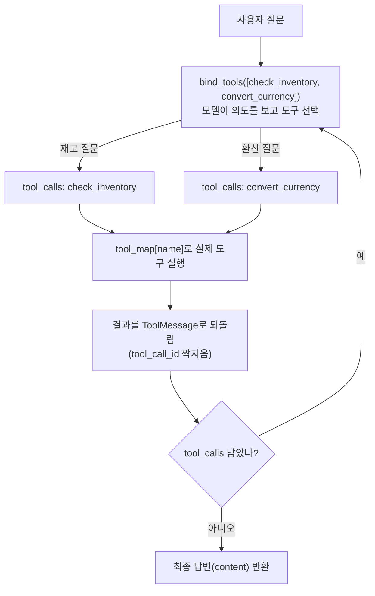

# 03. 여러 Custom Tool과 라우팅

`03_multiple_tools.py` 단독 학습 문서입니다.

## 무엇을 하는가

- 책임이 서로 다른 도구 두 개(`check_inventory`, `convert_currency`)를 정의합니다.
- 두 도구를 한 모델에 함께 붙이고, 질문 의도에 따라 알맞은 도구가 불리는지 봅니다.
- `tool_calls` → 도구 실행 → `ToolMessage` 회신의 왕복을 작은 함수(`run_tool_loop`)로 묶어 재사용합니다.

## 왜 필요한가

실제 비서는 도구 하나로 끝나지 않습니다. 여러 능력을 동시에 갖추고, 질문마다 알맞은 능력을 골라 써야 합니다. 이때 "검색하고 요약하고 환산까지 하는" 만능 도구를 하나 두는 것보다, 단일 책임을 가진 도구 여러 개를 주고 선택은 모델이 하게 하는 편이 안정적입니다. 도구가 작을수록 모델이 언제 부를지 판단하기 쉽고, 실패 지점도 분명해집니다. 이 예제는 그 다중 라우팅이 실제로 도는 모습을 보여 줍니다.

## 설계·구동 원리

- **단일 책임으로 쪼갠다.** `check_inventory`는 재고 조회만, `convert_currency`는 환율 환산만 합니다. 각 도구의 설명에 "언제 쓰는지"를 겹치지 않게 적어, 모델이 둘을 헷갈리지 않게 합니다.
- **여러 도구를 함께 붙인다.** `bind_tools([check_inventory, convert_currency])`로 두 도구를 한 모델에 알려 주면, 모델은 질문을 보고 둘 중 맞는 도구의 호출 제안을 `tool_calls`에 담습니다. 재고 질문이면 `check_inventory`로, 환산 질문이면 `convert_currency`로 갑니다.
- **이름으로 도구를 찾는다.** 모델이 돌려준 `tool_calls`에는 도구 이름이 문자열로 들어 있습니다. `tool_map = {t.name: t for t in tools}`로 이름→도구 사전을 만들어, 요청한 이름에 맞는 실제 도구를 골라 실행합니다.
- **왕복을 루프로 일반화한다.** `run_tool_loop`는 `tool_calls`가 빌 때까지 도구를 실행하고, 결과를 `ToolMessage`로 되돌린 뒤 다시 모델을 부릅니다. `tool_call_id`를 요청 `id`와 똑같이 맞춰야 모델이 결과를 짝지을 수 있습니다. 실패는 `ToolException`을 문자열로 바꿔 결과로 전달해, 모델이 회복할 수 있게 합니다.

## 구동 흐름 (다이어그램)

질문이 들어오면 모델이 도구를 고르고, 코드가 그 도구를 실행해 결과를 되돌립니다. `tool_calls`가 빌 때까지 이 왕복이 반복됩니다.



**구동 원리.** `check_inventory`와 `convert_currency`는 책임이 다른 두 도구입니다. `bind_tools`로 둘을 함께 붙이면, 모델은 질문 의도를 보고 둘 중 하나의 호출 제안을 `tool_calls`에 담습니다. 코드는 그 제안의 이름을 `tool_map`에서 찾아 실제 도구를 실행하고, 결과를 `ToolMessage`로 되돌립니다. 이때 `tool_call_id`를 요청 `id`와 똑같이 맞춰야 모델이 "내가 부른 그 호출의 결과"로 인식합니다. 결과를 받은 모델은 더 부를 도구가 없으면 최종 답변(`content`)을 내고, 남아 있으면 다시 도구를 부릅니다. `run_tool_loop`가 이 왕복을 `tool_calls`가 빌 때까지 반복합니다. 도구가 실패하면 예외로 루프를 죽이지 않고 `ToolException`을 문자열로 바꿔 결과로 전달하므로, 모델이 그 실패를 읽고 사용자에게 되묻거나 인자를 고쳐 재시도할 수 있습니다.

## 실행법

```bash
uv run python 04_custom_tool/03_multiple_tools.py
```

키가 없으면 안내만 출력하고 종료합니다.

## 예상 출력

```
=== 여러 도구 라우팅 ===
[재고] ICN 창고의 BAT-21700 재고는 1,240개입니다.
[환산] 100 USD = 138,000 KRW (또는 같은 뜻의 한국어 문장)
```

## 체크포인트

- 재고 질문과 환산 질문이 서로 다른 도구로 가서 각각 올바른 답이 나오면, 다중 도구 라우팅이 정상입니다.
- 답변에 정확한 수치(재고 1,240개·환산액)가 담기면, `tool_call_id` 짝짓기와 왕복 루프가 제대로 도는 것입니다.

## 더 해보기

- 도구를 하나 더 추가(예: `get_lead_time(sku)` 납기 조회)하고, 세 도구가 각자 맞는 질문에 불리는지 보십시오.
- 두 도구의 설명을 일부러 겹치게(둘 다 "정보를 조회한다") 바꿔, 모델이 엉뚱한 도구를 부르는지 관찰하십시오.
- "BAT-21700 인천 재고를 달러로 환산해줘"처럼 두 도구가 모두 필요한 질문을 던져, 왕복 루프가 여러 번 도는지 확인하십시오.

## 다음 예제

`04_system_prompt_design` — 도구가 "무엇을 할 수 있는가"를 정한다면, 시스템 프롬프트는 모델이 "어떻게 행동하는가"를 정합니다. 네 요소를 갖춘 프롬프트와 안티패턴을 비교합니다.
