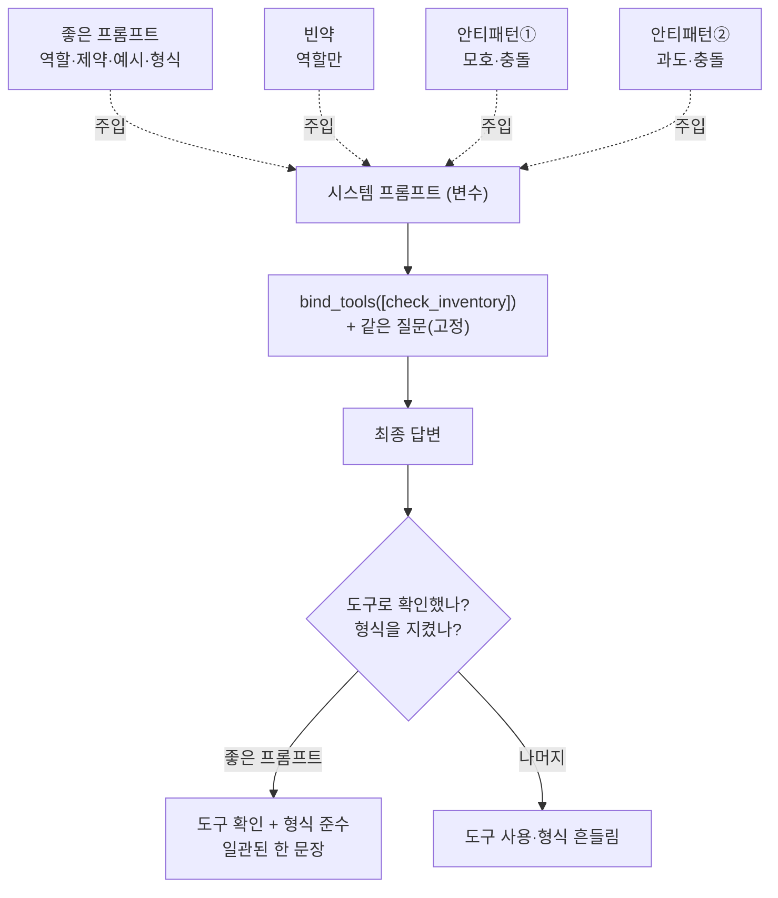

# 04. 시스템 프롬프트 설계

`04_system_prompt_design.py` 단독 학습 문서입니다.

## 무엇을 하는가

- 네 요소(역할·제약·예시·출력 형식)를 갖춘 좋은 시스템 프롬프트를 만듭니다.
- 같은 도구·같은 질문에 빈약한 프롬프트와 두 안티패턴(모호한 지시·과도한 지시)을 차례로 던져 답을 비교합니다.
- 달라지는 변수는 오직 시스템 프롬프트 하나뿐임을 확인합니다.

## 왜 필요한가

좋은 도구를 갖췄어도, 모델이 그 도구를 언제 어떤 태도로 쓸지는 또 다른 문제입니다. 도구는 "무엇을 할 수 있는가"를 정하고, 시스템 프롬프트는 "어떻게 행동해야 하는가"를 정합니다. 둘은 짝입니다. 특히 "추측하지 말고 도구로 먼저 확인하라"는 제약 한 줄이 환각을 크게 줄입니다. 이 예제는 도구와 질문을 고정한 채 프롬프트만 바꿔, 프롬프트가 도구 사용과 답 형식을 어떻게 좌우하는지 한눈에 보여 줍니다.

## 설계·구동 원리

- **시스템 프롬프트는 맨 앞에 둔다.** `SystemMessage`로 표현하며 메시지 목록의 맨 앞에 놓습니다. 모델은 대화를 시작하기 전 이 메시지를 먼저 읽고 자신의 역할과 규칙으로 삼습니다.
- **네 요소를 한두 문장씩 압축한다.** 역할(누구인가)·제약(무엇을 하지 말아야 하는가, 언제 도구를 쓰는가)·예시(좋은 답의 본보기)·출력 형식(길이·언어·단위)입니다. 좋은 프롬프트는 이 넷을 모두 담되 각 요소를 짧게 압축합니다.
- **빈약하면 흔들린다.** 역할만 있고 제약·예시·형식이 빠지면, 모델이 도구를 안 부르고 그럴듯하게 지어내거나 답 형식이 호출마다 제각각입니다.
- **모호한 지시는 기준을 못 잡게 한다.** "알아서 잘", "최대한 자세히/간결히"는 측정 불가능하거나 서로 충돌합니다. "필요하면 도구를 쓰고 아니면 안 써도 된다"처럼 도구 사용 기준이 없으면 호출이 흔들립니다.
- **과도한 지시는 핵심을 묻는다.** 규칙을 스무 개 욱여넣으면 서로 충돌하고 일부가 조용히 무시됩니다. 핵심 서너 개로 압축하고, 충돌 시 무엇이 우선인지 순위를 정하는 편이 낫습니다.

## 구동 흐름 (다이어그램)

도구와 질문은 고정입니다. 시스템 프롬프트만 바꾸면 같은 입력에 대한 도구 사용과 답 형식이 갈립니다.



**구동 원리.** 네 함수는 모두 같은 도구(`check_inventory`)와 같은 질문("BAT-21700 인천 창고 재고 얼마야?")을 씁니다. 유일하게 다른 것은 메시지 맨 앞의 `SystemMessage`입니다. 좋은 프롬프트는 역할로 정체성을 주고, "추측하지 말고 도구로 확인하라"는 제약으로 환각을 누르며, 예시로 답의 본보기를 보이고, 출력 형식으로 "한국어 한 문장, 천 단위 쉼표와 '개'"를 못 박습니다. 그 결과 모델은 도구로 수량을 확인하고 형식까지 지킨 일관된 답을 냅니다. 빈약한 프롬프트는 역할만 있어 도구 사용과 형식이 흔들리고, 모호한 지시는 충돌·측정 불가로 기준을 못 잡으며, 과도한 지시는 규칙이 서로 충돌해 일부가 무시됩니다. 프롬프트는 강제가 아니라 경향의 유도이므로, 정확성이 결정적인 영역에서는 프롬프트만 믿지 말고 코드 안전망을 함께 두어야 합니다(다음 예제들에서 다룹니다).

## 실행법

```bash
uv run python 04_custom_tool/04_system_prompt_design.py
```

키가 없으면 안내만 출력하고 종료합니다.

## 예상 출력

```
=== 좋은 시스템 프롬프트 (역할·제약·예시·형식) ===
[좋은 프롬프트] ICN 창고의 BAT-21700 재고는 1,240개입니다.

=== 빈약한 프롬프트 (역할만) ===
[빈약한 프롬프트] (형식이 들쭉날쭉하거나 도구 없이 추측할 수 있음)

=== 안티패턴 ① 모호한 지시 ===
[모호한 지시] (도구 사용 여부·형식이 호출마다 흔들릴 수 있음)

=== 안티패턴 ② 과도한 지시 ===
[과도한 지시] (충돌하는 규칙으로 일관성 없는 답)
```

> 좋은 프롬프트만 도구 확인과 형식을 안정적으로 지키고, 나머지 셋은 호출마다 결과가 흔들리는 것이 관찰 대상입니다.

## 체크포인트

- 좋은 프롬프트가 도구로 확인하고 형식(쉼표·'개')까지 지킨 한 문장을 내면, 네 요소가 작동한 것입니다.
- 빈약·모호·과도 프롬프트에서 도구 사용·형식이 흔들리면, 시스템 프롬프트 설계의 효과를 이해한 것입니다.

## 더 해보기

- 좋은 프롬프트에서 네 요소를 하나씩 빼며(역할만, 제약만 등) 답이 어떻게 달라지는지 비교해, 어느 요소가 어떤 품질을 책임지는지 체감하십시오.
- 과도한 프롬프트에서 충돌하는 규칙을 지우고 핵심 서너 개로 압축한 뒤, 우선순위 한 줄("정확성을 간결함보다 앞에 둔다")을 더해 일관성이 돌아오는지 보십시오.
- 프롬프트의 도구 이름을 일부러 틀리게(`check_inventory` → `inventory_check`) 적고, 모델이 규칙과 도구를 연결하지 못하는지 확인하십시오.

## 다음 예제

`05_tool_exception_recovery` — 프롬프트가 아무리 좋아도 도구는 실패합니다. `ToolException`으로 실패 사유를 모델에 되돌려, 모델이 지어내지 않고 회복(재질문)하게 만듭니다.
