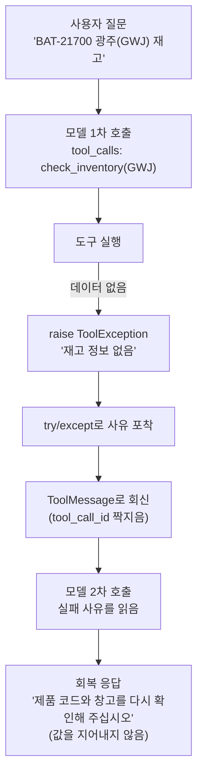

# 05. ToolException으로 실패를 회복시키기

`05_tool_exception_recovery.py` 단독 학습 문서입니다.

## 무엇을 하는가

- 없는 데이터를 만나면 `ToolException`으로 사유를 던지는 도구를 만듭니다.
- LLM 없이도 그 실패 동작(없는 창고 → 예외)을 먼저 확인합니다.
- 일부러 실패를 유발한 뒤, 사유를 `ToolMessage`로 모델에 되돌려 모델이 지어내지 않고 재확인을 요청하게 만듭니다.

## 왜 필요한가

도구는 늘 성공하지 않습니다. 입력이 형식은 맞지만 데이터가 없거나, 외부 시스템이 잠시 응답하지 않을 수 있습니다. 이때 예외를 그냥 던져 루프를 죽이면 Agent 전체가 멈춥니다. 반대로 도구가 빈 값을 슬그머니 돌려주면 모델은 그것을 사실로 착각해 답을 지어냅니다. 해법은 "실패도 하나의 관찰 결과"로 다루는 것입니다. 실패 사유를 모델이 읽을 수 있는 메시지로 돌려주면, 모델은 그것을 읽고 사용자에게 되묻거나 인자를 고쳐 재시도합니다.

## 설계·구동 원리

- **실패는 `ToolException`으로 던진다.** 데이터가 없을 때 `raise ToolException("재고 정보 없음: ...")`처럼 사유를 담아 던집니다. 이 메시지는 사람이 아니라 모델에게 전달될 안내문이므로, 무엇이 왜 실패했는지를 분명히 적습니다.
- **사유를 `ToolMessage`로 되돌린다.** 도구 실행을 `try/except`로 감싸 `ToolException`을 잡고, 그 문자열을 `ToolMessage`로 만들어 메시지 목록에 넣습니다. `tool_call_id`를 요청 `id`와 똑같이 맞춰야 모델이 "그 호출의 결과(실패)"로 인식합니다.
- **모델이 회복한다.** 실패 사유가 담긴 메시지로 모델을 다시 부르면, 모델은 그 사유를 읽고 답을 지어내는 대신 사용자에게 "제품 코드와 창고를 다시 확인해 달라"고 되묻습니다. 시스템 프롬프트에 "실패하면 지어내지 말고 재확인을 요청하라"는 규칙을 함께 두면 이 회복이 더 안정적입니다.
- **프롬프트와 코드를 함께 쓴다.** 시스템 프롬프트가 회복 방향을 잡고(1차), 도구가 실패를 의미 있는 메시지로 돌려주는 구조가 그 회복을 가능하게 합니다(2차). 둘이 짝일 때 모델이 스스로 멈추고 되묻을 줄 알게 됩니다.

## 구동 흐름 (다이어그램)

실패가 루프를 죽이지 않습니다. 사유가 관찰 결과로 모델에 돌아가고, 모델은 그것을 읽고 회복합니다.



**구동 원리.** `check_inventory`는 데이터가 없는 조합(광주 창고)을 만나면 빈 값을 돌려주는 대신 `ToolException`으로 사유를 던집니다. 모델이 광주 창고로 도구를 부르면, 코드는 도구 실행을 `try/except`로 감싸 그 예외를 잡고, 사유 문자열을 `ToolMessage`로 만들어 모델에 되돌립니다. 이때 `tool_call_id`를 요청 `id`와 일치시켜 모델이 "내가 부른 그 호출의 결과"로 인식하게 합니다. 사유를 받은 모델은 답을 지어내는 대신, 시스템 프롬프트의 "지어내지 말고 재확인을 요청하라"는 규칙에 따라 사용자에게 제품 코드와 창고를 다시 확인해 달라고 되묻습니다. 이렇게 실패를 죽이지 않고 관찰 결과로 돌려주면, Agent는 막다른 길에서 멈추는 대신 스스로 회복합니다.

## 실행법

```bash
uv run python 04_custom_tool/05_tool_exception_recovery.py
```

도구의 실패 동작은 키 없이도 확인할 수 있고, LLM 회복 루프는 키가 있을 때만 실행됩니다.

## 예상 출력

```
=== 도구의 실패 동작 (키 불필요) ===
[정상]  ICN 창고의 BAT-21700 재고는 1,240개입니다.
[실패]  재고 정보 없음: sku=BAT-21700, warehouse=GWJ

=== ToolException 회복 루프 (LLM) ===
[1차 호출 요청] [{'name': 'check_inventory', 'args': {'sku': 'BAT-21700', 'warehouse': 'GWJ'}, ...}]
[도구 실패] 재고 정보 없음: sku=BAT-21700, warehouse=GWJ
[회복 응답] 제품 코드와 창고를 다시 확인해 주십시오. ...
```

## 체크포인트

- 없는 창고가 `ToolException`으로 사유를 돌려주면, 실패를 관찰 결과로 다룰 준비가 된 것입니다.
- 도구 실패 후 모델이 값을 지어내지 않고 재확인을 요청하면, `ToolException` 기반 회복 루프가 정상 동작하는 것입니다.

## 더 해보기

- 시스템 프롬프트에서 "지어내지 말고 재확인을 요청하라" 규칙을 지운 뒤, 모델이 값을 지어내는지 비교하십시오.
- `_STOCK`에 광주(GWJ) 데이터를 추가하면 회복 대신 정상 답이 나오는지 확인하십시오.
- 도구 안의 `ToolException` 메시지를 더 친절하게(예: 지원하는 창고 목록을 함께 안내) 바꿔, 모델의 회복 답이 달라지는지 보십시오.

## 다음 예제

`06_approval_gate` — 실패 회복으로도 막을 수 없는 것이 있습니다. 되돌릴 수 없는 작업(재고 차감 등)은 프롬프트가 아니라 코드 가드(승인 게이트)로 막습니다.
