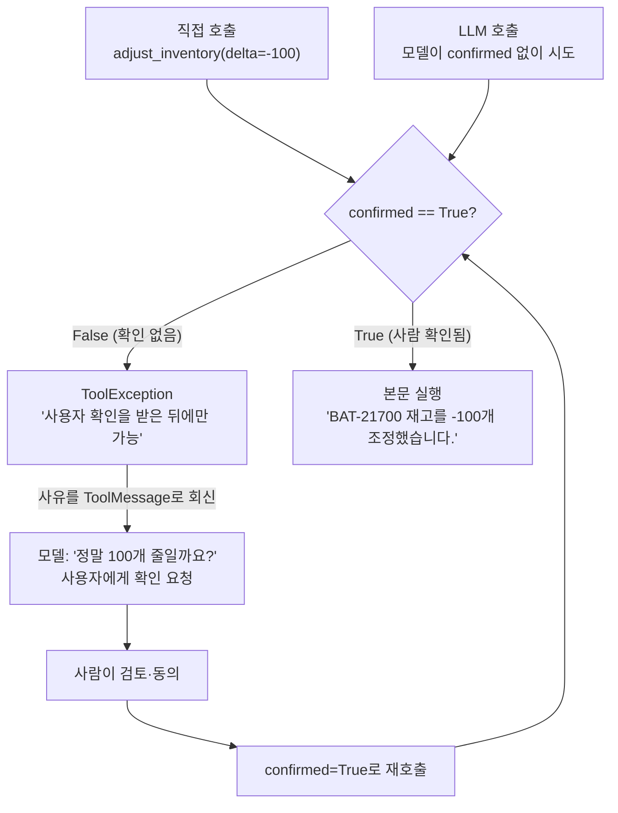

# 06. 승인 게이트 (코드 가드)

`06_approval_gate.py` 단독 학습 문서입니다.

## 무엇을 하는가

- 되돌릴 수 없는 작업(재고 차감)을 `confirmed=True`일 때만 실행하는 도구를 만듭니다.
- LLM 없이도 코드 가드가 `confirmed` 없는 호출을 막는지 확인합니다.
- LLM 경로에서 모델이 `confirmed` 없이 부르면 게이트에 막히고, 그 사유로 사용자에게 확인을 요청하는 과정을 봅니다.

## 왜 필요한가

메일 발송·결제·재고 변경·삭제처럼 한 번 실행하면 되돌리기 어려운 작업이 있습니다. 이런 작업을 모델의 판단에만 맡기면 위험합니다. 시스템 프롬프트에 "확인 없이 실행하지 마라"라고 적어도 100% 지켜지지 않습니다. 프롬프트는 강한 강제가 아니라 경향의 유도이기 때문입니다. 또 사용자가 직접 잘못 부를 수도 있습니다. 그래서 정확성·안전이 결정적인 작업은 프롬프트 바깥, 즉 코드 안에서 한 번 더 막아야 합니다. 이것이 승인 게이트입니다.

## 설계·구동 원리

- **게이트를 도구 안에 박는다.** `adjust_inventory`는 `confirmed` 인자를 받아, `confirmed`가 `False`이면 본문을 실행하지 않고 `ToolException`을 던집니다. 이 검문은 모델이 아니라 코드 안에 있으므로, 모델이 프롬프트를 어겨도, 사용자가 직접 호출해도 똑같이 작동합니다.
- **프롬프트는 1차, 코드는 2차 방어선이다.** 시스템 프롬프트에 "변경 전에 사용자 확인을 받아라"를 두어 모델이 먼저 확인을 요청하도록 유도합니다(1차). 그래도 모델이 `confirmed` 없이 부르면 코드 가드가 막습니다(2차). 두 겹이 함께 위험을 다스립니다.
- **막힘이 회복으로 이어진다.** 게이트가 막으면 그 사유를 `ToolMessage`로 모델에 되돌립니다. 모델은 그 사유를 읽고 사용자에게 "정말 변경할까요?"라고 확인을 요청합니다. 즉 게이트는 단순히 거부만 하는 것이 아니라, 사람의 확인을 받는 흐름을 만들어 줍니다.
- **실제 실행은 사람 확인 뒤에만.** 사용자가 동의하면, 사람이 검토한 뒤에 `confirmed=True`로 실제 실행합니다. 실무에서는 이 자리에 버튼 클릭·승인 API 같은 사람의 명시적 확인이 들어갑니다.

## 구동 흐름 (다이어그램)

`confirmed` 없는 호출은 경로가 무엇이든 게이트에서 막힙니다. 사람의 확인을 거친 호출만 본문에 닿습니다.



**구동 원리.** `adjust_inventory`는 본문 첫 줄에서 `confirmed` 값을 검사합니다. `confirmed`가 없거나 `False`이면 `ToolException`을 던져 본문에 닿기 전에 막습니다. 이 검문은 코드 안에 있으므로, 모델이 부르든 사람이 직접 부르든 동일하게 작동합니다. LLM 경로에서는 시스템 프롬프트가 모델에게 "변경 전 확인을 받아라"를 먼저 유도하지만(1차 방어선), 모델이 그래도 `confirmed` 없이 부르면 코드 가드가 막습니다(2차 방어선). 막힌 사유는 `ToolMessage`로 모델에 돌아가고, 모델은 그것을 읽고 사용자에게 변경 여부를 되묻습니다. 사용자가 동의하면 사람이 검토한 뒤 `confirmed=True`로 다시 호출하고, 그제야 게이트를 통과해 본문이 실행됩니다. 프롬프트는 행동의 방향을 잡되, 절대 어기면 안 되는 것은 코드로 막는다는 원칙이 이 게이트에 담겨 있습니다.

## 실행법

```bash
uv run python 04_custom_tool/06_approval_gate.py
```

코드 가드는 키 없이도 시연되고, LLM 경로는 키가 있을 때만 실행됩니다.

## 예상 출력

```
=== 승인 게이트 코드 가드 (키 불필요) ===
[코드 가드] confirmed 없이 직접 호출 (차단되어야 정상)
  가드 작동: 재고 변경은 confirmed=True로 사용자 확인을 받은 뒤에만 가능합니다
[사용자 승인 후 실행] BAT-21700 재고를 -100개 조정했습니다.

=== 승인 게이트 (LLM 경로) ===
[모델 1차] tool_calls: [...]
[모델 1차] content  : (변경 내용을 알리며 확인을 요청할 수 있음)
[게이트 후 응답] 정말 BAT-21700 재고를 100개 줄일까요? ...
[사용자 승인 후 실행] BAT-21700 재고를 -100개 조정했습니다.
```

## 체크포인트

- `confirmed` 없는 호출이 막히고 `confirmed=True`일 때만 실행되면, 코드 가드가 정상입니다.
- LLM 경로에서도 모델이 불러도 막히고, 확인을 요청한 뒤에야 실행되면 승인 게이트가 정상입니다.

## 더 해보기

- 시스템 프롬프트에서 "확인을 받아라" 규칙을 지운 뒤, 그래도 코드 가드가 막는지 확인하십시오(프롬프트와 무관함을 체감).
- `delta`가 음수일 때만(차감일 때만) 승인을 요구하고 양수(입고)는 바로 실행하도록 가드를 바꿔 보십시오.
- 게이트가 막을 때 돌려주는 사유에 "변경하려면 confirmed=True로 다시 요청하세요"를 더해, 모델의 확인 요청이 더 명확해지는지 보십시오.

## 다음 장

`05_langgraph_workflow` — 지금까지는 도구 실행 루프와 승인 게이트를 손으로 돌렸습니다. 다음 장에서는 이 흐름을 LangGraph의 상태·노드·엣지로 그래프화해, 분기·반복과 검증·승인 같은 안전 노드를 흐름 안에 명시적으로 박아 넣습니다.
