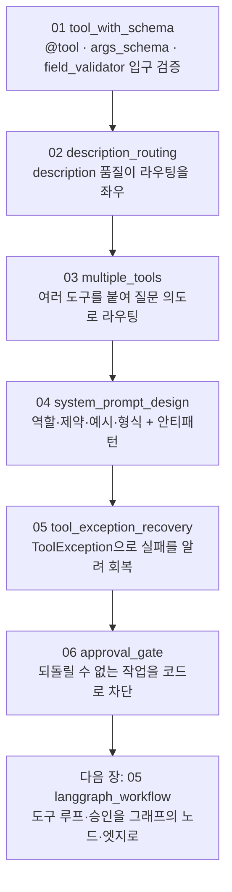

# 04. Custom Tool 개발과 시스템 프롬프트 설계

도구로 모델에게 능력을 주는 것과, 시스템 프롬프트로 그 능력을 어떻게 쓸지 다스리는 것을 함께 익히는 장입니다. 앞 장에서 도구 호출(`tool_calls`)과 도구 결과(`ToolMessage`)로 외부 시스템과 상호작용하는 법을 배웠다면, 이 장에서는 한 단계 더 들어갑니다. 모델이 잘 부르는 도구를 직접 설계하고(`args_schema`로 입력을 명세하고 description으로 라우팅을 이끌고), 시스템 프롬프트의 네 요소로 행동을 다스리며, 도구가 실패할 때 회복시키고, 되돌릴 수 없는 작업을 코드로 막는 승인 게이트까지 다룹니다.

핵심 한 줄은 이것입니다. **도구는 모델이 "무엇을 할 수 있는가"를 정하고, 시스템 프롬프트는 모델이 "어떻게 행동해야 하는가"를 정합니다.** 둘은 짝이며, 정확성이 결정적인 곳에서는 프롬프트만 믿지 않고 코드 안전망을 함께 둡니다.

이 장은 **하나의 주제마다 독립 실행 파일 하나**로 구성됩니다. 각 `NN_topic.py`는 자기완결이라 단독으로 실행되며, 짝이 되는 `NN_topic.md`가 그 예제만으로 혼자 학습할 수 있는 설계·구동 원리를 담습니다. 번호 순서대로 따라가면 도구 정의에서 승인 게이트까지 개념이 점점 쌓입니다.

## 학습 목표

- `@tool`이 모델에게 넘기는 세 가지(이름·description·인자 스키마)만으로 도구가 어떻게 보이는지 설명할 수 있다.
- `args_schema`(Pydantic)와 `field_validator`로 입력의 타입·기본값·의미·검증 규칙을 도구 입구에서 강제할 수 있다.
- description(docstring)이 모델의 도구 선택(라우팅)을 좌우함을 좋은 예와 빈약한 예로 비교해 보일 수 있다.
- 여러 Custom Tool을 한 모델에 붙여 질문 의도에 따라 알맞은 도구로 라우팅할 수 있다.
- 시스템 프롬프트의 네 요소(역할·제약·예시·출력 형식)를 갖춘 프롬프트를 작성하고, 모호·과도 같은 안티패턴을 식별할 수 있다.
- `ToolException`으로 실패를 모델에 되돌려 회복(재질문·재시도)시킬 수 있다.
- 되돌릴 수 없는 작업을 프롬프트가 아니라 코드 가드(승인 게이트)로 막을 수 있다.

## 실행 방법

```bash
# 레포 루트(ai-agent-dev-lgens)에서
uv sync                       # 최초 1회 (의존성 설치)
cp .env.example .env          # 최초 1회, .env에 OPENAI_API_KEY 입력

# 예제는 하나씩 단독으로 실행합니다.
uv run python 04_custom_tool/01_tool_with_schema.py
uv run python 04_custom_tool/02_description_routing.py
# ... 06까지 같은 방식
```

각 파일은 상단에 `load_dotenv()`·`MODEL` 상수·필요한 import·자체 모델 초기화를 모두 갖춰, 다른 파일에 의존하지 않습니다. 도구 정의·입구 검증·승인 게이트의 코드 가드(01·05·06의 일부)는 LLM 호출 없이도 동작하고, LLM이 필요한 부분은 키가 없으면 안내만 출력하고 건너뜁니다. 공급사를 바꾸려면 각 파일 상단의 `MODEL` 상수만 교체하면 됩니다(기본 `openai:gpt-5.4-mini`).

## 권장 학습 경로

번호 순서대로 보는 것을 권장합니다. 각 예제는 `NN_topic.py`(코드)와 `NN_topic.md`(설계·원리)가 짝을 이룹니다.

| 번호 | 예제 | 한 줄 요약 | 키 필요 |
|------|------|-----------|---------|
| 01 | `01_tool_with_schema` | `@tool` + Pydantic `args_schema` + `field_validator` 입구 검증 | 불필요 |
| 02 | `02_description_routing` | description 품질이 라우팅을 좌우 (좋은 예 vs 빈약한 예) | 필요 |
| 03 | `03_multiple_tools` | 여러 Custom Tool을 붙여 질문 의도로 라우팅 | 필요 |
| 04 | `04_system_prompt_design` | 시스템 프롬프트 네 요소(역할·제약·예시·형식) + 안티패턴 | 필요 |
| 05 | `05_tool_exception_recovery` | `ToolException`으로 실패를 알려 회복(재질문) | 일부 |
| 06 | `06_approval_gate` | 되돌릴 수 없는 작업을 코드 가드(승인 게이트)로 차단 | 일부 |

01이 도구 정의·검증, 02~03이 description과 다중 라우팅, 04가 시스템 프롬프트 설계, 05~06이 실패 회복과 안전망입니다.

## 챕터 전체 흐름 (다이어그램)

번호를 따라가면 도구 정의의 토대 위에 라우팅·프롬프트·실패 회복·안전망이 차례로 쌓입니다.



## 핵심 점검

이 장이 성공인지 가르는 한 가지 기준은 **`02_description_routing`에서 description만 바꿨을 때 라우팅이 달라지는지**입니다. 함수 본문이 같아도 모델 눈에 보이는 명세서(이름·설명·인자)의 차이가 도구가 불릴지 말지를 가른다는 점을 직접 확인하면, 이 장의 절반을 이해한 것입니다.

- **모델은 함수 본문을 못 본다.** `@tool`은 이름·description·인자 스키마 세 가지만 추려 모델에 넘깁니다. 그래서 description은 주석이 아니라 모델이 도구를 고르는 유일한 근거이며, "검색한다"가 아니라 "어떤 질문일 때 무엇을 돌려준다"처럼 언제 쓰는지를 행동 지시문으로 적어야 합니다.
- **입력은 입구에서 막는다.** `args_schema`(Pydantic)는 타입·기본값·`Field(description=...)`을 모델에 노출하는 동시에, 본문 로직에 닿기 전 입구에서 형식을 강제합니다. 업무 규칙(예: 제품 코드는 `BAT-`로 시작)까지 `field_validator`로 한곳에 모아 두면 재사용·테스트가 쉽습니다.
- **시스템 프롬프트는 네 요소다.** 역할(누구인가)·제약(무엇을 하지 말아야 하는가, 언제 도구를 쓰는가)·예시(좋은 답의 본보기)·출력 형식(어떻게 답하는가). 특히 "추측하지 말고 도구로 먼저 확인하라"는 제약 한 줄이 환각을 크게 줄입니다. 각 요소는 한두 문장으로 압축합니다.
- **프롬프트는 강제가 아니라 경향의 유도다.** 그래서 정확성이 결정적인 영역에서는 프롬프트를 1차 방어선으로 두되, 코드 검증을 2차 방어선으로 둡니다. `06_approval_gate`의 승인 게이트가 바로 그 코드 안전망입니다.
- **실패도 하나의 관찰 결과다.** 도구가 실패할 때 예외로 루프를 죽이지 않고 `ToolException`으로 사유를 돌려주면, 모델은 그 메시지를 읽고 사용자에게 되묻거나 인자를 고쳐 재시도합니다.

## 흔한 실수 (증상별 진단)

| 증상 | 원인 | 해결 |
|------|------|------|
| 도구가 있어도 안 불린다 | description이 모호함("처리한다") | "어떤 질문일 때 무엇을 돌려준다"로 행동 지시문화 |
| 엉뚱한 도구를 부른다 | 여러 도구의 설명이 서로 겹침 | 각 도구의 사용 시나리오를 겹치지 않게 명시 |
| 모델이 인자를 추측한다 | 타입만 있고 의미가 안 드러남 | `Field(description=...)`로 인자 의미를 명시 |
| 잘못된 입력이 본문까지 들어온다 | 입구 검증이 없음 | `args_schema` + `field_validator`로 입구에서 차단 |
| 답의 길이·어조가 호출마다 다르다 | 출력 형식 미지정 | 시스템 프롬프트에 길이·언어·단위 형식 명시 |
| 규칙을 자꾸 무시한다 | 규칙이 너무 많거나 서로 충돌 | 핵심 서너 개로 압축하고 우선순위를 정함 |
| 프롬프트 규칙과 도구가 안 이어진다 | 프롬프트의 도구 이름 철자가 실제와 다름 | 도구 이름을 바꾸면 프롬프트 언급도 함께 수정 |
| 도구 실패 시 값을 지어낸다 | 예외를 그냥 흘려보냄 | `ToolException`으로 사유를 모델에 회신 |
| 위험 작업이 프롬프트만으로 막히지 않는다 | 프롬프트는 강제가 아님 | `confirmed` 같은 코드 가드(승인 게이트) 추가 |

> 막힘은 대부분 모델 탓이 아니라 위 패턴입니다. 더 큰 모델로 바꾸기 전에 증상을 표에서 역추적하십시오. 도구가 안 불리면 description을, 형식이 흔들리면 시스템 프롬프트를, 위험 작업이면 코드 가드를 먼저 봅니다.

## 더 해보기

- 각 `NN_topic.md`의 "더 해보기" 항목을 따라, 예제를 조금씩 바꿔 가며 동작을 관찰하십시오.
- `02_description_routing`의 빈약한 docstring을 한 줄씩 보강하며 어느 지점에서 라우팅이 살아나는지 보십시오.
- `04_system_prompt_design`의 좋은 프롬프트에서 네 요소를 하나씩 빼며, 어느 요소가 어떤 품질을 책임지는지 체감하십시오.
- `.env`에 `GOOGLE_API_KEY`를 넣고 각 파일의 `MODEL`을 `google-genai:gemini-3.5-flash`로 바꿔, 같은 도구·프롬프트 설계가 다른 공급사에서도 도는지 확인하십시오.

## 다음 장

`05_langgraph_workflow` — 지금까지는 도구 실행 루프와 승인 게이트를 손으로 돌렸습니다(`run_tool_loop`). 다음 장에서는 이 흐름을 **LangGraph의 상태·노드·엣지로 그래프화**해, 분기와 반복을 명시적으로 설계하고 상한·검증·승인 같은 안전 노드를 흐름 안에 박아 넣습니다.
