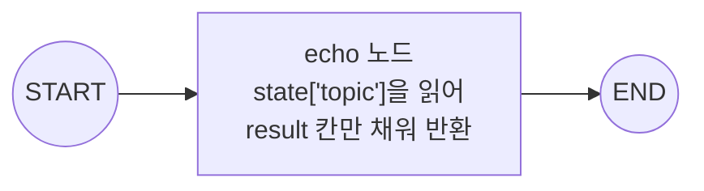
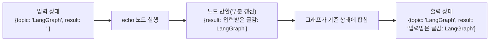

# 01. 상태(State)와 최소 그래프

`01_state_and_graph.py` 단독 학습 문서입니다. 이 한 파일만으로 LangGraph 그래프의 뼈대를 익힐 수 있습니다.

## 무엇을 하는가

- `TypedDict`로 상태(State)의 칸(키)을 미리 선언합니다.
- `StateGraph`로 빌더를 만들고 노드 하나를 등록합니다.
- `START`에서 노드로, 노드에서 `END`로 엣지를 잇습니다.
- `compile`로 실행 가능한 그래프를 만들고 `invoke`로 한 번 돌립니다.

## 왜 필요한가

직선으로 이어지는 체인과 달리, 실제 에이전트는 "상황을 보고 길을 정하고 필요하면 되돌아가는" 흐름을 가집니다. LangGraph는 이런 흐름을 상태·노드·엣지 세 가지로 표현합니다. 이 장의 모든 예제가 이 뼈대 위에 한 조각씩 얹히므로, 가장 작은 그래프부터 손으로 돌려 보아야 다음 개념이 자연스럽게 쌓입니다.

## 설계·구동 원리

- **State는 노드들이 함께 쓰는 작업판.** 회의실 화이트보드처럼, 그래프가 도는 동안 노드들이 같은 보드를 보며 각자 맡은 칸을 채웁니다. `TypedDict`로 어떤 칸을 둘지 미리 선언합니다(여기서는 `topic`·`result`).
- **Node는 바뀐 부분만 돌려준다.** 노드 함수는 현재 상태를 입력으로 받지만, 반환할 때는 전체 상태를 다시 조립할 필요 없이 자기가 채운 칸만 딕셔너리로 돌려줍니다. 부분 갱신을 기존 상태에 합치는 일은 그래프가 맡습니다.
- **Edge가 곧 실행 순서.** `START`는 입력이 들어오는 진입점, `END`는 워크플로우의 종착점을 나타내는 특수 노드입니다. `add_edge(START, "echo")`처럼 일반 노드를 잇듯 연결합니다.
- **compile해야 실행된다.** `compile()`은 끊긴 노드가 없는지 같은 구조 기본 검사를 수행해 실행 가능한 그래프를 만듭니다. 컴파일하지 않으면 `invoke`할 수 없습니다.

## 구동 흐름 (다이어그램)

`START`에서 출발해 `echo` 노드를 거쳐 `END`로 끝나는, 노드 하나짜리 최소 그래프입니다. 노드는 상태의 `result` 칸만 채워 돌려줍니다.



상태가 노드를 지나며 어떻게 채워지는지 따로 보면 다음과 같습니다.



**구동 원리.** `StateGraph(State)`는 상태 스키마를 받아 그래프 빌더를 만듭니다. `add_node("echo", echo)`로 함수에 이름을 붙여 등록하고, `add_edge(START, "echo")`와 `add_edge("echo", END)`로 진입점과 종착점을 잇습니다. 엣지가 곧 실행 순서라서, `START`에서 들어온 입력이 `echo`를 거쳐 `END`로 빠져나갑니다. `echo`는 상태 전체가 아니라 자기가 채울 `result` 칸만 딕셔너리로 돌려주고, 그 부분 갱신을 기존 상태에 합치는 일은 그래프가 맡습니다. 입력의 `topic` 칸은 노드가 손대지 않았으므로 그대로 남습니다. 마지막으로 `compile()`이 설계도를 실행 가능한 그래프로 바꾸어야 `invoke`로 돌릴 수 있습니다.

## 실행법

```bash
# 레포 루트(ai-agent-dev-lgens)에서
uv sync                       # 최초 1회 (의존성 설치)
uv run python 05_langgraph_workflow/01_state_and_graph.py
```

이 예제는 모델을 부르지 않으므로 API 키 없이도 그대로 돕니다.

## 예상 출력

```
입력 글감: LangGraph
노드 산출물: 입력받은 글감: LangGraph
```

## 체크포인트

- State에 어떤 칸을 둘지부터 정한다는 점을 이해하면 출발 준비가 된 것입니다.
- 모델 없이도 `START → echo → END`가 돌아 `result`가 채워지면 그래프 뼈대를 이해한 것입니다.
- 노드가 상태 전체가 아니라 "바뀐 칸(`result`)"만 돌려준다는 점이 핵심입니다.

## 더 해보기

- `echo` 노드가 `topic` 칸도 함께 바꿔 돌려주도록 고쳐, 입력 칸이 갱신되는지 확인하십시오.
- `add_edge("echo", END)` 한 줄을 지우고 컴파일해, 끊긴 그래프를 만들면 어떤 일이 일어나는지 보십시오.
- State에 칸을 하나 더(`note: str`) 추가하고, 노드가 그 칸도 채우도록 늘려 보십시오.

## 다음 예제

`02_nodes_and_edges` — 노드를 여러 개로 늘리고, 엣지로 실행 순서를 잇습니다. 엣지로 잇지 않은 노드는 실행되지 않는다는 점을 직접 확인합니다.
