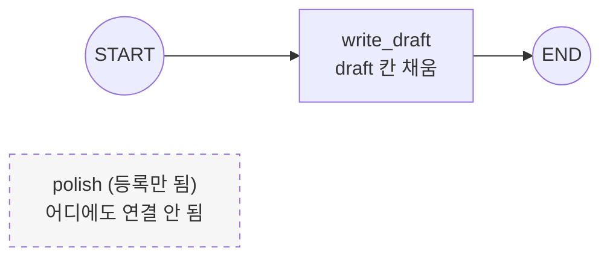
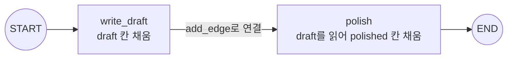

# 02. 노드 여러 개와 엣지 연결

`02_nodes_and_edges.py` 단독 학습 문서입니다.

## 무엇을 하는가

- 한 노드에 다 몰아넣지 않고, 단계를 노드 둘(`write_draft`·`polish`)로 쪼갭니다.
- 엣지로 잇지 않은 노드는 실행되지 않음을 먼저 확인합니다.
- 엣지 한 줄(`write_draft → polish`)로 두 노드를 직선으로 잇습니다.
- 앞 노드가 채운 칸(`draft`)을 뒤 노드가 받아 다음 칸(`polished`)을 채웁니다.

## 왜 필요한가

작업을 한 노드에 몰아넣으면 흐름이 한눈에 보이지 않고 고치기도 어렵습니다. 단계를 노드로 쪼개면 각 단계가 무엇을 하는지 또렷해지고, 엣지만 다시 이어 순서를 바꿀 수 있습니다. 여기서 "엣지가 곧 실행 순서"라는 감각을 잡아 두면, 다음 예제의 조건부 분기가 왜 엣지를 갈아 끼우는 일인지 자연스럽게 이해됩니다.

## 설계·구동 원리

- **노드를 등록해도 엣지로 잇지 않으면 실행되지 않는다.** 첫 부분에서는 `polish`를 `add_node`로 등록만 하고 `START`는 `write_draft`에만 잇습니다. 그래서 `polish`는 정의되어 있어도 호출되지 않고, `polished` 칸은 비어 있습니다.
- **엣지 한 줄이 두 노드를 잇는다.** 둘째 부분에서 달라지는 것은 `add_edge("write_draft", "polish")` 한 줄뿐입니다. 이 한 줄로 1단계 다음에 2단계가 실행되도록 순서가 생깁니다.
- **앞 노드의 산출물이 뒤 노드의 입력이 된다.** 두 노드는 같은 상태(작업판)를 공유합니다. `write_draft`가 채운 `draft` 칸을 `polish`가 읽어 다듬은 결과를 `polished` 칸에 적습니다. 노드 사이에 값을 전달해야 하므로 상태에 칸을 단계별로 둡니다.

## 구동 흐름 (다이어그램)

엣지로 잇지 않은 노드는 그래프 어디에도 연결되지 않아 실행되지 않습니다.



엣지 한 줄을 더하면 두 노드가 직선으로 이어지고, `draft`를 `polish`가 받아 `polished`를 채웁니다.



**구동 원리.** 노드는 같은 상태를 공유하는 작업 단위입니다. 첫 부분에서 `polish`는 `add_node`로 등록만 되었을 뿐 어떤 엣지로도 이어지지 않아, 그래프가 도달할 길이 없어 실행되지 않습니다. 그래서 `polished` 칸은 빈 채로 남습니다. 둘째 부분에서 `add_edge("write_draft", "polish")` 한 줄을 더하면 `write_draft` 다음에 `polish`가 오도록 실행 순서가 생깁니다. `write_draft`는 주제로 초안을 만들어 `draft` 칸을 채우고, `polish`는 그 `draft`를 읽어 다듬은 결과를 `polished` 칸에 적습니다. 두 노드가 같은 상태(작업판)를 보며 각자 맡은 칸을 채우므로, 앞 노드의 산출물이 자연스럽게 뒤 노드의 입력이 됩니다. 엣지를 더 이어 붙이면 단계를 얼마든지 늘릴 수 있습니다.

## 실행법

```bash
uv run python 05_langgraph_workflow/02_nodes_and_edges.py
```

노드 안에서 모델을 부르므로 `OPENAI_API_KEY`가 필요합니다. 키가 없으면 안내만 출력하고 종료합니다.

## 예상 출력

```
=== 엣지로 잇지 않은 노드는 실행되지 않는다 ===
[초안]      재택근무는 ... (한 문장 초안)
[다듬은 글] (아직 비어 있음 — polish를 엣지로 잇지 않았습니다)

=== 엣지로 두 노드를 직선으로 잇는다 ===
[초안]      재택근무는 ... (한 문장 초안)
[다듬은 글] 재택근무는 ... (더 매끄럽게 다듬은 문장)
```

## 체크포인트

- 노드를 등록만 하고 엣지로 잇지 않으면 그 노드는 실행되지 않음을 확인하면 됩니다.
- `draft`가 먼저 채워지고 그 값을 `polish`가 받아 다듬으면 순서 연결이 동작한 것입니다.

## 더 해보기

- 세 번째 노드(`translate`)를 추가하고 `polish → translate → END`로 단계를 한 칸 늘려 보십시오.
- 엣지 순서를 `polish → write_draft`로 거꾸로 잇고 실행해, 빈 `draft`를 다듬으려 할 때 어떤 결과가 나오는지 관찰하십시오.

## 다음 예제

`03_reducers` — 노드가 돌려준 값을 기존 상태에 "덮어쓸지 누적할지" 정하는 리듀서를 다룹니다. `add_messages`로 메시지를 쌓는 원리를 봅니다.
