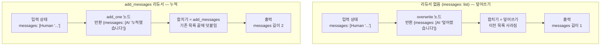

# 03. 리듀서 — 덮어쓰기 vs 누적

`03_reducers.py` 단독 학습 문서입니다.

## 무엇을 하는가

- 리듀서(reducer)가 무엇인지 봅니다: 노드 반환값을 기존 상태에 "어떻게 합칠지" 정하는 규칙.
- 리듀서가 없으면 기본은 "덮어쓰기"라서 이전 값이 통째로 사라짐을 확인합니다.
- `Annotated[list, add_messages]`를 붙이면 메시지가 "누적"됨을 봅니다.
- 같은 원리로 `Annotated[int, operator.add]`가 숫자를 호출마다 더해 쌓음을 봅니다.

## 왜 필요한가

노드는 "바뀐 부분만" 돌려준다고 했습니다. 그런데 그 부분 갱신을 기존 상태에 합치는 방식이 칸마다 달라야 할 때가 있습니다. "현재 단계" 같은 한 개짜리 값은 덮어쓰는 게 맞지만, 대화 메시지 목록을 덮어쓰면 직전 대화가 사라집니다. 리듀서는 이 합치기 규칙을 노드 바깥으로 빼내 칸별로 선언하는 장치입니다. 대화 맥락을 유지하는 `add_messages`도 리듀서의 한 사례입니다.

## 설계·구동 원리

- **기본 동작은 덮어쓰기.** 어떤 칸에 리듀서를 지정하지 않으면, 노드가 새 값을 돌려줄 때 이전 값을 통째로 대체합니다. 그래서 `messages: list`인 상태에 새 메시지 하나를 돌려주면 입력 메시지가 사라지고 메시지 수가 1이 됩니다.
- **Annotated로 리듀서를 붙이면 합치기로 바뀐다.** `Annotated[타입, 리듀서]`의 둘째 자리에 합치기 함수를 두면, 그 칸은 덮어쓰기 대신 그 함수가 정한 방식으로 합쳐집니다. `add_messages`는 새 메시지는 덧붙이고 같은 ID 메시지는 갱신하는 똑똑한 병합이라, 같은 1회 실행인데 메시지 수가 2가 됩니다(입력 + 새 메시지).
- **리듀서는 메시지 전용이 아니다.** 같은 원리를 숫자 칸에도 씁니다. `Annotated[int, operator.add]`를 붙이면 노드가 부분 값(`3`)만 돌려줘도 그래프가 기존 값(`10`)에 더해 `13`으로 합칩니다. 덮어쓰기였다면 `3`이 됩니다.

## 구동 흐름 (다이어그램)

같은 노드 한 개짜리 그래프인데, 칸에 리듀서가 붙었는지에 따라 합치는 방식이 갈립니다.



칸 선언에 따라 합치기 동작이 다음과 같이 갈립니다.

| 칸 선언 | 합치기 동작 |
|---|---|
| `messages: list` | 덮어쓰기 (이전 목록 사라짐) |
| `messages: Annotated[list, add_messages]` | 누적 (덧붙이거나 같은 ID는 갱신) |
| `total: int` | 덮어쓰기 (새 값으로 대체) |
| `total: Annotated[int, operator.add]` | 합산 (기존 값에 더함) |

**구동 원리.** 노드가 돌려주는 것은 언제나 "바뀐 부분"입니다. 그 부분을 기존 상태에 합치는 규칙이 리듀서입니다. 리듀서를 지정하지 않은 칸의 기본 규칙은 덮어쓰기라서, `overwrite` 노드가 메시지 하나를 돌려주면 입력 메시지가 사라지고 메시지 수가 1이 됩니다. 같은 그래프인데 `messages`에 `Annotated[list, add_messages]`만 붙이면, `add_messages`가 새 메시지를 기존 목록 끝에 덧붙여 메시지 수가 2가 됩니다(입력 1 + 새 메시지 1). 이 합치기 규칙은 메시지에만 쓰는 것이 아니라, 숫자 칸에 `operator.add`를 붙이면 노드가 부분 점수만 돌려줘도 그래프가 합산해 줍니다. 합치기를 노드 코드 밖, 상태 선언에서 칸별로 정한다는 점이 핵심입니다.

## 실행법

```bash
uv run python 05_langgraph_workflow/03_reducers.py
```

이 예제는 모델을 부르지 않으므로 API 키 없이도 그대로 돕니다(미리 만든 메시지로 차이만 봅니다).

## 예상 출력

```
=== 리듀서 없음 — 반환값이 기존 상태를 덮어쓴다 ===
[리듀서 없음] 메시지 수: 1

=== add_messages 리듀서 — 메시지가 누적된다 ===
[리듀서 있음] 메시지 수: 2
   - [human] 이 입력은 남습니다
   - [ai] 누적했습니다

=== operator.add 리듀서 — 숫자도 합쳐 쌓인다 ===
[숫자 리듀서] 10 + 3 = 13
```

## 체크포인트

- 같은 1회 실행인데 덮어쓰기는 메시지 1개, 누적은 2개가 나오면 둘의 차이를 확인한 것입니다.
- 대화 맥락이 필요하면 `add_messages`가 필수임을 이해하면 됩니다.
- 숫자 결과가 `3`이 아니라 `13`이면, 숫자 칸도 리듀서로 합쳐짐을 확인한 것입니다.

## 더 해보기

- `run_accumulate`의 노드를 두 번 거치도록 엣지를 늘려, 메시지가 3개로 쌓이는지 보십시오.
- `run_number_reducer`의 `total` 칸에서 `Annotated[..., operator.add]`를 떼고 `total: int`로 바꿔, 결과가 `13`에서 `3`으로 바뀌는지 확인하십시오.

## 다음 예제

`04_conditional_edge` — 상태를 보고 다음 노드를 동적으로 정하는 조건부 엣지를 다룹니다. 라우터 함수와 `add_conditional_edges`로 흐름을 갈라 봅니다.
