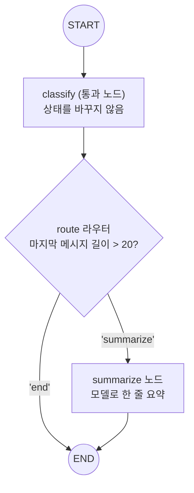

# 04. 조건부 엣지 (라우터)

`04_conditional_edge.py` 단독 학습 문서입니다.

## 무엇을 하는가

- 라우터(router)가 무엇인지 봅니다: 상태를 보고 "다음에 갈 곳"을 문자열 키로 돌려주는 함수.
- 그래프에 붙이기 전, 입력만 바꿔 가며 라우터가 어떤 키를 돌려주는지 확인합니다(모델 없이).
- `add_conditional_edges`로 라우터를 노드 뒤에 달아, 키를 노드 또는 `END`에 매핑합니다.
- 짧은 입력은 모델 호출 없이 바로 종료되고, 긴 입력만 요약 노드를 거칩니다.

## 왜 필요한가

`add_edge`는 "항상 다음 노드로" 보내는 고정 연결입니다. 하지만 실제 흐름은 "상황을 보고 길을 정해야" 할 때가 많습니다. 짧은 질문은 그냥 끝내고 긴 글만 요약하거나, 모델이 도구를 불렀는지에 따라 도구 실행으로 보내는 식입니다. 조건부 엣지는 이 "보고 길을 정하는" 판단을 그래프에 표현하는 장치이고, 그 판단을 맡는 것이 라우터입니다.

## 설계·구동 원리

- **라우터는 평범한 함수.** 상태를 입력으로 받아, 다음에 갈 곳을 문자열 키로 돌려줍니다. 그래프에 붙이기 전에 입력만 바꿔 호출해 보면, 같은 함수가 입력에 따라 다른 키(`summarize`/`end`)를 돌려주는 모습을 따로 확인할 수 있습니다.
- **add_conditional_edges가 라우터를 노드 뒤에 단다.** 첫 인자는 출발 노드, 둘째는 라우터 함수, 셋째는 라우터 반환값을 실제 노드 또는 `END`에 잇는 매핑(path_map)입니다. 매핑을 생략하면 반환값이 곧 노드 이름이 되지만, 명시하면 반환값과 노드 이름을 분리해 의도가 분명해집니다.
- **통과 노드.** 조건부 엣지는 출발 노드가 필요합니다. 여기서는 상태를 바꾸지 않고 그대로 통과시키는 `classify` 노드를 두고, 실제 분기 판단은 `route` 라우터가 맡습니다. 판단(라우터)과 작업(노드)을 분리하는 설계입니다.
- **분기로 비용을 아낀다.** 짧은 입력은 라우터가 `end`를 돌려 `summarize` 노드를 건너뛰므로 모델 호출이 일어나지 않습니다. 라우터 함수만 고치면 그래프 구조를 건드리지 않고 분기 경계를 조정할 수 있습니다.

## 구동 흐름 (다이어그램)

`classify` 뒤에 라우터를 단 조건부 엣지가 흐름을 둘로 가릅니다. 긴 입력만 `summarize`를 거치고, 짧은 입력은 곧장 `END`로 빠집니다.



라우터가 돌려준 키를 실제 노드/`END`에 잇는 매핑은 다음과 같습니다.

| 라우터 반환 키 | 매핑(path_map) | 실제 이동 |
|---|---|---|
| `"summarize"` | `{"summarize": "summarize"}` | `summarize` 노드로 |
| `"end"` | `{"end": END}` | 종착점 `END`로 (모델 호출 없음) |

**구동 원리.** 분기 판단은 `route`라는 평범한 함수가 맡습니다. 그래프에 붙이기 전에 입력만 바꿔 호출해 보면, 짧은 입력에는 `"end"`, 긴 입력에는 `"summarize"`를 돌려주는 모습을 따로 볼 수 있습니다. 이 라우터를 `add_conditional_edges("classify", route, {...})`로 `classify` 노드 뒤에 답니다. 셋째 인자는 라우터가 돌려준 키를 실제 노드 이름이나 `END`에 잇는 매핑입니다. `classify`는 상태를 바꾸지 않고 통과시키는 출발 노드일 뿐이고, 실제 길은 라우터가 정합니다. 그래서 긴 입력은 `summarize` 노드를 거쳐 모델로 요약되고, 짧은 입력은 `route`가 `"end"`를 돌려 모델 호출 없이 곧장 끝납니다. 분기 경계(길이 20)를 바꾸고 싶으면 그래프 구조는 그대로 두고 라우터 함수만 고치면 됩니다.

## 실행법

```bash
uv run python 05_langgraph_workflow/04_conditional_edge.py
```

라우터 함수만 보는 첫 부분은 모델 없이 돕니다. 요약 노드가 모델을 부르므로, 조건부 엣지 실행 예시에는 `OPENAI_API_KEY`가 필요합니다. 키가 없으면 안내만 출력하고 종료합니다.

## 예상 출력

```
=== 라우터 함수만 보기 (모델 없음) ===
[짧은 입력] route -> end
[긴 입력]   route -> summarize

=== 라우터를 조건부 엣지로 연결 ===
[긴 입력] summarize 노드를 거칩니다:
   신제품 출시 일정과 마케팅 예산을 논의했다. (한 줄 요약)
[짧은 입력] summarize 없이 바로 종료합니다:
   안녕
```

## 체크포인트

- 입력에 따라 라우터가 다른 문자열을 돌려주면, 라우터는 "분기 판단 함수"임을 이해한 것입니다.
- 짧은 입력은 `route`가 `"end"`를 돌려 모델 호출 없이 끝나면 분기가 동작한 것입니다.
- 라우터 함수만 고치면 그래프 구조를 건드리지 않고 흐름을 조정할 수 있다는 점이 핵심입니다.

## 더 해보기

- `route`의 기준 길이(20)를 5로 낮춰, 짧은 입력도 요약 노드를 거치는지 보십시오.
- `add_conditional_edges`의 매핑을 생략하고 라우터가 노드 이름과 똑같은 키(`"summarize"`/`END`)를 돌려주도록 고쳐, 매핑 없이도 도는지 확인하십시오.

## 다음 예제

`05_router_patterns` — 같은 `add_conditional_edges`를 쓰되 "무엇을 보고 경로를 정하느냐"가 다른 세 가지 라우터 설계 유형을 다룹니다.
