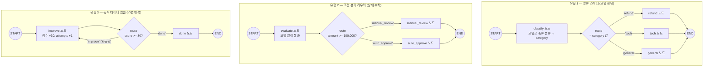

# 05. 라우터 설계 세 유형

`05_router_patterns.py` 단독 학습 문서입니다. 이 장의 무게중심이 되는 심화 예제입니다.

## 무엇을 하는가

- **분류 라우터** — 모델이 입력을 분류해, 종류에 맞는 전문 노드로 보냅니다.
- **조건 분기 라우터** — 상태에 담긴 수치·플래그(임계치)로 경로를 정합니다.
- **동적 데이터 흐름** — 목표를 만족할 때까지 반복 횟수가 입력에 따라 달라집니다.
- 설계 요령으로 분류(노드)와 라우팅(엣지)을 분리하고, 라우터 반환 타입을 `Literal`로 좁힙니다.

## 왜 필요한가

조건부 엣지를 한 번 배우고 나면, 실무의 거의 모든 흐름 제어는 "무엇을 보고 경로를 정하느냐"의 변주입니다. 모델 판단으로 종류를 나눌 때, 상태 수치로 결정할 때, 목표 도달까지 반복할 때 — 쓰는 도구(`add_conditional_edges`)는 같지만 라우터가 보는 것이 다릅니다. 이 세 유형을 구분해 두면, 새 흐름을 만날 때 어떤 라우터로 풀지 빠르게 판단할 수 있습니다.

## 설계·구동 원리

- **유형 1) 분류 라우터.** `classify` 노드가 모델로 입력을 카테고리(환불/기술/일반) 중 하나로 분류해 상태(`category`)에 적어 둡니다. `route`는 그 값을 읽어 전문 노드 키로 돌려줍니다. 분류(노드)와 라우팅(엣지)을 분리하면, 분류 로직과 흐름 제어를 따로 다듬을 수 있습니다. 모델이 약속 밖 단어를 내도 안전하도록, 모르는 값은 기본 카테고리(`general`)로 수렴시키는 코드 안전망을 둡니다.
- **유형 2) 조건 분기 라우터.** 모델 판단이 아니라 상태에 담긴 수치로 경로를 정합니다. `route`는 결제 금액이 임계치(100,000원)를 넘으면 사람 검토로, 아니면 자동 승인으로 보냅니다. 규칙 기반 분기는 LLM이 필요 없으므로 평가 노드는 모델을 부르지 않습니다. 반환 타입을 `Literal["auto_approve", "manual_review"]`로 좁혀, 가능한 경로를 코드에 분명히 드러냅니다.
- **유형 3) 동적 데이터 흐름.** "목표를 만족할 때까지" 같은 가변 반복입니다. `improve` 노드가 점수를 끌어올리고, `route`는 목표(80점)에 닿으면 종료, 아니면 다시 `improve`로 되돌립니다. 시작 점수가 낮을수록 더 많이 반복하므로, 경로(반복 횟수)가 데이터에 따라 동적으로 달라집니다. 반복 횟수 누적에는 `operator.add` 리듀서를 씁니다(03의 원리).

## 구동 흐름 (다이어그램)

세 유형은 모두 `add_conditional_edges`를 쓰지만, 라우터가 보는 대상이 다릅니다.



세 유형의 차이를 한 표로 정리하면 다음과 같습니다.

| 유형 | 무엇으로 경로를 정하나 | 언제 쓰나 | 이 예제 |
|------|------------------------|-----------|---------|
| **분류 라우터** | 모델이 분류한 카테고리 | 요청 종류가 여러 가지이고 종류마다 처리가 다를 때 | 문의를 환불/기술/일반으로 응대 |
| **조건 분기 라우터** | 상태에 담긴 수치·플래그 | 모델 판단이 아니라 규칙으로 흐름이 정해질 때 | 금액 임계치로 자동 승인/사람 검토 |
| **동적 데이터 흐름** | 목표 도달 여부(가변 반복) | "기준을 만족할 때까지" 반복이 필요할 때 | 점수가 목표에 닿을 때까지 다시 고쳐 쓰기 |

**구동 원리.** 세 유형의 공통 뼈대는 같습니다. 출발 노드 뒤에 `add_conditional_edges`로 라우터를 달고, 라우터가 돌려준 키를 매핑으로 실제 노드에 잇습니다. 다른 것은 라우터가 보는 대상입니다. 분류 라우터는 `classify` 노드가 모델로 정해 상태에 적어 둔 `category` 값을 읽고, 조건 분기 라우터는 상태에 담긴 `amount` 수치를 직접 비교하며, 동적 데이터 흐름은 매 반복의 `score`를 보고 목표 도달 여부로 다시 돌릴지 끝낼지를 정합니다. 특히 동적 데이터 흐름은 라우터가 출발 노드(`improve`) 자신으로 되돌리는 키를 돌려줄 수 있어, 목표에 닿을 때까지 가변 횟수로 반복합니다. 설계의 요령은 분류(노드)와 라우팅(엣지)을 분리하는 것입니다. 노드는 판단 결과를 상태에 적고, 라우터는 그 값을 읽어 다음 노드 키만 돌려줍니다. 라우터 반환 타입을 `Literal`로 좁혀 두면 가능한 경로가 코드에 드러나 실수가 줄어듭니다.

## 실행법

```bash
uv run python 05_langgraph_workflow/05_router_patterns.py
```

분류 라우터는 모델을 부르므로 `OPENAI_API_KEY`가 필요합니다. 조건 분기 라우터와 동적 데이터 흐름은 모델 없이 동작하므로 키가 없어도 그 두 유형은 그대로 돕니다.

## 예상 출력

```
=== 유형 1) 분류 라우터 (모델 판단) ===
[환불받고 싶어요] -> refund: [환불팀] 환불 절차를 안내드리겠습니다.
[앱이 자꾸 꺼져요] -> tech: [기술지원팀] 증상을 확인하겠습니다.
[영업시간이 언제인가요] -> general: [일반상담] 무엇을 도와드릴까요.

=== 유형 2) 조건 분기 라우터 (상태 수치) ===
[30,000원] 30,000원 자동 승인
[250,000원] 250,000원 고액 결제 — 사람 검토 대기

=== 유형 3) 동적 데이터 흐름 (가변 반복) ===
[시작 70점] 최종 100점, 반복 1회
[시작 10점] 최종 100점, 반복 3회
```

## 체크포인트

- 문의 내용에 따라 환불/기술/일반 노드로 갈라지면 분류 라우터가 동작한 것입니다.
- 금액 미만은 자동 승인, 이상은 사람 검토로 갈리면 조건 분기 라우터가 동작한 것입니다.
- 시작 점수에 따라 반복 횟수가 달라지면 동적 데이터 흐름을 확인한 것입니다.
- 세 유형 모두 같은 `add_conditional_edges`를 쓰되 라우터가 보는 대상만 다르다는 점이 핵심입니다.

## 더 해보기

- 분류 라우터에 카테고리(`billing`)와 전문 노드를 하나 더 추가하고, `classify` 프롬프트도 함께 늘려 보십시오.
- 조건 분기 라우터의 임계치(100,000)를 바꿔, 같은 금액이 다른 경로로 가는지 확인하십시오.
- 동적 데이터 흐름의 목표 점수(80)나 증가폭(30)을 바꿔, 반복 횟수가 즉시 달라지는지 보십시오.

## 다음 예제

`06_loop_and_recursion` — 동적 데이터 흐름처럼 순환하는 그래프가 종료 조건을 잃으면 어떻게 되는지, 그리고 `recursion_limit`로 무한 루프를 어떻게 안전하게 끊는지 다룹니다.
