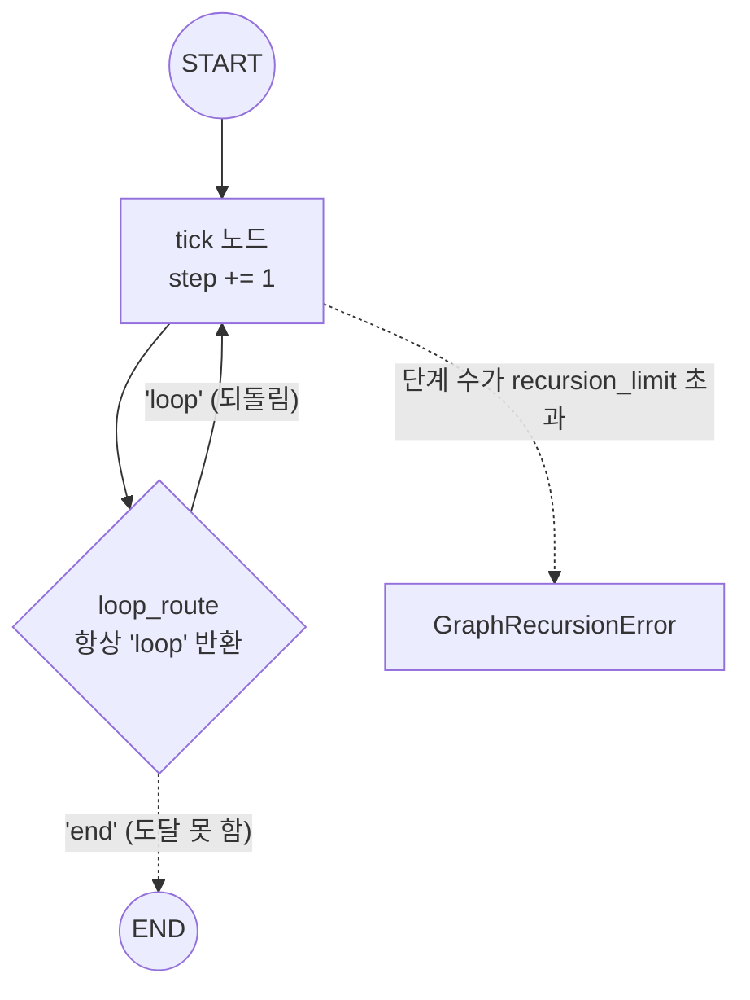
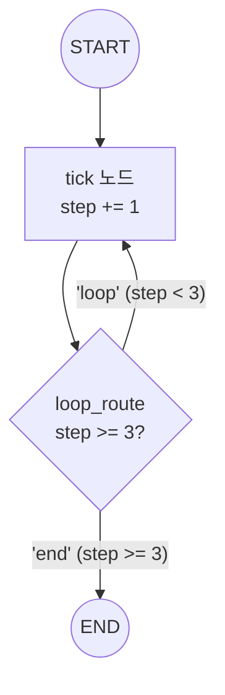

# 06. 순환과 recursion_limit

`06_loop_and_recursion.py` 단독 학습 문서입니다.

## 무엇을 하는가

- 노드에서 자기 자신으로 되돌아오는 순환(loop) 그래프를 만듭니다.
- 종료 조건이 없는 순환은 영원히 돈다는 사실을 체험합니다.
- `recursion_limit`로 단계 수 상한을 두어, 한도 초과 시 `GraphRecursionError`로 안전하게 멈춥니다.
- 근본 해결은 라우터에 종료 조건을 두는 것이고, `recursion_limit`는 마지막 안전망임을 봅니다.

## 왜 필요한가

조건부 엣지로 노드를 자기 자신이나 앞 노드로 되돌리면 순환이 생깁니다. 에이전트의 "도구를 부르고, 결과를 보고, 다시 판단하는" 루프가 바로 이 순환입니다. 그런데 라우터가 종료 조건을 빠뜨리면 그래프는 영원히 돕니다. 손으로 짠 루프라면 사람이 반복 횟수를 셌지만, 그래프에서는 LangGraph가 단계 수 상한으로 이를 대신 막아 줍니다. 이 안전망의 동작과 한계를 알아 두면, 멈추지 않는 그래프를 만났을 때 어디를 고쳐야 할지 알 수 있습니다.

## 설계·구동 원리

- **순환은 조건부 엣지로 만든다.** `tick` 노드 뒤에 라우터를 달아, 라우터가 `"loop"`를 돌려주면 다시 `tick`으로 되돌아갑니다. 라우터가 `"end"`를 돌려줄 때만 `END`로 빠집니다.
- **종료 조건이 없으면 영원히 돈다.** 첫 부분의 라우터는 의도적으로 항상 `"loop"`만 돌려줍니다. 종료 조건이 없으니 그래프는 멈출 길이 없습니다.
- **recursion_limit는 단계 수 상한.** 그래프가 밟을 수 있는 단계 수의 상한입니다. 지정하지 않으면 라이브러리가 정한 기본 상한이 적용되며, 호출 시 직접 지정해 올리거나 내릴 수 있습니다(기본값 숫자는 버전마다 다를 수 있으므로 필요하면 직접 지정합니다). 한도에 닿으면 `GraphRecursionError`로 안전하게 멈춥니다.
- **근본 해결은 종료 조건.** 둘째 부분의 라우터는 `step >= 3`이면 `"end"`를 돌려줍니다. 그래서 한도를 넉넉히 둬도 세 번 돈 뒤 스스로 멈춥니다. `recursion_limit`는 종료 조건이 빠졌을 때 비용 폭주를 막는 안전망일 뿐, 무한 루프의 근본 해결책은 라우터에 종료 조건을 제대로 두는 것입니다.

## 구동 흐름 (다이어그램)

종료 조건이 없는 라우터는 항상 `tick`으로 되돌려, `recursion_limit`에 닿아야 멈춥니다.



종료 조건을 둔 라우터는 한도에 닿기 전에 정상 종료합니다.



**구동 원리.** 순환은 조건부 엣지가 노드를 자기 자신으로 되돌릴 때 생깁니다. 첫 부분의 `loop_route`는 항상 `"loop"`를 돌려주므로 `tick`에서 `tick`으로 영원히 돕니다. 이때 `recursion_limit`를 5로 지정하면, 단계 수가 그 상한을 넘는 순간 LangGraph가 `GraphRecursionError`를 던져 안전하게 멈춥니다. 이것이 마지막 안전망입니다. 둘째 부분의 `loop_route`는 `step >= 3`이면 `"end"`를 돌려주므로, 한도를 100처럼 넉넉히 둬도 세 번 돈 뒤 스스로 `END`로 빠집니다. 무한 루프를 막는 근본 해법은 한도를 키우는 것이 아니라 라우터에 종료 조건을 두는 것입니다. 멈추지 않는 그래프는 대개 라우터 설계가 빠졌다는 신호이고, 한도만 키우면 모델 호출이 쌓여 비용과 지연만 늘어납니다.

## 실행법

```bash
uv run python 05_langgraph_workflow/06_loop_and_recursion.py
```

이 예제는 모델을 부르지 않으므로 API 키 없이도 그대로 돕니다(순환 구조와 안전망만 봅니다).

## 예상 출력

```
=== 종료 조건 없는 순환 — recursion_limit로 안전하게 끊기 ===
[recursion_limit=5] 종료 조건 없는 순환을 안전하게 끊습니다:
  GraphRecursionError 발생: 한도를 넘겨 안전하게 중단되었습니다.

=== 종료 조건 있는 순환 — 한도에 닿기 전에 정상 종료 ===
[종료 조건 있음] 정상 종료, 최종 step = 3
```

## 체크포인트

- 종료 조건 없는 순환에서 `GraphRecursionError`가 발생하면 한도 초과로 안전하게 멈춘 것입니다.
- 종료 조건을 둔 순환이 한도에 닿기 전에 `step=3`에서 정상 종료하면, 종료 조건이 근본 해결임을 확인한 것입니다.
- `recursion_limit`를 무작정 키우면 비용만 늘 뿐, 멈추지 않는 그래프는 라우터 설계가 빠진 것입니다.

## 더 해보기

- 첫 부분의 `recursion_limit`를 3으로 더 낮춰, 더 적은 단계에서 멈추는지 보십시오.
- 둘째 부분의 종료 기준(`step >= 3`)을 `step >= 5`로 바꿔, 반복 횟수가 늘어나는지 확인하십시오.
- 둘째 부분의 종료 조건을 지우고 `recursion_limit` 없이 실행하면, 라이브러리 기본 상한에 닿아 멈추는 모습을 관찰하십시오.

## 다음 장

`06_langgraph_agent` — 이 장에서 손으로 짠 조건부 엣지·되돌아오는 엣지·`recursion_limit`를 직접 조립하는 대신, LangGraph가 제공하는 프리빌트 에이전트로 도구 호출 루프를 한 번에 닫습니다. 지금 익힌 개념이 그 안에서 어떻게 작동하는지 알고 들어가면, 프리빌트가 무엇을 대신해 주는지가 또렷이 보입니다.
