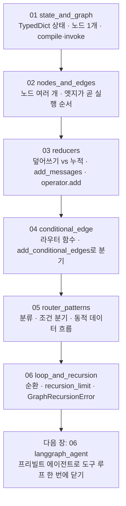

# 05. LangGraph 워크플로우

도구 호출 루프를 손으로 돌리던 앞 장에서 한 걸음 나아가, 흐름 자체를 **그래프**로 그리는 장입니다. 직선으로 이어지는 체인과 달리, 실제 에이전트는 "상황을 보고 길을 정하고, 필요하면 되돌아가는" 흐름을 가집니다. LangGraph는 이런 흐름을 상태(State)·노드(node)·엣지(edge) 세 가지로 표현합니다.

이 장은 **하나의 주제마다 독립 실행 파일 하나**로 구성됩니다. 각 `NN_topic.py`는 자기완결이라 단독으로 실행되며, 짝이 되는 `NN_topic.md`가 그 예제만으로 혼자 학습할 수 있는 설계·구동 원리를 담습니다. 번호 순서대로 따라가면 상태 정의에서 순환 안전망까지 작은 그래프가 점점 자라납니다.

## 학습 목표

- 체인과 그래프의 차이를 설명하고, 에이전트 흐름을 그래프로 표현하는 까닭을 말할 수 있다.
- State·Node·Edge·Conditional Edge 네 개념으로 LangGraph 그래프의 구성 요소를 설명할 수 있다.
- `StateGraph`로 상태·노드·엣지를 정의하고 `compile`·`invoke`로 실행할 수 있다.
- `add_messages` 리듀서로 메시지를 누적할 수 있고, 리듀서가 없을 때의 기본 동작(덮어쓰기)과 비교할 수 있다.
- `add_conditional_edges`와 라우터 함수로 상태에 따라 흐름이 갈라지는 분기를 만들 수 있다.
- 라우터 설계 세 유형(분류 라우터·조건 분기 라우터·동적 데이터 흐름)을 구분해 쓸 수 있다.
- `recursion_limit`로 순환 그래프의 무한 루프를 안전하게 끊을 수 있다.

## 실행 방법

```bash
# 레포 루트(ai-agent-dev-lgens)에서
uv sync                       # 최초 1회 (의존성 설치)
cp .env.example .env          # 최초 1회, .env에 OPENAI_API_KEY 입력

# 예제는 하나씩 단독으로 실행합니다.
uv run python 05_langgraph_workflow/01_state_and_graph.py
uv run python 05_langgraph_workflow/02_nodes_and_edges.py
# ... 06까지 같은 방식
```

각 파일은 상단에 필요한 import·`MODEL` 상수·(모델을 쓰는 파일은) `load_dotenv()`·자체 모델 초기화를 모두 갖춰, 다른 파일에 의존하지 않습니다. 공급사를 바꾸려면 각 파일 상단의 `MODEL` 상수만 교체하면 됩니다(기본 `openai:gpt-5.4-mini`).

이 장은 그래프 구조 자체를 익히는 예제가 많아, **모델 키 없이도 상당 부분을 따라갈 수 있습니다.** 그래프 구조만 다루는 예제(01·03·06)는 모델을 부르지 않으므로 키가 없어도 그대로 돕니다. 모델을 부르는 예제(02·04·05)는 `OPENAI_API_KEY`가 필요하며, 키가 없으면 안내만 출력하고 모델이 필요 없는 부분만 이어서 실행합니다.

## 권장 학습 경로

번호 순서대로 보는 것을 권장합니다. 각 예제는 `NN_topic.py`(코드)와 `NN_topic.md`(설계·원리)가 짝을 이룹니다.

| 번호 | 예제 | 한 줄 요약 | 모델 키 |
|------|------|-----------|---------|
| 01 | `01_state_and_graph` | State(`TypedDict`) 정의·노드 1개 최소 그래프·`compile`·`invoke` | 불필요 |
| 02 | `02_nodes_and_edges` | 노드 여러 개·엣지 연결·잇지 않은 노드는 실행 안 됨 | 필요 |
| 03 | `03_reducers` | 리듀서(덮어쓰기 vs 누적)·`add_messages`·`operator.add` | 불필요 |
| 04 | `04_conditional_edge` | 조건부 엣지·라우터 함수·`add_conditional_edges` | 일부 필요 |
| 05 | `05_router_patterns` | 라우터 세 유형(분류·조건 분기·동적 데이터 흐름) | 일부 필요 |
| 06 | `06_loop_and_recursion` | 순환 그래프·`recursion_limit`·`GraphRecursionError` | 불필요 |

01~03이 그래프의 뼈대(상태·노드·엣지·리듀서), 04~05가 조건부 분기와 라우터 설계(이 장의 핵심), 06이 순환의 안전망입니다.

## 챕터 전체 흐름 (다이어그램)

번호를 따라가면 상태 정의의 토대 위에 노드·엣지·리듀서·분기·라우터·순환이 차례로 쌓입니다.



## 핵심 개념 — State·Node·Edge·Conditional Edge

LangGraph는 네 개념으로 이루어집니다. 이 넷만 잡으면 대부분을 이해한 것입니다.

- **State(상태)** — 노드들이 함께 쓰는 한 장의 작업판입니다. 회의실 화이트보드처럼, 그래프가 도는 동안 노드들이 같은 보드를 보며 각자 맡은 칸을 채웁니다. 대화형이라면 보통 `messages` 한 칸을 두지만, 노드 사이에 다른 값을 전달해야 하면 칸을 더 둡니다(01·02).
- **Node(노드)** — 상태를 받아 **바뀐 부분만** 딕셔너리로 돌려주는 함수입니다. 작업판 전체를 다시 그릴 필요 없이 자기가 적을 칸에만 손을 대고, 합치는 일은 그래프와 리듀서가 맡습니다(01·03).
- **Edge(엣지)** — 노드에서 노드로의 고정 연결입니다. 특수 노드 `START`(진입점)에서 시작해 `END`(종착점)에서 끝납니다. **엣지가 곧 실행 순서**이며, 어느 노드도 엣지로 잇지 않으면 그 노드는 실행되지 않습니다(02).
- **Conditional Edge(조건부 엣지)** — 상태를 보고 다음 노드를 동적으로 정하는 분기입니다. 분기 판단은 **라우터(router)** 라는 일반 함수가 맡아, 상태를 보고 다음에 갈 곳을 문자열 키로 돌려줍니다(04·05).

## 라우터 설계 세 유형 (이 장의 핵심)

이 장의 무게중심은 04·05입니다. 같은 `add_conditional_edges`를 쓰지만 "무엇을 보고 경로를 정하느냐"가 다릅니다.

| 유형 | 무엇으로 경로를 정하나 | 언제 쓰나 | 이 장 예시 |
|------|------------------------|-----------|-----------|
| **분류 라우터** | 모델이 분류한 카테고리 | 요청 종류가 여러 가지이고 종류마다 처리가 다를 때 | 문의를 환불/기술/일반으로 응대 (05) |
| **조건 분기 라우터** | 상태에 담긴 수치·플래그 | 모델 판단이 아니라 규칙으로 흐름이 정해질 때 | 금액 임계치로 자동 승인/사람 검토 (05) |
| **동적 데이터 흐름** | 목표 도달 여부(가변 반복) | "기준을 만족할 때까지" 반복이 필요할 때 | 점수가 목표에 닿을 때까지 다시 고쳐 쓰기 (05) |

설계의 요령은 **분류(노드)와 라우팅(엣지)을 분리**하는 것입니다. 노드는 판단 결과를 상태에 적어 두고, 라우터는 그 값을 읽어 다음 노드 키만 돌려줍니다. 분류 로직과 흐름 제어를 따로 다듬을 수 있어 유지보수가 쉬워집니다. 라우터 반환 타입을 `Literal["auto_approve", "manual_review"]`처럼 좁혀 두면, 가능한 경로가 코드에 분명히 드러나 실수가 줄어듭니다(05).

## 핵심 점검

이 장이 성공인지 가르는 한 가지 기준은 **`03_reducers`에서 덮어쓰기와 누적의 메시지 수가 다른지**입니다. 같은 1회 실행인데 덮어쓰기는 1개, 누적은 2개가 나오면 리듀서의 동작을 손으로 확인한 것입니다.

- **리듀서가 동작하는가.** 리듀서는 노드가 돌려준 값을 기존 상태에 **어떻게 합칠지** 정하는 규칙입니다. 지정하지 않으면 기본은 **덮어쓰기**라서 이전 값이 통째로 사라지고, `Annotated[list, add_messages]`로 붙이면 **누적**으로 바뀝니다. 같은 원리로 누적 점수 칸에 `operator.add`를 붙이면 노드마다 부분 값을 더해 줍니다(03·05·06).
- **분기가 갈라지는가.** 짧은 입력은 라우터가 `"end"`를 돌려 모델 호출 없이 끝나고, 긴 입력만 요약 노드를 거치면 조건부 엣지가 동작한 것입니다(04). 라우터 함수만 고치면 그래프 구조를 건드리지 않고 흐름을 조정할 수 있다는 점이 핵심입니다.
- **세 라우터 유형의 차이를 떠올릴 수 있는가.** 분류 라우터는 **모델 판단**으로, 조건 분기 라우터는 **상태 수치**로, 동적 데이터 흐름은 **목표 도달 여부**로 경로를 정합니다(05).
- **순환이 안전하게 끊기는가.** `recursion_limit`는 그래프가 밟을 수 있는 단계 수의 상한으로, 지정하지 않으면 라이브러리가 정한 기본 상한이 적용됩니다(기본값 숫자는 버전마다 다를 수 있어 필요하면 직접 지정합니다). 종료 조건 없는 순환은 영원히 돌므로, 한도에 닿으면 `GraphRecursionError`로 안전하게 멈춥니다(06).

## 흔한 실수 (증상별 진단)

| 증상 | 원인 | 해결 |
|------|------|------|
| 등록한 노드가 실행되지 않는다 | 엣지로 잇지 않음 | `add_edge`로 진입 경로 연결 (02) |
| 대화 맥락이 매번 사라진다 | `add_messages` 리듀서 누락 | `messages: Annotated[list, add_messages]` 지정 (03) |
| 그래프가 멈추지 않는다 | 라우터가 `END`를 영영 안 냄 | 종료 조건일 때 `END`(또는 `"end"`)를 반환하게 함 (06) |
| 분기 후 돌아오지 못하고 끊긴다 | 되돌아오는 엣지 누락 | 분기 뒤 노드에서 `END` 또는 다음 노드로 엣지 추가 |
| `GraphRecursionError`가 자꾸 난다 | 종료 조건이 빠진 순환 | 라우터에 종료 조건을 넣음 (한도만 키우면 비용만 늘어남) |
| 라우터가 예상 밖 노드로 보낸다 | 모델이 약속 밖 단어를 냄 | 모르는 값은 기본 카테고리로 수렴시키는 코드 안전망 (05) |

> 막힘은 대부분 모델 탓이 아니라 그래프 구조 문제입니다. 종료 조건과 리듀서, 그리고 엣지 연결부터 표에서 역추적하십시오. `recursion_limit`는 종료 조건이 빠졌을 때 비용 폭주를 막는 마지막 안전망일 뿐, 무한 루프의 근본 해결책은 라우터에 종료 조건을 제대로 두는 것입니다.

## 더 해보기

- 각 `NN_topic.md`의 "더 해보기" 항목을 따라, 예제를 조금씩 바꿔 가며 동작을 관찰하십시오.
- `.env`에 `GOOGLE_API_KEY`를 넣고 모델을 쓰는 파일의 `MODEL`을 `google-genai:gemini-3.5-flash`로 바꿔, 같은 그래프 코드가 다른 공급사에서 도는지 확인하십시오.

## 다음 장

`06_langgraph_agent` — 이 장에서 손으로 짠 조건부 엣지와 되돌아오는 엣지를 직접 조립하는 대신, LangGraph가 제공하는 **프리빌트 에이전트**로 도구 호출 루프를 한 번에 닫습니다. 지금 익힌 State·Node·조건부 엣지·`recursion_limit`가 그 안에서 어떻게 작동하는지를 알고 들어가면, 프리빌트가 무엇을 대신해 주는지가 또렷이 보입니다.
