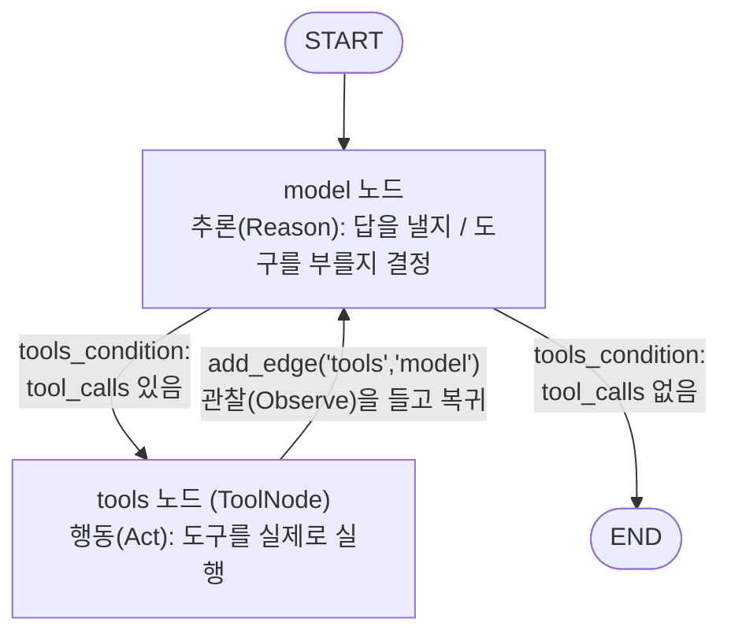

# 01. 수동 Agent 그래프 — 추론·행동·관찰 순환 배선하기

`01_manual_agent_graph.py` 단독 학습 문서입니다. 이 한 파일만으로 Agent 그래프를 손으로 배선하는 전 과정을 익힐 수 있습니다.

## 무엇을 하는가

- 도구를 모아 모델에 바인딩합니다(`bind_tools`).
- 모델 노드(추론)·`ToolNode`(행동)·조건부 엣지(`tools_condition`)·되돌아오는 엣지를 `StateGraph`에 직접 끼워, 추론·행동·관찰 순환을 가진 Agent 그래프를 완성합니다.
- 어느 부품이 ReAct 루프의 어느 단계를 맡는지 코드 한 줄씩 대응시킵니다.

## 왜 필요한가

다음 예제에서 만날 `create_agent` 한 줄이 바로 이 그래프를 자동으로 만들어 줍니다. 그런데도 손으로 한 번 배선해 보는 까닭은, 그 한 줄이 만드는 구조를 알아야 루프 중간에 검증·승인 노드를 끼우거나 막힘을 진단할 수 있기 때문입니다. 빠른 길을 먼저 배우면 빠르게 짜지만, 느린 길을 먼저 밟으면 깊이 이해합니다. LO1에서 개념으로 익힌 추론·행동·관찰 루프를 여기서 코드로 옮기면, 추상적인 사이클이 실제 노드와 엣지로 또렷해집니다.

## 설계·구동 원리

- **세 단계가 세 부품에 대응한다.** Agent의 동작은 한 문장으로 줄이면 생각하고(Reason) 행동하고(Act) 관찰하는(Observe) 과정을 목표에 닿을 때까지 반복하는 것입니다. 이 세 단계가 그래프의 어느 부품에 대응하는지 짚어 두면 전체가 한눈에 들어옵니다.

  | ReAct 단계 | 하는 일 | 그래프 부품 |
  |------------|---------|-------------|
  | Reason(추론) | 지금까지의 맥락을 보고 답을 바로 낼지, 어떤 도구를 어떤 인자로 부를지 정함 | 모델 노드(`call_model`) |
  | Act(행동) | 모델이 고른 도구를 우리 코드가 실제로 실행 | `ToolNode` |
  | Observe(관찰) | 실행 결과(`ToolMessage`)를 다시 모델에 돌려줌 | `add_edge("tools", "model")` |

- **모델은 도구를 직접 실행하지 않는다.** Act 단계에서 모델은 "이 도구를 이렇게 불러 달라"고 제안하는 `AIMessage`(`tool_calls`)만 돌려줍니다. 실제 실행 권한은 우리 코드(`ToolNode`)가 쥡니다. 그래서 도구 실행 전에 검증·승인 노드를 끼워 통제할 자리가 생깁니다.
- **`bind_tools`가 도구 스키마를 알린다.** `model.bind_tools([add, multiply])`는 도구의 이름·인자·설명(docstring)을 모델에 알려 줍니다. 이제 모델은 답을 바로 내거나, 도구 호출을 요청하는 `AIMessage`를 돌려줄 수 있습니다.
- **`ToolNode`가 손 루프를 대신한다.** `ToolNode(tools)`는 직전 `AIMessage`의 `tool_calls`를 읽어, 호출마다 맞는 함수를 찾아 실행하고 결과를 `ToolMessage`(`tool_call_id` 짝지음)로 만들어 상태에 누적합니다. 앞 장에서 손으로 짜던 `for` 루프를 이 한 부품이 대신합니다.
- **`tools_condition`이 분기를 맡는다.** 마지막 `AIMessage`에 도구 호출이 있으면 `"tools"`로, 없으면 `END`로 보내는 사전 제작 분기 함수입니다. `add_conditional_edges("model", tools_condition)`으로 모델 노드 뒤에 답니다.
- **되돌아오는 엣지가 순환을 만든다.** 결정적인 줄은 `add_edge("tools", "model")`입니다. 도구 결과(관찰)를 들고 다시 추론으로 돌아가는 이 한 줄이 ReAct 루프의 "순환"을 만듭니다. 이 줄을 지우면 도구 실행 후 모델로 돌아가지 못해 순환이 끊기고, 결과를 정리해 최종 답을 만드는 단계가 사라집니다.
- **`add_messages`가 맥락을 잇는다.** `messages` 칸에 `Annotated[list, add_messages]` 리듀서를 붙여야 추론·행동·관찰이 덮어쓰이지 않고 누적되어, 순환이 맥락을 이어 갈 수 있습니다.

## 구동 흐름 (다이어그램)

`StateGraph`에 끼운 부품이 만드는 Agent 그래프의 구조입니다. `model`에서 시작해, 도구가 필요하면 `tools`로 갔다가 다시 `model`로 돌아오고, 더 필요 없으면 `END`로 빠지는 순환입니다.



**구동 원리.** 진입점 `START`는 항상 모델 노드(추론)로 들어갑니다. 모델은 지금까지 쌓인 메시지를 보고, 답할 정보가 충분하면 일반 텍스트 `AIMessage`를 내고, 부족하면 어떤 도구를 어떤 인자로 부를지 담은 `AIMessage`(`tool_calls`)를 냅니다. 모델 노드 뒤에 달린 `tools_condition`이 이 마지막 메시지를 보고 갈 길을 정합니다. 도구 호출이 있으면 `tools` 노드로, 없으면 `END`로 보냅니다. `tools` 노드(`ToolNode`)는 호출마다 맞는 도구를 실행하고 결과를 `ToolMessage`(관찰)로 상태에 쌓은 뒤, `add_edge("tools", "model")`을 따라 다시 모델로 돌아갑니다. 모델은 관찰을 보고 또 도구를 부르거나, 충분하면 최종 답을 냅니다. "3 더하기 5를 4와 곱하면?"은 `add` 한 번과 `multiply` 한 번, 두 번의 도구 호출을 거쳐야 풀리므로 이 순환이 두 바퀴 돌고, 마지막에 도구 호출이 없는 `AIMessage`가 나오면 `tools_condition`이 `END`로 보내 루프가 끝납니다. 손으로 짜던 `for _ in range(MAX_TURNS)` 안전판이 사라진 자리는 다음 예제들에서 다룰 `recursion_limit`이 대신합니다.

## 실행법

```bash
# 레포 루트(ai-agent-dev-lgens)에서
uv sync                       # 최초 1회 (의존성 설치)
cp .env.example .env          # 최초 1회, .env에 OPENAI_API_KEY 입력
uv run python 06_langgraph_agent/01_manual_agent_graph.py
```

키가 없으면 안내만 출력하고 종료합니다. 문법·import 점검은 키 없이도 됩니다.

## 예상 출력

```
=== 도구가 필요 없는 질문 (분기가 바로 END로) ===
최종 답변: 안녕하세요! 무엇을 도와드릴까요?

=== 도구가 두 번 필요한 질문 (추론-행동-관찰 순환) ===
최종 답변: 3 더하기 5는 8이고, 8과 4를 곱하면 32입니다.

[누적된 메시지 흐름]
================================ Human Message =================================
3 더하기 5를 4와 곱하면?
================================== Ai Message ==================================
Tool Calls: add(a=3, b=5)
================================= Tool Message =================================
8
================================== Ai Message ==================================
Tool Calls: multiply(a=8, b=4)
================================= Tool Message =================================
32
================================== Ai Message ==================================
3 더하기 5는 8이고, 8과 4를 곱하면 32입니다.
```

(메시지 형식과 표현은 모델·버전에 따라 조금씩 다를 수 있습니다.)

## 체크포인트

- 인사말이 도구를 거치지 않고 바로 답하면 `tools_condition` 분기가 동작한 것입니다.
- 계산 답변에 32가 나오면 추론·행동·관찰 순환이 한 바퀴 이상 돌아간 것입니다.
- 메시지 흐름에 `AIMessage`(도구 호출) → `ToolMessage`(관찰)가 번갈아 보이면 순환을 눈으로 확인한 것입니다.

## 흔한 실수 (증상별 진단)

| 증상 | 원인 | 해결 |
|------|------|------|
| 도구 결과(8)에서 답이 멈춘다 | `tools → model` 되돌아오는 엣지 누락 | `add_edge("tools", "model")` 한 줄 추가 |
| 인사말에도 도구로 강제로 간다 | `model → tools`를 무조건 연결 | `add_conditional_edges("model", tools_condition)`으로 교체 |
| `messages`가 매번 덮어써져 맥락을 잃는다 | `State`에 `add_messages` 리듀서를 안 달았다 | `Annotated[list, add_messages]`로 선언 |
| 두 번째 도구 결과가 답에 안 반영된다 | `ToolMessage`의 `tool_call_id`가 호출 `id`와 불일치 | `ToolNode`를 쓰면 자동 정렬됨 |

## 더 해보기

- `build_agent_graph`에서 `add_edge("tools", "model")` 줄을 지웠다가 다시 넣어 보며, 순환이 끊겼을 때와 이어졌을 때 최종 답이 어떻게 달라지는지 비교하십시오.
- `add_conditional_edges("model", tools_condition)`을 `add_edge("model", "tools")`로 바꿔, 인사말도 도구로 강제로 가는지 확인하십시오.
- `model`과 `tools` 사이에 간단한 검증 노드를 끼워, 도구 인자가 규칙에 맞는지 도구 실행 전에 거르는 분기를 만들어 보십시오.

## 다음 예제

`02_react_loop_observe` — 같은 그래프를 `stream`으로 흘려보며 추론·행동·관찰이 번갈아 도는 모습을 단계별로 관찰합니다.
