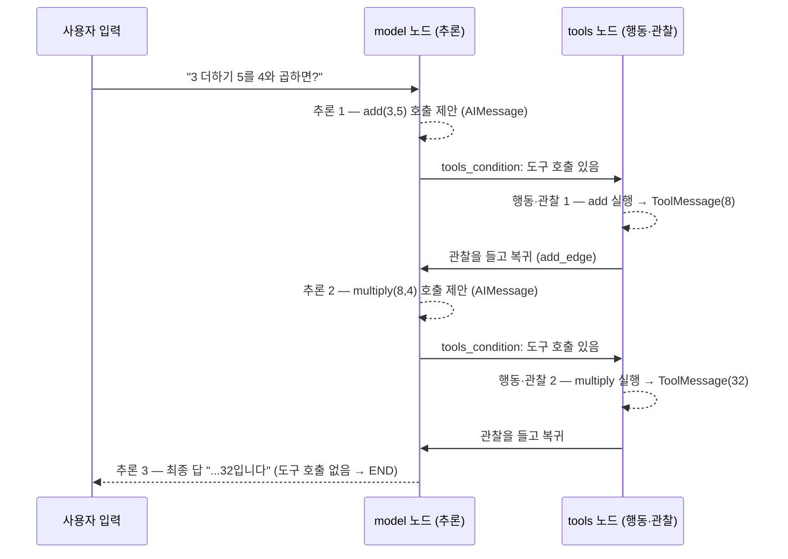

# 02. ReAct 루프 관찰 — stream으로 순환을 단계별로 보기

`02_react_loop_observe.py` 단독 학습 문서입니다.

## 무엇을 하는가

- 01에서 배선한 것과 같은 수동 Agent 그래프를 만듭니다.
- `stream`으로 한 번의 실행을 여러 단계로 펼쳐, 추론·행동·관찰이 번갈아 도는 모습을 봅니다.
- `stream_mode="values"`로 매 단계의 누적 상태를, `stream_mode="updates"`로 노드별 변경분을 관찰합니다.

## 왜 필요한가

LO1의 추론·행동·관찰 루프가 한 번의 `invoke` 안에서 여러 바퀴 돈다는 사실은, 최종 답만 봐서는 보이지 않습니다. `invoke`는 루프가 다 끝난 뒤의 결과 하나만 돌려주기 때문입니다. `stream`은 같은 그래프를 단계마다 멈춰 세워 중간 결과를 흘려보냅니다. 추론(도구 호출 제안) 다음에 행동·관찰(`ToolMessage`)이 오고 다시 추론으로 돌아가는 순환을 눈으로 확인하면, 01에서 배선한 그래프가 실제로 어떻게 도는지가 또렷해집니다.

## 설계·구동 원리

- **`invoke`와 `stream`의 차이.** 입력은 같지만, `invoke`는 루프가 끝난 뒤 최종 상태 하나를 돌려주고, `stream`은 단계가 끝날 때마다 결과를 하나씩 내보냅니다. `for step in agent.stream(...):`로 흘러나오는 단계를 하나씩 받아 처리합니다.
- **`stream_mode="values"`.** 매 단계가 끝날 때마다 그 시점까지 누적된 **전체 상태**를 흘려보냅니다. 각 단계의 마지막 메시지(`step["messages"][-1]`)를 찍으면 그 단계에서 새로 쌓인 메시지가 보입니다. 추론(도구 호출 `AIMessage`) → 관찰(`ToolMessage`) → 추론이 번갈아 나옵니다.
- **`stream_mode="updates"`.** 각 노드가 끝날 때마다 **그 노드가 바꾼 부분만** `{노드이름: {변경분}}` 형태로 흘려보냅니다. `values`가 "전체 그림"을 준다면 `updates`는 "어느 노드가 무엇을 바꿨는지"를 노드 이름과 함께 줍니다. `model` 노드는 도구 호출을, `tools` 노드는 관찰값을 번갈아 냅니다.
- **루프의 종료 시점.** 도구 호출이 더 없는 마지막 `AIMessage`가 나오면, `tools_condition`이 `END`로 보내 스트림이 끝납니다. 스트림이 멈추는 지점이 곧 루프가 닫히는 지점입니다.

## 구동 흐름 (다이어그램)

한 번의 실행이 단계별로 펼쳐지는 모습입니다. 같은 순환을 두 가지 stream_mode로 들여다봅니다.



**구동 원리.** `stream`은 그래프의 각 단계를 끝나는 즉시 내보냅니다. 위 다이어그램의 화살표 하나하나가 스트림에서 한 청크로 흘러나옵니다. `stream_mode="values"`로 보면 매 청크가 그 시점의 누적 메시지 전체이고, 마지막 메시지만 찍으면 "이번 단계에 새로 쌓인 것"이 추론(도구 호출 `AIMessage`)인지 관찰(`ToolMessage`)인지 드러납니다. `stream_mode="updates"`로 보면 같은 흐름이 `model` 노드의 변경분과 `tools` 노드의 변경분으로 나뉘어, 어느 노드가 무엇을 만들었는지가 노드 이름과 함께 보입니다. "3 더하기 5를 4와 곱하면?"은 도구가 두 번 필요하므로 추론·행동·관찰이 두 바퀴 돌고, 도구 호출이 없는 세 번째 추론에서 `tools_condition`이 `END`로 보내 스트림이 멈춥니다. 멈추는 지점이 곧 루프가 닫히는 지점입니다.

## 실행법

```bash
uv run python 06_langgraph_agent/02_react_loop_observe.py
```

## 예상 출력

```
[stream_mode='values' — 매 단계의 누적 상태에서 마지막 메시지]
================================ Human Message =================================
3 더하기 5를 4와 곱하면?
================================== Ai Message ==================================
Tool Calls: add(a=3, b=5)
================================= Tool Message =================================
8
================================== Ai Message ==================================
Tool Calls: multiply(a=8, b=4)
================================= Tool Message =================================
32
================================== Ai Message ==================================
3 더하기 5는 8이고, 8과 4를 곱하면 32입니다.

[stream_mode='updates' — 노드별 변경분]
  [model] AIMessage 도구 호출 → [('add', {'a': 3, 'b': 5})]
  [tools] ToolMessage: 8
  [model] AIMessage 도구 호출 → [('multiply', {'a': 8, 'b': 4})]
  [tools] ToolMessage: 32
  [model] AIMessage: 3 더하기 5는 8이고, 8과 4를 곱하면 32입니다.
```

(메시지 형식과 표현은 모델·버전에 따라 조금씩 다를 수 있습니다.)

## 체크포인트

- `values`에서 추론(도구 호출 `AIMessage`)과 관찰(`ToolMessage`)이 번갈아 나오면 순환을 눈으로 본 것입니다.
- `updates`에서 `model` 노드는 도구 호출을, `tools` 노드는 관찰값을 번갈아 내면 노드 단위로 흐름을 추적한 것입니다.
- 도구 호출이 더 없는 마지막 `AIMessage`에서 스트림이 멈추면, 그 지점이 `tools_condition`이 `END`로 보낸 종료 시점입니다.

## 더 해보기

- 질문을 "3 더하기 5는?"처럼 도구 한 번으로 끝나는 형태로 바꿔, 순환이 한 바퀴만 도는지 관찰하십시오.
- 질문을 "안녕!"으로 바꿔, 도구를 거치지 않고 추론 한 번에 스트림이 끝나는지 확인하십시오.
- `stream_mode="messages"`(토큰 단위 스트리밍)로 바꿔, 최종 답이 토큰 단위로 흘러나오는지 시도해 보십시오.

## 다음 예제

`03_create_agent` — 지금까지 손으로 배선한 그래프를 `create_agent` 한 줄로 만들어, 같은 루프임을 대조합니다.
