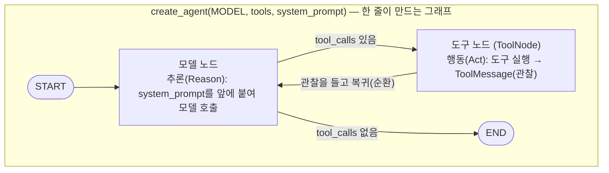

# 03. create_agent 한 줄 — 수동 그래프와 같은 루프 대조

`03_create_agent.py` 단독 학습 문서입니다.

## 무엇을 하는가

- `create_agent`에 모델·도구·시스템 프롬프트만 주어, 01에서 손으로 배선한 그래프와 같은 ReAct Agent를 한 줄로 만듭니다.
- 한 줄 버전의 입력·출력 형태가 수동 그래프와 같음을 확인합니다(입력 `{"messages": [...]}`, 최종 답 `result["messages"][-1].content`).
- `create_agent`가 돌려주는 것도 결국 컴파일된 그래프임을 봅니다.

## 왜 필요한가

01에서 모델 노드·`ToolNode`·`tools_condition`·되돌아오는 엣지를 한 줄씩 끼워 만든 그래프를, `create_agent`는 단 한 줄로 똑같이 구성합니다. 손으로 한 번 배선해 본 뒤에 한 줄 버전을 보면, 그 한 줄이 "무엇을 자동화했는지"가 또렷해집니다. 빠른 길을 먼저 배우면 빠르게 짜지만, 느린 길(01)을 먼저 밟고 빠른 길(03)을 만나면 그 빠른 길이 어떤 부품을 감췄는지 알게 됩니다. 표준 ReAct 루프로 충분한 대부분의 경우, 운영 코드는 이 한 줄로 시작합니다.

## 설계·구동 원리

- **한 줄이 감추는 것.** `create_agent(MODEL, tools=[...], system_prompt=...)`는 01에서 손으로 호출한 `StateGraph`·`add_node`·`add_conditional_edges`·`add_edge`를 내부에서 똑같이 수행합니다. 모델 노드(추론), `ToolNode`(행동), `tools_condition` 분기, 그리고 도구 노드에서 모델 노드로 되돌아오는 순환까지 한 번에 배선됩니다.
- **입력·출력이 01과 같다.** 프리빌트 Agent의 상태도 `messages` 칸을 쓰므로, 입력은 `{"messages": [...]}` 형태이고 최종 답은 `result["messages"][-1].content`입니다. 반환된 `messages`에는 질문·도구 호출·도구 결과·최종 답이 시간 순으로 담깁니다.
- **돌려주는 것도 그래프다.** `create_agent`의 반환값은 `invoke`·`stream`을 가진 컴파일된 그래프입니다. 01의 `build_agent_graph()`가 돌려준 객체와 같은 종류라, 쓰는 방법도 똑같습니다.
- **`system_prompt`의 자리.** 고정 시스템 프롬프트는 매 호출 앞에 붙어 모델의 역할·규칙을 정합니다. 상태 값에 따라 프롬프트를 바꾸고 싶으면(개인화) 05에서 다룰 동적 프롬프트로 넘어갑니다.

## 구동 흐름 (다이어그램)

`create_agent` 한 줄이 만드는 그래프의 내부 구조입니다. 01에서 손으로 배선한 모델 노드·도구 노드·조건 분기·순환과 모양이 같습니다.



**구동 원리.** `create_agent`는 받은 `tools`를 모델에 바인딩한 모델 노드와, 그 도구들을 실제로 실행하는 `ToolNode`를 만들고, 둘 사이에 도구 호출 유무로 갈라지는 조건 분기를 답니다. 호출하면 진입점에서 모델 노드(추론)로 들어가고, 모델 응답에 `tool_calls`가 있으면 도구 노드(행동)로 가서 도구를 실행해 `ToolMessage`(관찰)를 쌓은 뒤 다시 모델 노드로 돌아옵니다. 모델이 더 이상 도구를 부르지 않고 일반 텍스트만 내면 그래프가 `END`로 끝납니다. "3 더하기 5를 4와 곱하면?"은 `add` 한 번과 `multiply` 한 번, 두 번의 도구 호출을 거쳐야 풀리므로 이 순환이 두 바퀴 돌고, 도구 호출이 없는 마지막 `AIMessage`에서 멈춥니다. 이는 01에서 손으로 배선한 흐름과 정확히 같습니다. 다른 점은 그 배선을 우리가 했느냐, 한 줄이 했느냐뿐입니다.

## 실행법

```bash
uv run python 06_langgraph_agent/03_create_agent.py
```

## 예상 출력

```
agent 타입: CompiledStateGraph / invoke 보유: True

=== 도구가 두 번 필요한 질문 (01과 같은 답이 나오는지 대조) ===
최종 답변: 3 더하기 5는 8이고, 8과 4를 곱하면 32입니다.

[누적된 메시지 흐름 — 01의 수동 그래프와 같은 모양]
================================ Human Message =================================
3 더하기 5를 4와 곱하면?
================================== Ai Message ==================================
Tool Calls: add(a=3, b=5)
================================= Tool Message =================================
8
================================== Ai Message ==================================
Tool Calls: multiply(a=8, b=4)
================================= Tool Message =================================
32
================================== Ai Message ==================================
3 더하기 5는 8이고, 8과 4를 곱하면 32입니다.
```

(타입 이름·메시지 형식·표현은 모델·버전에 따라 조금씩 다를 수 있습니다.)

## 체크포인트

- `agent`가 `invoke`를 가진 그래프로 출력되면, `create_agent`가 컴파일된 그래프를 돌려준 것입니다.
- 최종 답에 32가 나오면, 한 줄 버전이 01의 수동 그래프와 같은 루프를 만든 것입니다.
- 메시지 흐름에 `AIMessage`(도구 호출) → `ToolMessage`(관찰)가 번갈아 보이면, 같은 ReAct 루프임을 눈으로 확인한 것입니다.

## 수동 그래프와 한 줄 — 같은 루프, 다른 통제력

01의 수동 배선과 `create_agent`는 결과 동작이 같습니다. 그렇다면 굳이 손으로 짜는 까닭은 무엇일까요. 답은 **끼워 넣을 자리**입니다.

| 구분 | 만드는 법 | 강점 | 한계 |
|------|-----------|------|------|
| 프리빌트(`create_agent`) | 한 줄 | 표준 루프를 즉시 세움, 보일러플레이트 없음 | 모델 노드와 도구 노드가 곧장 붙어 그 사이에 끼울 틈이 없음 |
| 커스텀(01의 수동 배선) | `StateGraph`에 노드·엣지 직접 | 두 노드 사이에 검증·승인·후처리 노드를 끼울 수 있음 | 줄 수가 늘고 직접 관리해야 함 |

선택 기준은 단순합니다. **표준 루프로 충분하면 프리빌트, 루프 중간에 직접 개입해야 하면 커스텀**입니다. 두 길은 단절돼 있지 않습니다. `create_agent`가 만드는 그래프도 결국 같은 `StateGraph`이므로, 프로토타입은 한 줄로 시작하고 운영에서 검증·승인·로깅이 필요해지면 그때 커스텀으로 풀어 쓰면 됩니다.

## 더 해보기

- `system_prompt`를 "너는 농담을 좋아하는 비서다"처럼 바꿔, 같은 계산에도 답의 어조가 달라지는지 확인하십시오.
- 질문을 "안녕!"으로 바꿔, 도구를 거치지 않고 곧장 답하는지(분기가 `END`로 가는지) 확인하십시오.
- 01의 `build_agent_graph()` 결과와 이 파일의 `build_agent()` 결과를 같은 질문으로 나란히 호출해, 최종 답을 비교하십시오.

## 다음 예제

`04_multi_tool_agent` — 도구를 여러 개 얹어, 모델이 어떤 도구를 어떤 순서로 부를지 스스로 정하는 모습을 봅니다.
