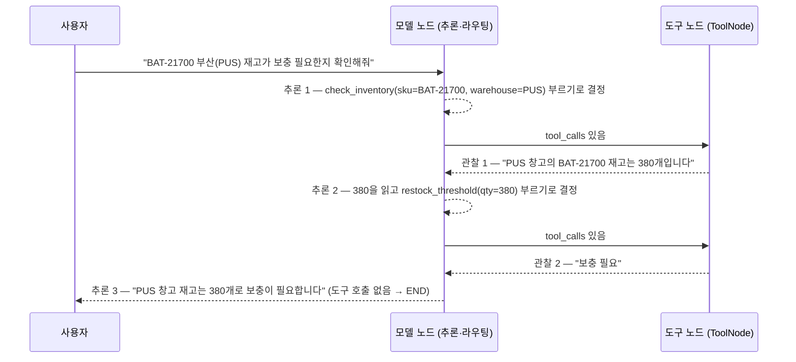

# 04. 다중 도구 Agent — 모델이 도구를 골라 순서대로 엮기

`04_multi_tool_agent.py` 단독 학습 문서입니다.

## 무엇을 하는가

- `create_agent`의 `tools` 목록에 도구를 둘(재고 조회 + 보충 판단) 넣습니다.
- 도구가 여럿이면 모델이 질문을 보고 "어떤 도구를 어떤 순서로 부를지" 스스로 정하는 모습을 봅니다.
- 한 도구의 결과(재고 수량)를 다음 도구(보충 판단)의 입력으로 이어 가는 다단계 흐름을 관찰합니다.

## 왜 필요한가

03에서는 도구가 둘이어도 단순한 계산(`add`, `multiply`)이었습니다. 실무의 Agent는 보통 여러 도구를 갖추고, 질문에 따라 그중 어떤 것을 어떤 순서로 쓸지 모델이 판단합니다. "재고를 먼저 조회하고, 그 수치로 보충 여부를 판단하라" 같은 다단계 작업이 대표적입니다. 도구를 늘려 보면, Agent의 능력을 키우는 일이 결국 **좋은 도구를 더 다는 일**임을 알게 됩니다. 그래프 배선은 그대로 한 줄이고, `tools` 목록만 길어집니다.

## 설계·구동 원리

- **도구 목록만 늘린다.** `create_agent(MODEL, tools=[check_inventory, restock_threshold], ...)`처럼 목록에 도구를 더 넣으면 능력이 확장됩니다. 그래프 배선은 03과 똑같은 한 줄입니다. 도구가 많아져도 모델 노드·도구 노드·조건 분기·순환이라는 구조는 변하지 않습니다.
- **모델이 라우팅한다.** 도구가 둘 이상이면, 모델은 질문과 각 도구의 설명(docstring·`Field` description)을 보고 "지금은 어떤 도구를 어떤 인자로 부를지"를 정합니다. 도구를 고르는 주체는 우리 코드가 아니라 모델입니다. 그래서 도구 설명을 또렷이 쓰는 것이 라우팅 정확도를 좌우합니다.
- **결과를 다음 도구로 잇는다.** `check_inventory`가 "부산 창고 재고는 380개"라고 답하면, 모델은 그 380을 읽어 `restock_threshold(qty=380)`을 부릅니다. 한 도구의 관찰이 다음 추론의 재료가 되는 ReAct 루프가 도구 사이의 연결을 만듭니다.
- **`args_schema`로 인자를 또렷이.** `check_inventory`는 `InventoryInput`(Pydantic)으로 인자의 의미·예시를 명시했습니다. `Field(description=...)`이 모델에게 "이 인자에 무엇을 넣어야 하는지" 알려 주어, 모델이 `sku`·`warehouse`를 정확히 채우게 돕습니다.
- **빈 결과 대신 읽을 수 있는 메시지.** 재고 정보가 없을 때 빈 문자열이 아니라 `"재고 정보 없음: ..."`을 돌려줍니다. 모델이 "없음"을 읽고 멈출 수 있게 하는 설계로, 06에서 무한 루프 예방의 근본 처방으로 자세히 다룹니다.

## 구동 흐름 (다이어그램)

같은 ReAct 루프 위에서, 모델이 두 도구를 차례로 골라 부르는 모습입니다.



**구동 원리.** 도구가 여럿일 때 흐름의 뼈대는 03과 같은 ReAct 루프입니다. 다른 점은 **추론 단계에서 모델이 도구를 고른다**는 것입니다. 첫 추론에서 모델은 "재고를 알아야 보충 여부를 판단할 수 있다"고 보고 `check_inventory`를 먼저 부릅니다. 도구 노드가 부산 창고 재고 380개를 `ToolMessage`로 돌려주면, 모델은 그 수치를 읽고 두 번째 추론에서 `restock_threshold(qty=380)`을 부릅니다. 임계치 500보다 380이 작으므로 도구가 "보충 필요"를 돌려주고, 모델은 마지막 추론에서 재고 수량과 보충 여부를 한 문장으로 정리합니다. 이때는 더 부를 도구가 없으므로 도구 호출이 없는 `AIMessage`가 나오고 그래프가 끝납니다. 한 도구의 결과가 다음 도구의 입력으로 이어지는 이 연결이, 여러 도구를 가진 Agent의 핵심 동작입니다.

## 실행법

```bash
uv run python 06_langgraph_agent/04_multi_tool_agent.py
```

## 예상 출력

```
=== 도구 두 개를 순서대로 부르는 질문 (재고 조회 → 보충 판단) ===
최종 답변: BAT-21700의 부산(PUS) 창고 재고는 380개로, 임계치보다 적어 보충이 필요합니다.

[누적된 메시지 흐름 — 모델이 고른 도구 호출 순서]
================================ Human Message =================================
BAT-21700 부산(PUS) 창고 재고가 보충이 필요한지 확인해줘
================================== Ai Message ==================================
Tool Calls: check_inventory(sku=BAT-21700, warehouse=PUS)
================================= Tool Message =================================
PUS 창고의 BAT-21700 재고는 380개입니다.
================================== Ai Message ==================================
Tool Calls: restock_threshold(qty=380)
================================= Tool Message =================================
보충 필요
================================== Ai Message ==================================
BAT-21700의 부산(PUS) 창고 재고는 380개로, 임계치보다 적어 보충이 필요합니다.
```

(메시지 형식과 표현은 모델·버전에 따라 조금씩 다를 수 있습니다.)

## 체크포인트

- `check_inventory`(PUS=380) → `restock_threshold`(380) 순으로 두 도구가 차례로 호출되면, 모델이 도구를 스스로 골라 순서대로 엮은 것입니다.
- 최종 답에 "380"과 "보충 필요"가 함께 나오면, 한 도구의 결과가 다음 도구로 이어진 것입니다.
- 도구를 여러 개 줬어도 그래프 배선은 03과 같은 한 줄임을 떠올릴 수 있어야 합니다.

## 흔한 실수 (증상별 진단)

| 증상 | 원인 | 해결 |
|------|------|------|
| 모델이 엉뚱한 도구를 부른다 | 도구 설명(docstring·`Field`)이 모호 | 도구마다 "언제 쓰는지"를 한 문장으로 또렷이 적기 |
| 재고를 도구로 확인하지 않고 지어낸다 | `system_prompt`에 "추측 금지·도구 확인" 규칙이 없음 | "수량은 반드시 도구로 확인하라"를 프롬프트에 명시 |
| 두 번째 도구로 이어지지 않는다 | 첫 도구가 수치를 사람이 못 읽는 형태로 돌려줌 | 결과 문장에 수량 같은 핵심 값을 그대로 담기 |
| 없는 재고에서 같은 검색을 반복한다 | 빈 결과를 빈 문자열로 돌려줌 | "재고 정보 없음" 같은 읽을 수 있는 메시지로(06에서 상세) |

## 더 해보기

- 질문을 인천(ICN) 창고로 바꿔(재고 1240개), "충분"으로 결론나는지 확인하십시오.
- 존재하지 않는 제품 코드를 물어, "재고 정보 없음" 메시지를 받은 모델이 어떻게 답하는지 보십시오.
- 세 번째 도구(예: 발주 수량 계산)를 더 달아, 모델이 세 도구를 어떤 순서로 엮는지 관찰하십시오.

## 다음 예제

`05_custom_state` — 도구 대신 **커스텀 상태와 상태 기반 동적 프롬프트**로 Agent를 개인화합니다.
