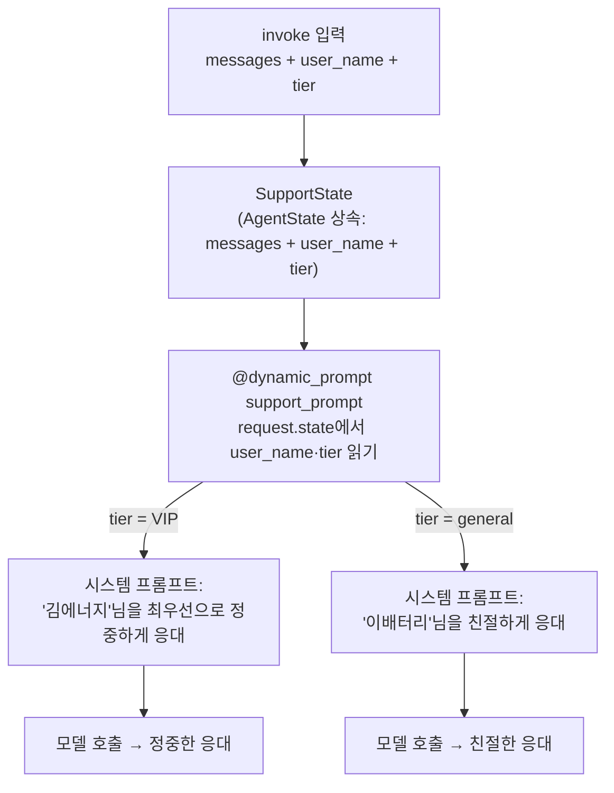

# 05. 커스텀 상태 — 상태 기반 동적 프롬프트로 개인화

`05_custom_state.py` 단독 학습 문서입니다.

## 무엇을 하는가

- `create_agent`의 기본 상태(`AgentState`)를 상속해 우리가 쓸 필드(`user_name`, `tier`)를 더합니다.
- `state_schema`로 기본 상태 대신 확장한 상태를 쓰게 합니다.
- `@dynamic_prompt` 미들웨어로, 매 호출의 상태 값을 읽어 시스템 프롬프트를 그때그때 만듭니다.

## 왜 필요한가

03·04의 `system_prompt`는 고정 문자열이라, 누가 무엇을 물어도 같은 지시였습니다. 그러나 실무에서는 같은 질문에도 상대에 따라 다르게 응대해야 할 때가 많습니다. VIP 고객에게는 더 정중하게, 일반 고객에게는 친절하게 같은 식입니다. 이를 위해 두 가지가 필요합니다. 하나는 고객 이름·등급 같은 값을 담을 **상태의 확장**이고, 다른 하나는 그 상태를 읽어 프롬프트를 **호출마다 새로 만드는** 동적 프롬프트입니다. 이 둘을 갖추면 같은 Agent가 상대에 맞춰 응대 톤을 바꿉니다.

## 설계·구동 원리

- **기본 상태를 상속한다.** `class SupportState(AgentState)`는 `create_agent`의 기본 상태를 물려받아 `messages` 칸을 그대로 가진 채, `user_name`·`tier` 필드만 더합니다. 처음부터 새로 만들지 않고 필요한 칸만 얹는 방식입니다.
- **`state_schema`로 갈아 끼운다.** `create_agent(..., state_schema=SupportState)`로 기본 상태 대신 확장한 상태를 쓰게 합니다. 이제 `invoke` 입력에 `messages`뿐 아니라 `user_name`·`tier`도 함께 넘길 수 있습니다.
- **`@dynamic_prompt`가 매번 프롬프트를 만든다.** 고정 문자열 대신, `@dynamic_prompt`로 감싼 함수가 호출마다 실행되어 시스템 프롬프트를 동적으로 만듭니다. 함수는 `ModelRequest`를 받고, `request.state`에서 그 시점의 상태 값을 읽어 프롬프트 문자열을 돌려줍니다.
- **미들웨어로 끼운다.** 만든 동적 프롬프트 함수를 `create_agent(..., middleware=[support_prompt])`로 끼웁니다. 미들웨어는 모델 호출 앞뒤에 끼어드는 부품으로, 여기서는 호출 직전 시스템 프롬프트를 상태 기반으로 갈아 끼우는 역할을 합니다.
- **`.get(키, 기본값)`으로 안전하게.** `request.state.get("tier", "general")`처럼 기본값을 두면, 호출 시 값이 빠져도 오류 없이 동작합니다. 방어적으로 기본값을 두는 습관이 운영 코드를 튼튼하게 합니다.

## 구동 흐름 (다이어그램)

같은 질문이 상태에 따라 다른 시스템 프롬프트로 변환되는 흐름입니다.



**구동 원리.** `create_agent`에 `state_schema=SupportState`를 주면, 그래프의 상태가 `messages`에 더해 `user_name`·`tier`까지 담을 수 있게 확장됩니다. 호출할 때 `{"messages": ..., "user_name": "김에너지", "tier": "VIP"}`처럼 이 값들을 함께 넘기면, 모델을 부르기 직전에 미들웨어로 끼운 `support_prompt`가 실행됩니다. 이 함수는 `request.state`에서 `tier`를 읽어, VIP면 "최우선으로 정중하게", 그 밖이면 "친절하게"라는 톤을 정하고, `user_name`을 호칭에 끼워 그 호출만의 시스템 프롬프트를 만듭니다. 그래서 "환불 절차가 궁금해요"라는 똑같은 질문이라도, `tier` 값에 따라 모델 앞에 붙는 지시가 달라지고 응대 톤도 달라집니다. 고정 프롬프트(03·04)가 한 번 정하면 끝인 것과 달리, 동적 프롬프트는 매 호출의 상태를 읽어 그때그때 새로 만든다는 점이 핵심입니다.

## 실행법

```bash
uv run python 06_langgraph_agent/05_custom_state.py
```

## 예상 출력

```
=== VIP 고객 응대 (동적 프롬프트가 '최우선으로 정중하게') ===
응대: 김에너지님, 환불 절차를 정성껏 안내해 드리겠습니다. ...

=== 일반 고객 응대 (동적 프롬프트가 '친절하게') ===
응대: 이배터리님, 환불 절차를 안내해 드릴게요. ...
```

(호칭·톤은 모델·버전에 따라 다르게 표현될 수 있습니다. 핵심은 `tier`에 따라 응대가 갈리는 것입니다.)

## 체크포인트

- 같은 질문인데 `tier`에 따라 응대 톤·호칭이 달라지면, 상태가 프롬프트에 반영된 것입니다.
- `user_name`이 답변에 나타나면, 커스텀 상태 값이 동적 프롬프트로 전달된 것입니다.
- 고정 `system_prompt`(03·04)와 달리, 호출마다 프롬프트가 새로 만들어진다는 점이 차이입니다.

## 고정 프롬프트와 동적 프롬프트 — 언제 무엇을

| 구분 | 만드는 법 | 언제 쓰나 |
|------|-----------|-----------|
| 고정(`system_prompt="..."`) | 문자열 한 줄 | 누구에게나 같은 역할·규칙이면 충분할 때(03·04) |
| 동적(`@dynamic_prompt` + 상태) | 상태를 읽어 함수가 매번 생성 | 사용자·맥락에 따라 지시를 바꿔야 할 때(개인화·권한별 응대) |

동적 프롬프트의 값은 상태를 읽을 수 있다는 점입니다. 사용자 등급, 언어, 권한, 직전 대화 요약 같은 상태 값을 프롬프트에 끼워, 같은 Agent가 맥락에 맞춰 다르게 행동하게 만듭니다.

## 흔한 실수 (증상별 진단)

| 증상 | 원인 | 해결 |
|------|------|------|
| 커스텀 필드가 무시된다 | `state_schema`를 안 넘겨 기본 상태를 씀 | `create_agent(..., state_schema=SupportState)` 명시 |
| 동적 프롬프트가 안 먹는다 | `middleware`에 함수를 안 끼웠다 | `middleware=[support_prompt]`로 등록 |
| 값이 없을 때 오류가 난다 | `request.state["tier"]`로 직접 접근 | `.get("tier", "general")`로 기본값 두기 |
| tier가 같으면 응대도 같다 | 톤 분기 로직이 tier를 반영 안 함 | 프롬프트 생성 함수에서 tier로 톤을 가르기 |

## 더 해보기

- `support_prompt`를 바꿔(예: `tier`별로 응대 길이를 다르게) 상태 값이 프롬프트에 어떻게 반영되는지 보십시오.
- `SupportState`에 `language` 필드를 더하고, 그 값에 따라 응대 언어를 바꾸는 동적 프롬프트를 만들어 보십시오.
- 04의 도구와 이 예제의 커스텀 상태를 합쳐, 등급에 따라 다른 도구 사용 규칙을 주는 Agent를 시도해 보십시오.

## 다음 예제

`06_error_and_safety` — 도구 루프의 위험을 다룹니다. **무한 루프의 근본 원인, `ToolNode`의 오류 회신, `recursion_limit` 안전망**까지 세 겹의 방어를 익힙니다.
