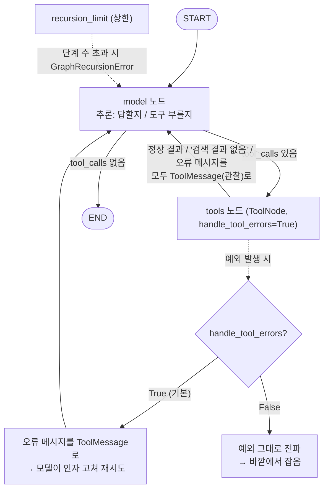

# 06. 오류와 안전 — 무한 루프 근본 원인, 오류 회신, 재귀 한도

`06_error_and_safety.py` 단독 학습 문서입니다.

## 무엇을 하는가

- 도구 루프가 끝나는 조건은 단 하나(모델이 도구를 그만 부름)임을 짚습니다.
- `ToolNode`가 기본값(`handle_tool_errors=True`)으로 도구 예외를 잡아, 오류를 담은 `ToolMessage`로 돌려줘 모델이 인자를 고쳐 다시 시도하게 합니다(자기 교정).
- 빈 결과 대신 '읽을 수 있는 실패 메시지'를 돌려주는 것이 무한 루프의 근본 처방임을 봅니다.
- `recursion_limit`으로 단계 수에 상한을 둬, 무엇이 잘못되든 일정 횟수에서 루프를 끊습니다.

## 왜 필요한가

도구 루프에는 본질적인 위험이 하나 있습니다. 루프가 끝나는 조건은 단 하나, 모델이 도구를 그만 부르고 일반 텍스트로 답하는 것인데, 모델이 만족하지 못하면 그 조건이 영영 오지 않습니다. 손으로 짤 때는 `for _ in range(MAX_TURNS)` 같은 안전판이 코드에 그대로 보였지만, 그래프로 옮기면 그 `for` 문이 사라져 "어디서 멈추는가"가 코드에서 보이지 않게 됩니다. 그래서 무한 루프를 예방하는 설계가 필요합니다. 핵심은 한도를 무작정 올리는 것이 아니라, **도구가 실패를 모델이 읽을 수 있는 형태로 알리게** 하는 것입니다.

## 설계·구동 원리 — 세 겹의 방어

안전한 도구 루프는 세 겹으로 지킵니다. 각 겹은 서로를 대신하지 못하고 함께 작동합니다.

- **둘째 겹, 의미 있는 실패 (근본 처방).** 도구가 빈 결과나 예외를 그냥 흘리지 않고, 모델이 읽고 판단할 수 있는 메시지로 돌려줍니다. 두 갈래가 있습니다.
  - *예외를 던질 때*: 모델이 인자를 잘못 채워 도구가 터지면, `ToolNode`는 기본 설정(`handle_tool_errors=True`)에서 그 예외를 잡아 오류 메시지를 담은 `ToolMessage`로 돌려줍니다. 모델은 그 메시지를 읽고 인자를 고쳐 다시 시도합니다(자기 교정). 인자 실수 하나로 그래프 전체가 죽지 않습니다. 동작을 바꾸려면 `handle_tool_errors`에 고정 문자열·예외 타입·콜러블을 줄 수 있고, `False`로 두면 예외를 그대로 전파시켜 바깥에서 잡습니다.
  - *빈 결과를 돌려줄 때*: 이건 `ToolNode`가 잡아 줄 수 없습니다. 예외가 아니라 정상 반환이기 때문입니다. 검색 결과가 없어 빈 문자열 `""`이 돌아오면 모델은 그 의미를 못 읽고 같은 검색을 되풀이합니다. 처방은 도구 쪽에 있습니다. `"검색 결과 없음. 해당 내용은 사내 문서에 없습니다."`처럼 읽을 수 있는 메시지를 돌려주면, 모델은 "없다"는 사실을 읽고 재시도를 멈춰 솔직하게 답합니다.
- **첫째 겹, 상한 (마지막 그물).** `recursion_limit`으로 그래프가 밟을 단계 수에 천장을 둬, 무엇이 잘못되든 일정 횟수에서 루프가 끊기게 합니다. 모델 호출 한 번, 도구 실행 한 번이 각각 한 단계로 세집니다. 한도를 넘으면 `GraphRecursionError`를 던집니다. 이건 마지막 그물입니다. 정상 흐름에서 닿으면 안 되고, 닿았다면 설계를 점검하라는 신호입니다. (기본값은 라이브러리가 정한 넉넉한 수이며, 버전에 따라 다를 수 있으므로 특정 숫자에 의존하지 않습니다.)
- **셋째 겹, 위험 작업 차단.** 메일 발송·결제·외부 시스템 변경처럼 되돌리기 어려운 작업은 모델의 판단에만 맡기지 않습니다. 커스텀 그래프의 검증·승인 노드를 도구 실행 *앞*에 두어(01에서 자리만 짚었습니다), 모델이 프롬프트를 어겨도 코드가 한 번 더 거릅니다. 상한과 의미 있는 실패가 루프의 *양*을 다스린다면, 이 겹은 루프가 일으킬 *피해*를 다스립니다.

> 이 예제는 둘째 겹과 첫째 겹에 집중합니다. `ToolNode`를 직접 배선하는 까닭은 `handle_tool_errors`가 `ToolNode`의 옵션임을 보이고, 셋째 겹의 검증 노드를 끼울 자리가 이 커스텀 길에 있음을 떠올리기 위해서입니다.

## 구동 흐름 (다이어그램)

도구가 예외를 던지거나 빈 결과에 가까운 상황에서, 오류 회신과 재귀 한도가 어떻게 루프를 지키는지 보여 줍니다.



**구동 원리.** 그래프의 뼈대는 01의 수동 ReAct 루프와 같습니다. 다른 점은 `tools` 노드를 만들 때 `handle_tool_errors=True`(기본값)를 두었다는 것입니다. 도구가 정상 결과를 내면 그대로 `ToolMessage`로 돌아오고, 검색 결과가 없으면 도구가 `"검색 결과 없음"`이라는 읽을 수 있는 메시지를 돌려주어 모델이 "없다"를 이해하고 멈춥니다. 도구가 예외를 던지면(예: 0으로 나누기) `ToolNode`가 그 예외를 잡아 오류 메시지를 담은 `ToolMessage`로 바꿔 모델에 돌려주고, 모델은 그것을 읽어 인자를 고치거나 솔직하게 설명합니다. 그래도 모델이 끝없이 도구를 부르는 극단의 경우를 대비해, `recursion_limit`이 단계 수에 천장을 둡니다. 한도를 넘으면 `GraphRecursionError`가 나고, 운영에서는 이 예외를 잡아 안내 메시지로 바꾸고 로그로 남깁니다. 근본은 둘째 겹(의미 있는 실패)이고, 첫째 겹(상한)은 그 뒤를 받치는 마지막 그물입니다.

## 실행법

```bash
uv run python 06_langgraph_agent/06_error_and_safety.py
```

## 예상 출력

```
=== 의미 있는 실패: 없는 내용을 물으면 모델이 '없다'고 솔직히 답한다 ===
최종 답변: 사내 문서에서 헬스장 이용 규정을 찾지 못했습니다.

=== 도구 예외 회복: 예외를 오류 메시지로 받아 모델이 정정·설명한다 ===
최종 답변: 10을 0으로 나눌 수 없습니다. 0이 아닌 값으로 다시 알려 주시면 계산해 드리겠습니다.

=== 재귀 한도: 일부러 1로 낮춰 한도 초과를 유발한다 ===
  스텝 상한 초과로 중단(GraphRecursionError) — 운영에서는 잡아 안내·로깅: GraphRecursionError

=== 재귀 한도: 넉넉한 기본값이면 정상 종료한다 ===
  최종 답변: 연차는 입사 1년차 15일이며, 매 2년마다 1일씩 늘어 최대 25일입니다.
```

(표현은 모델·버전에 따라 다를 수 있습니다. 핵심은 그래프가 예외로 죽지 않고 안전하게 처리하는 것입니다.)

## 체크포인트

- 없는 내용을 물었을 때 "없습니다" 류로 답하고 같은 검색을 무한히 반복하지 않으면, 의미 있는 실패가 동작한 것입니다.
- 0으로 나누기에서 그래프가 예외로 죽지 않고 "나눌 수 없다"는 취지로 답하면, `ToolNode`의 오류 회신이 동작한 것입니다.
- 낮은 한도(`recursion_limit=1`)에서 `GraphRecursionError`가, 넉넉한 기본값에서 정상 답이 나오면 안전망이 동작한 것입니다.

## 흔한 실수 (증상별 진단)

| 증상 | 원인 | 해결 |
|------|------|------|
| 같은 질문이 자꾸 `GraphRecursionError`에 닿는다 | 도구가 빈 결과·모호한 실패를 돌려줘 모델이 만족 못 함 | 한도를 키우기 전에, 도구가 "검색 결과 없음" 같은 읽을 수 있는 메시지를 돌려주게 고침 |
| 도구가 터지면 그래프 전체가 죽는다 | `handle_tool_errors=False`이거나 바깥에서 안 잡음 | 기본값(`True`)을 쓰거나, `False`라면 `invoke`를 `try/except`로 감쌈 |
| 한도를 올려도 루프가 안 멈춘다 | 종료 조건이 도구·프롬프트 설계에 없음 | "왜 모델이 만족 못 하고 계속 부르는가"부터 진단(근본은 둘째 겹) |
| 위험 작업이 검증 없이 실행된다 | 모델 판단에만 맡김 | 커스텀 그래프의 검증·승인 노드를 도구 실행 앞에 둠(셋째 겹) |

> 막힘은 대부분 모델 탓이 아니라 위 패턴입니다. 무한 루프에 닿을 때 `recursion_limit`을 무작정 올리는 것은 흔한 실수입니다. 멈출 줄 모르는 Agent는 대개 도구나 프롬프트 설계가 잘못됐다는 신호이므로, "왜 모델이 만족하지 못하고 계속 도구를 부르는가"를 먼저 따지십시오.

## 안전 설계 점검 — 세 겹을 차례로

세 겹을 함께 두면 점검 질문이 분명해집니다. 어느 겹이 비었는지를 보면 무엇을 보강할지가 곧 드러납니다.

1. **한도에 닿았는가** (첫째 겹) — 닿았다면 정상 흐름이 아니라는 신호입니다.
2. **도구가 실패를 제대로 알리는가** (둘째 겹) — 빈 결과·예외를 읽을 수 있는 메시지로 돌려주는지 봅니다.
3. **위험 작업이 검증을 거치는가** (셋째 겹) — 되돌리기 어려운 작업 앞에 검증·승인 노드가 있는지 봅니다.

안전은 한 가지 설정으로 끝나는 것이 아니라, 이 세 겹이 각자의 자리를 지킬 때 완성됩니다.

## 더 해보기

- `search_doc`이 못 찾았을 때 빈 문자열 `""`을 돌려주도록 바꿔, 모델이 같은 검색을 반복하다 한도에 닿는지 관찰하십시오(둘째 겹이 무너졌을 때의 증상).
- `ToolNode(tools, handle_tool_errors="입력을 다시 확인하십시오.")`처럼 고정 문자열로 바꿔, 오류 회신 메시지가 통일되는지 보십시오.
- `model`과 `tools` 사이에 간단한 검증 노드를 끼워, 위험한 인자를 도구 실행 전에 막는 셋째 겹을 직접 만들어 보십시오.

## 다음 장

`07_short_memory` — 지금까지는 한 번의 `invoke`가 끝나면 대화가 사라졌습니다. 다음 장에서는 **체크포인터로 대화 상태를 저장**해, 여러 번의 호출에 걸쳐 같은 Agent가 앞 대화를 기억하게 만듭니다.
