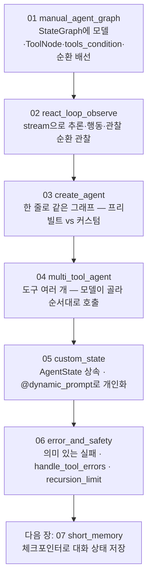

# 06. LangGraph 기반 Agent

앞 장까지 손으로 돌리던 도구 호출 루프를 이제 그래프에 맡기는 장입니다. LO1에서 개념으로 배운 Agent의 추론(Reasoning)·행동(Action)·관찰(Observation) 루프를 여기서는 코드로 옮깁니다. 먼저 `StateGraph`에 모델 노드와 도구 노드를 한 줄씩 끼워 가며 **수동 Agent 그래프**를 직접 배선해 루프가 어떻게 도는지 눈으로 확인하고, 그다음 같은 그래프를 `create_agent` 한 줄로 줄여 둘을 대조합니다. 끝으로 다중 도구·커스텀 상태·오류와 안전망까지, 운영에 필요한 능력을 한 가지씩 얹습니다.

이 장은 **하나의 주제마다 독립 실행 파일 하나**로 구성됩니다. 각 `NN_topic.py`는 자기완결이라 단독으로 실행되며, 짝이 되는 `NN_topic.md`가 그 예제만으로 혼자 학습할 수 있는 설계·구동 원리와 ```mermaid 다이어그램을 담습니다. 번호 순서대로 따라가면 수동 배선에서 안전 설계까지 개념이 점점 쌓입니다.

## 학습 목표

- 추론·행동·관찰 루프(ReAct)가 무엇이며, 그래프의 어느 부품이 각 단계를 맡는지 설명할 수 있다.
- `StateGraph`에 모델 노드·`ToolNode`·`tools_condition`·되돌아오는 엣지를 직접 배선해 수동 Agent 그래프를 완성할 수 있다.
- `create_agent` 한 줄이 만드는 그래프가 수동 그래프와 동일한 루프임을 확인하고, 프리빌트와 커스텀을 가려 쓸 기준을 댈 수 있다.
- 도구를 여러 개 얹어 모델이 도구를 골라 순서대로 엮게 하고, 커스텀 상태와 상태 기반 동적 프롬프트로 Agent를 개인화할 수 있다.
- 무한 루프의 근본 원인을 짚고, `ToolNode`의 오류 회신·의미 있는 실패·`recursion_limit`으로 도구 루프를 안전하게 지킬 수 있다.

## 실행 방법

```bash
# 레포 루트(ai-agent-dev-lgens)에서
uv sync                       # 최초 1회 (의존성 설치)
cp .env.example .env          # 최초 1회, .env에 OPENAI_API_KEY 입력

# 예제는 하나씩 단독으로 실행합니다.
uv run python 06_langgraph_agent/01_manual_agent_graph.py
uv run python 06_langgraph_agent/02_react_loop_observe.py
# ... 06까지 같은 방식
```

각 파일은 상단에 `load_dotenv()`·`MODEL` 상수·필요한 import·자체 모델 초기화를 모두 갖춰, 다른 파일에 의존하지 않습니다. 키가 없으면 안내만 출력하고 종료하므로, 문법·import 점검은 키 없이도 됩니다. 공급사를 바꾸려면 각 파일 상단의 `MODEL` 상수만 교체하면 됩니다(기본 `openai:gpt-5.4-mini`, Gemini 대안은 `google-genai:gemini-3.5-flash`).

## 권장 학습 경로

번호 순서대로 보는 것을 권장합니다. 각 예제는 `NN_topic.py`(코드)와 `NN_topic.md`(설계·원리·다이어그램)가 짝을 이룹니다.

| 번호 | 예제 | 한 줄 요약 |
|------|------|-----------|
| 01 | `01_manual_agent_graph` | 모델 노드·`ToolNode`·`tools_condition`·되돌아오는 엣지를 손으로 배선해 ReAct 순환 완성 |
| 02 | `02_react_loop_observe` | `stream`으로 추론·행동·관찰이 번갈아 도는 순환을 단계별로 관찰 |
| 03 | `03_create_agent` | `create_agent` 한 줄로 01과 같은 그래프를 만들어 대조 |
| 04 | `04_multi_tool_agent` | 도구를 여러 개 얹어, 모델이 도구를 골라 순서대로 엮기 |
| 05 | `05_custom_state` | 커스텀 상태(`AgentState` 상속)와 상태 기반 동적 프롬프트로 개인화 |
| 06 | `06_error_and_safety` | 무한 루프 근본 원인·`handle_tool_errors`·`recursion_limit`(세 겹 방어) |

01~02가 수동 배선과 관찰, 03이 한 줄 대조, 04~05가 능력 확장, 06이 오류와 안전(심화)입니다.

## 챕터 전체 흐름 (다이어그램)

번호를 따라가면 수동 배선의 토대 위에 한 줄 대조·다중 도구·커스텀 상태·안전 설계가 차례로 쌓입니다.



## 추론·행동·관찰 루프를 그래프로 옮기기

이 장의 뼈대는 ReAct 루프입니다. Agent의 동작은 한 문장으로 줄이면 **생각하고(Reason) 행동하고(Act) 관찰하는(Observe) 과정을 목표에 도달할 때까지 반복하는 것**입니다. 추론만 하거나 행동만 하게 두지 않고 둘을 번갈아 엮으면, 추론은 다음에 무엇을 할지 계획하게 하고 행동은 그 계획을 현실의 정보로 검증하게 하므로 서로를 보완합니다.

세 단계가 그래프의 어느 부품에 대응하는지 짚어 두면 01·02 전체가 한눈에 들어옵니다.

| ReAct 단계 | 하는 일 | 그래프 부품 |
|------------|---------|-------------|
| Reason(추론) | 지금까지의 맥락을 보고 답을 바로 낼지, 어떤 도구를 어떤 인자로 부를지 정함 | 모델 노드(`call_model`) |
| Act(행동) | 모델이 고른 도구를 우리 코드가 실제로 실행 | `ToolNode` |
| Observe(관찰) | 실행 결과(`ToolMessage`)를 다시 모델에 돌려줌 | `add_edge("tools", "model")` |

여기서 결정적인 줄이 01의 `add_edge("tools", "model")`입니다. 도구 결과(관찰)를 들고 다시 추론으로 돌아가는 이 한 줄이 ReAct 루프의 "순환"을 만듭니다. 모델은 관찰을 보고 또 도구를 부르거나, 충분하면 최종 답을 냅니다. 이 줄을 지우면 도구 실행 후 모델로 돌아가지 못해 순환이 끊기고, 도구 결과를 정리해 최종 답을 만드는 단계가 사라집니다.

> **중요한 점**: Act 단계에서 모델은 도구를 직접 실행하지 않습니다. "이 도구를 이렇게 불러 달라"고 제안할 뿐이고, 실행 권한은 우리 코드(`ToolNode`)가 쥡니다. 그래서 도구 실행 전에 검증·승인 노드를 끼워 통제할 자리가 생깁니다.

## 수동 그래프와 create_agent — 같은 루프, 다른 통제력

01~02에서 손으로 짠 모델 노드·`ToolNode`·조건부 엣지·순환을, `create_agent`는 내부에서 똑같이 구성합니다(03). 결과 동작은 같고 보일러플레이트만 사라집니다. 그렇다면 굳이 손으로 배선하는 커스텀 그래프의 값은 어디에 있을까요. 답은 **끼워 넣을 자리**입니다.

- **프리빌트(`create_agent`)**: 모델 노드와 도구 노드가 곧장 맞붙어 있어 그 사이에 무엇을 넣을 틈이 없습니다. 표준 ReAct 루프로 충분한 대부분의 경우에 한 줄로 끝냅니다.
- **커스텀 그래프(수동 배선)**: 같은 두 노드를 우리가 배선하므로, 그 사이에 노드를 하나 더 끼워 넣을 자리가 생깁니다. 도구 실행 전 검증, 위험한 작업 전 사람 승인, 도구 결과 후처리가 대표적인 개입 지점입니다.

선택 기준은 단순합니다. **표준 루프로 충분하면 프리빌트, 루프 중간에 직접 개입해야 하면 커스텀**입니다. 두 길은 단절돼 있지 않습니다. 프리빌트가 만드는 그래프도 결국 같은 `StateGraph`이므로, 프로토타입은 프리빌트로 시작하고 운영에서 검증·승인·로깅이 필요해지면 그때 커스텀으로 풀어 쓰면 됩니다. 검증 노드가 값진 까닭은 그것이 *모델 바깥*에 있다는 점입니다. 프롬프트는 경향을 유도할 뿐 강제하지 못하지만, 그래프에 박힌 노드는 흐름을 강제합니다. 모델이 시스템 프롬프트를 어기고 위험한 호출을 시도해도 검증 노드가 도구 실행 전에 한 번 더 걸러 줍니다.

## 안전한 도구 루프 — 세 겹의 방어 (06)

도구 루프에는 본질적인 위험이 있습니다. 루프가 끝나는 조건은 단 하나, 모델이 도구를 그만 부르고 일반 텍스트로 답하는 것인데, 모델이 만족하지 못하면 그 조건이 영영 오지 않습니다. 06은 이를 세 겹으로 막습니다.

1. **의미 있는 실패(근본 처방)**: 도구가 빈 결과나 예외를 그냥 흘리지 않고, 모델이 읽고 판단할 수 있는 메시지로 돌려줍니다. `ToolNode`의 기본 오류 회신(`handle_tool_errors=True`)이 예외를 메시지로 바꿔 주고, 빈 결과는 도구 쪽에서 "검색 결과 없음"처럼 말로 돌려줍니다.
2. **상한(마지막 그물)**: `recursion_limit`으로 단계 수에 천장을 둬, 무엇이 잘못되든 일정 횟수에서 루프가 끊기게 합니다. 정상 흐름에서 닿으면 안 되고, 닿았다면 설계를 점검하라는 신호입니다.
3. **위험 작업 차단**: 되돌리기 어려운 작업은 커스텀 그래프의 검증·승인 노드를 도구 실행 *앞*에 두어, 모델이 프롬프트를 어겨도 코드가 한 번 더 거릅니다.

> 무한 루프에 닿을 때 `recursion_limit`을 무작정 올리는 것은 흔한 실수입니다. 멈출 줄 모르는 Agent는 대개 도구나 프롬프트 설계가 잘못됐다는 신호이므로, "왜 모델이 만족하지 못하고 계속 도구를 부르는가"를 먼저 따지십시오.

## 핵심 점검

이 장이 성공인지 가르는 한 가지 기준은 **01에서 최종 답변에 32가 나오는지**입니다. "3 더하기 5를 4와 곱하면?"이라는 질문은 `add` 한 번, `multiply` 한 번, 두 번의 도구 호출을 거쳐야 풀립니다. 32가 나오면 추론·행동·관찰 순환이 한 바퀴 이상 돌아간 것입니다.

- **순환이 도는가.** 도구 결과를 받은 모델이 다시 추론으로 돌아가 두 번째 도구를 부르고, 마지막에 사람 문장으로 정리하면 성공입니다. 도구 결과(`ToolMessage`)에서 흐름이 끊겨 답이 안 나오면 `add_edge("tools", "model")`을 빠뜨린 것입니다(01).
- **분기가 동작하는가.** 인사말("안녕!")은 도구를 거치지 않고 바로 답하고, 계산 질문만 `tools`로 가야 합니다. `tools_condition`은 마지막 `AIMessage`에 도구 호출이 있으면 `tools`로, 없으면 종착점으로 보냅니다(01·02).
- **수동과 한 줄이 같은가.** 03의 `create_agent` 답이 01의 수동 그래프와 같으면(32 포함), 한 줄 버전이 동일한 그래프를 만든 것입니다. 둘을 비교하며 "create_agent가 내부에서 무엇을 자동화했는지"를 떠올릴 수 있어야 합니다.

## 흔한 실수 (증상별 진단)

| 증상 | 원인 | 해결 | 관련 예제 |
|------|------|------|-----------|
| 도구 결과(8)에서 답이 멈춘다 | `tools → model` 되돌아오는 엣지 누락 | `add_edge("tools", "model")` 한 줄 추가 | 01 |
| 인사말에도 도구로 강제로 간다 | `model → tools`를 무조건 연결 | `add_conditional_edges("model", tools_condition)`으로 교체 | 01 |
| `messages`가 매번 덮어써져 맥락을 잃는다 | `State`에 `add_messages` 리듀서를 안 달았다 | `Annotated[list, add_messages]`로 선언 | 01·02 |
| 모델이 엉뚱한 도구를 부른다 | 도구 설명(docstring·`Field`)이 모호 | 도구마다 "언제 쓰는지"를 또렷이 적기 | 04 |
| 커스텀 필드가 무시된다 | `state_schema`를 안 넘겨 기본 상태를 씀 | `create_agent(..., state_schema=...)` 명시 | 05 |
| 같은 질문이 자꾸 `GraphRecursionError`에 닿는다 | 도구가 빈 결과·모호한 실패를 돌려줘 모델이 만족 못 함 | 한도를 키우기 전에, 도구가 읽을 수 있는 메시지를 돌려주게 고침 | 06 |

> 막힘은 대부분 모델 탓이 아니라 위 배선·설계 패턴입니다. 더 큰 모델로 바꾸기 전에 증상을 표에서 역추적하십시오.

## 다음 장

`07_short_memory` — 지금까지는 한 번의 `invoke`가 끝나면 대화가 사라졌습니다. 다음 장에서는 **체크포인터로 대화 상태를 저장**해, 여러 번의 호출에 걸쳐 같은 Agent가 앞 대화를 기억하게 만듭니다.
