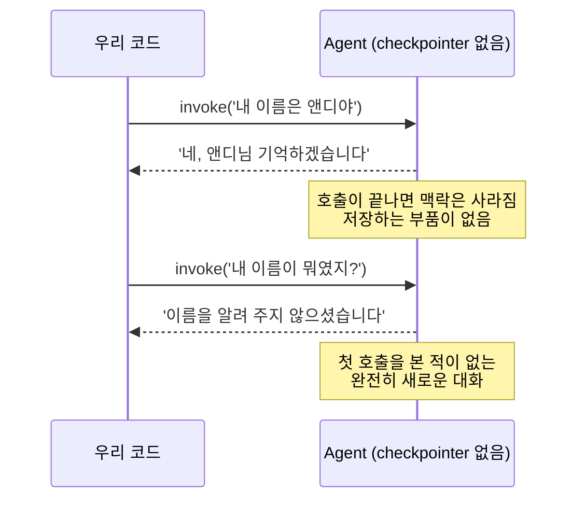

# 01. 메모리 없는 Agent는 매번 잊는다

`01_no_memory.py` 단독 학습 문서입니다. 이 한 파일만으로 "단기 메모리가 왜 필요한가"를 몸으로 느낄 수 있습니다.

## 무엇을 하는가

- `create_agent`로 에이전트를 하나 만듭니다. checkpointer는 일부러 붙이지 않습니다.
- 이름을 알려 준 다음, 다른 호출에서 이름을 물어봅니다.
- 두 번째 호출이 첫 대화를 전혀 기억하지 못하는 것을 확인합니다.

## 왜 필요한가

기본 Agent에는 큰 구멍이 있습니다. 매 호출이 백지에서 시작한다는 것입니다. `agent.invoke(...)`를 부를 때마다 모델은 그 입력에 담긴 메시지만 보고 답하며, 호출이 끝나면 맥락은 사라집니다. 사람이라면 당연히 기억할 것을, Agent는 우리가 기억을 붙여 주지 않으면 못 합니다. 이 구멍을 먼저 눈으로 확인해 두면, 다음 예제에서 checkpointer 한 줄을 더하는 이유가 자연스럽게 이해됩니다.

## 설계·구동 원리

- **모델은 무상태입니다.** 모델은 호출 사이에 아무것도 기억하지 못합니다. 매 호출은 독립적이며, 직전 호출에서 무슨 말이 오갔는지 스스로 알지 못합니다. 요청 하나를 처리하고 맥락을 들고 있지 않는 무상태 HTTP 핸들러와 같습니다.
- **에이전트 입력은 메시지 딕셔너리입니다.** `create_agent`로 만든 에이전트는 `{"messages": [...]}` 형태를 입력으로 받습니다. 메시지는 `{"role": "user", "content": "..."}` 딕셔너리로 넣습니다. 응답도 `{"messages": [...]}`이며, 맨 마지막(`[-1]`)이 모델의 최신 답변입니다.
- **두 호출은 서로 별개입니다.** 첫 호출에서 이름을 알려 주어도, 그 상태를 어딘가에 저장하는 부품이 없으면 두 번째 호출은 그 사실을 알 길이 없습니다. 그래서 같은 질문을 두 번 나눠 던지면, 두 번째 답은 이름을 모른다고 나옵니다. 이는 모델이 모자라서가 아니라 구조가 그래서입니다.

## 구동 흐름 (다이어그램)

다음 다이어그램은 checkpointer가 없을 때 두 호출이 서로 단절되는 모습을 보여 줍니다.



**구동 원리.** 모델은 무상태이고, 우리가 만든 에이전트에도 호출 사이의 상태를 저장하는 부품이 없습니다. 첫 호출에서 "내 이름은 앤디야"를 받아 답을 돌려준 뒤, 에이전트는 그 대화를 어디에도 남기지 않습니다. 그래서 두 번째 호출 `invoke('내 이름이 뭐였지?')`는 첫 대화를 한 번도 본 적이 없는 새 대화입니다. 모델은 이번 입력에 담긴 메시지만 읽으므로 이름을 알 수 없습니다. 02 챕터에서 본 무상태 원리가 에이전트에서도 똑같이 적용되는 셈입니다. 이 단절을 메우려면, 호출 사이에 대화 상태를 저장하고 다음 호출에서 복원하는 부품이 필요합니다. 그 부품이 바로 다음 예제의 checkpointer입니다.

## 실행법

```bash
# 레포 루트(ai-agent-dev-lgens)에서
uv sync                       # 최초 1회 (의존성 설치)
cp .env.example .env          # 최초 1회, .env에 OPENAI_API_KEY 입력
uv run python 07_short_memory/01_no_memory.py
```

키가 없으면 안내만 출력하고 종료합니다. 문법·import 점검은 키 없이도 됩니다.

## 예상 출력

```
[에이전트] CompiledStateGraph (checkpointer 없음)
[1번째 호출] 네, 앤디님. 기억하겠습니다.
[2번째 호출] 죄송하지만 이름을 알려 주지 않으셨습니다. ...
```

## 체크포인트

- 2번째 호출에서 모델이 이름을 모른다고 답하면, 단기 메모리가 왜 필요한지 체감한 것입니다.
- 이것이 정상 동작입니다. 호출 사이에 상태를 저장하는 부품(checkpointer)이 없기 때문입니다.

## 더 해보기

- 두 메시지를 한 번의 `invoke`에 같이 넣어(`messages`에 두 개) 보고, 한 호출 안에서는 맥락이 이어지는지 확인하십시오. 단절은 "호출과 호출 사이"에서만 생깁니다.
- `system_prompt`를 "항상 한 문장으로만 답하라"로 바꿔, 답의 형식이 달라지는지 보십시오.

## 다음 예제

`02_checkpointer` — `checkpointer=InMemorySaver()` 한 줄을 더해 단기 메모리를 켜고, 같은 질문에 모델이 이름을 기억하게 만듭니다.
