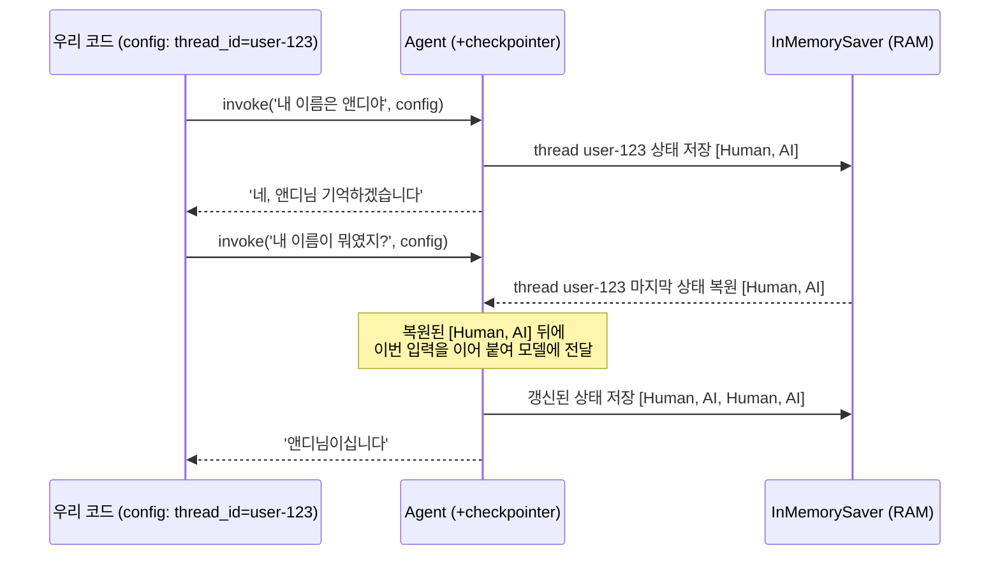

# 02. checkpointer 한 줄로 단기 메모리 켜기

`02_checkpointer.py` 단독 학습 문서입니다.

## 무엇을 하는가

- `InMemorySaver`를 만들어 `create_agent`에 `checkpointer`로 넘깁니다 (한 줄 추가).
- `thread_id`를 정해 같은 대화방에 두 턴을 보냅니다.
- 01 예제와 똑같은 코드인데, checkpointer 한 줄 차이로 모델이 이름을 기억함을 확인합니다.

## 왜 필요한가

01 예제에서 본 단절은 "호출 사이에 상태를 저장하는 부품이 없다"는 한 가지 이유였습니다. checkpointer가 바로 그 부품입니다. 이 한 줄이 어떻게 매 호출을 하나의 대화로 이어 주는지를 이해하면, 단기 메모리의 핵심 절반을 잡은 것입니다. 나머지 절반인 `thread_id`는 다음 예제에서 깊이 다룹니다.

## 설계·구동 원리

- **checkpointer는 상태를 통째로 저장합니다.** 에이전트의 상태에는 `messages`가 있고, `add_messages` 리듀서가 새 메시지를 기존 목록에 누적합니다(05 챕터에서 본 리듀서). checkpointer는 그래프가 한 단계 진행될 때마다 그 시점의 상태를 통째로 저장해 둡니다.
- **복원은 호출 직전에 일어납니다.** 같은 `thread_id`로 다시 호출하면, LangGraph는 그 스레드에 저장된 마지막 상태를 먼저 불러와 거기에 이번 입력을 이어 붙입니다. 그래서 두 번째 호출의 모델은 "내 이름은 앤디야"와 그에 대한 답까지 모두 본 상태에서 "내 이름이 뭐였지?"를 받습니다.
- **`thread_id`는 설정으로 넘깁니다.** `thread_id`는 입력 메시지가 아니라 `{"configurable": {"thread_id": ...}}`라는 config로 넘어갑니다. checkpointer만 붙이고 thread_id를 빠뜨리면 "어느 대화에 저장할지"를 모릅니다. 두 인자가 짝을 이루어야 메모리가 동작합니다.
- **InMemorySaver는 RAM에 저장합니다.** 이름 그대로 프로세스 메모리에만 두므로 재시작하면 사라집니다. 학습·프로토타입에는 충분하지만 운영에는 쓰지 않습니다(영속 저장은 06 예제).

## 구동 흐름 (다이어그램)

다음 다이어그램은 checkpointer가 같은 `thread_id`의 상태를 저장하고 복원해 대화를 잇는 모습을 보여 줍니다.



**구동 원리.** 01 예제와 달라진 것은 `create_agent`에 `checkpointer=InMemorySaver()` 한 줄을 더하고, 호출 때 `config`(같은 `thread_id`)를 함께 넘긴 것뿐입니다. 첫 호출에서 checkpointer는 `thread_id=user-123`의 상태로 `[Human, AI]`를 저장합니다. 두 번째 호출에서 같은 `thread_id`가 들어오면, LangGraph는 그 스레드의 마지막 상태를 먼저 복원한 다음 이번 입력(`내 이름이 뭐였지?`)을 그 뒤에 이어 붙여 모델에 넘깁니다. 모델은 02 챕터에서 본 것처럼 누적된 메시지를 처음부터 읽으므로 "앤디"를 기억해 답합니다. 맥락이 이어지는 것처럼 보이는 까닭은 모델이 기억해서가 아니라, checkpointer가 매번 앞 대화를 복원해 다시 보여 주기 때문입니다. 02 챕터에서 우리가 손으로 `messages.append`하던 누적을, 이제 checkpointer가 `thread_id` 단위로 자동으로 해 주는 셈입니다.

## 실행법

```bash
uv run python 07_short_memory/02_checkpointer.py
```

## 예상 출력

```
[에이전트] CompiledStateGraph (checkpointer 부착 완료)
[1턴] 네, 앤디님. 기억하겠습니다.
[2턴] 앤디님이십니다.
[누적 메시지 수] 4
```

## 체크포인트

- 2턴에서 "앤디"가 나오고 누적 수가 4 이상이면 멀티턴 맥락 유지에 성공한 것입니다.
- 01 예제와 비교하십시오. 같은 질문인데 checkpointer 한 줄 + 같은 `thread_id` 차이로 결과가 달라졌습니다.

## 더 해보기

- 두 번째 `invoke`에서 `config`를 빼고 호출해 보십시오. `thread_id`가 없으면 다시 백지에서 시작합니다.
- `thread_id`를 `user-123`이 아닌 다른 값으로 두 번째 호출에 넘겨 보고, 결과가 어떻게 달라지는지 확인하십시오(다음 예제의 주제입니다).

## 다음 예제

`03_thread_id` — `thread_id`가 "어떤 호출들을 한 대화로 묶을지" 정하는 열쇠임을 이해하고, 같은 `thread_id`로는 잇고 다른 `thread_id`로는 격리하는 경계를 직접 긋습니다.
