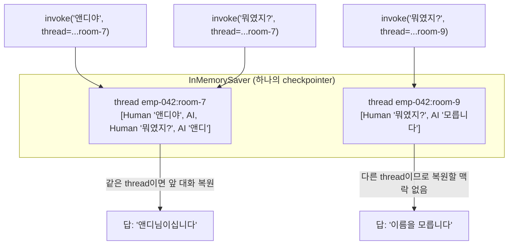

# 03. thread_id로 대화의 경계 긋기

`03_thread_id.py` 단독 학습 문서입니다.

## 무엇을 하는가

- 같은 `thread_id`로 여러 턴을 주고받아 맥락이 이어지는 것을 확인합니다.
- `thread_id`를 바꾸면 앞 대화가 보이지 않는 것을 확인합니다 (의도된 격리).
- 사용자 ID와 대화방 ID를 조합한 "세션 키"를 `thread_id`로 만드는 패턴을 익힙니다.

## 왜 필요한가

checkpointer 코드를 다 이해했더라도, 실무에서 정작 헷갈리는 것은 코드가 아니라 `thread_id`를 어떻게 정할 것인가입니다. 이 식별자가 메모리의 진짜 열쇠이기 때문입니다. `thread_id`를 정하는 일은 곧 대화의 단위를 설계하는 일이며, 사용자가 어시스턴트를 어떻게 경험하는지를 좌우합니다.

## 설계·구동 원리

- **`thread_id`는 호출을 묶는 기준입니다.** 같은 `thread_id`로 부르는 호출들은 한 대화로 이어지고, 그 사이 오간 맥락이 매번 복원됩니다. `thread_id`를 바꾸면 LangGraph는 새 대화로 보고 백지에서 출발합니다.
- **경계를 긋는 주체는 우리입니다.** 모델은 두 호출이 같은 대화인지 스스로 판단하지 않습니다. 우리가 같은 `thread_id`를 주면 잇고, 다른 `thread_id`를 주면 끊습니다. 어제 이야기를 오늘 이어 가길 바라면 사용자별로 고정된 `thread_id`를 쓰고, 매번 새 상담으로 시작하길 바라면 상담마다 새 `thread_id`를 발급합니다.
- **격리는 버그가 아닙니다.** `thread_id`를 바꿔 기억이 사라지는 것은 의도된 격리입니다. 한 사용자의 대화가 다른 사용자에게 새어 나가면 안 되기 때문입니다.
- **세션 키처럼 설계합니다.** 백엔드의 무상태 HTTP 핸들러에서 어떤 요청들을 한 세션으로 묶을지 세션 키로 정하듯, 어떤 호출들을 한 대화로 이어 줄지 `thread_id`로 정합니다. 한 직원이 여러 상담 창구를 동시에 열 수 있다면, `thread_id`를 사용자 ID와 상담 ID로 조합(`f"{user_id}:{room_id}"`)해 대화가 섞이지 않게 합니다.

## 구동 흐름 (다이어그램)

다음 다이어그램은 하나의 checkpointer 안에서 `thread_id`별로 상태가 따로 저장·복원되는 모습을 보여 줍니다.



**구동 원리.** 하나의 checkpointer는 `thread_id`를 키로 삼아 대화 상태를 칸칸이 따로 저장합니다. `make_thread_id("emp-042", "room-7")`로 만든 thread에 이름을 알려 주고 같은 thread로 다시 물으면, 그 칸의 마지막 상태가 복원되어 "앤디"를 기억합니다. 반면 같은 직원이라도 다른 대화방(`room-9`)은 별개의 `thread_id`이므로 복원할 맥락이 없어 백지에서 출발합니다. 대화의 경계를 긋는 결정은 모델이 아니라, 우리가 `thread_id`를 어떻게 조합하느냐에 달려 있습니다. 합성 키를 쓰면 같은 직원이 설비 상담과 휴가 문의를 동시에 열어도 섞이지 않고, 어제 열어 둔 같은 상담방에 오늘 다시 들어오면 같은 `thread_id`가 만들어져 어제의 맥락이 그대로 이어집니다. 코드 한 줄로 보이는 이 키 설계가 사용자 경험을 좌우하는 셈입니다.

## 실행법

```bash
uv run python 07_short_memory/03_thread_id.py
```

## 예상 출력

```
[thread A] emp-042:room-7
  [같은 thread 2턴] 앤디님이십니다.
[thread B] emp-042:room-9
  [다른 thread] 죄송하지만 이름을 알려 주지 않으셨습니다.
```

## 체크포인트

- thread A에서는 "앤디"를 기억하고 thread B에서는 모른다고 답하면, thread별 격리에 성공한 것입니다.
- `thread_id`를 바꿔 기억이 사라지는 것은 버그가 아니라 의도된 격리임을 기억하십시오.

## 더 해보기

- thread B의 `room_id`를 다시 `room-7`로 바꿔, 같은 키가 만들어지면 thread A의 맥락이 이어지는지 확인하십시오.
- `make_thread_id`에 사용자 ID 대신 고정 문자열을 넣어 모든 사용자가 한 thread를 공유하게 만들어 보고, 왜 그것이 위험한지 생각해 보십시오.

## 다음 예제

`04_inspect_state` — `get_state`·`get_state_history`로 특정 `thread_id`에 지금 무엇이 쌓여 있는지 저장소 안을 직접 들여다봅니다.
