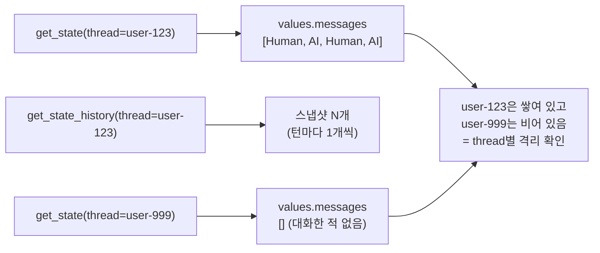

# 04. 저장된 상태 들여다보기

`04_inspect_state.py` 단독 학습 문서입니다.

## 무엇을 하는가

- `get_state`로 특정 `thread_id`에 지금 무엇이 쌓여 있는지 스냅샷을 봅니다.
- `get_state_history`로 턴마다 찍힌 체크포인트를 거슬러 봅니다.
- 다른 `thread_id`는 비어 있음을 대비로 확인해, thread별 격리를 눈으로 봅니다.

## 왜 필요한가

checkpointer는 "보이지 않는 마법"이 아닙니다. 저장소 안에는 우리가 직접 조회할 수 있는 구체적인 상태가 들어 있습니다. 상태를 들여다볼 수 있으면, "왜 기억을 못 하지?" 같은 문제를 추측이 아니라 사실로 진단할 수 있습니다. 또 턴마다 찍힌 스냅샷을 거슬러 보며 디버깅·되감기에 활용할 수 있습니다.

## 설계·구동 원리

- **`get_state(config)`는 현재 스냅샷을 돌려줍니다.** `config`(어떤 `thread_id`인지)를 넘기면, 그 스레드에 지금 저장된 상태를 돌려줍니다. `.values["messages"]`에 누적된 메시지 리스트가 들어 있어, 종류(Human/AI/Tool)와 내용을 하나씩 확인할 수 있습니다.
- **`get_state_history(config)`는 이력을 돌려줍니다.** 그래프가 한 단계 진행될 때마다 상태 스냅샷이 하나씩 찍힙니다. 이 함수는 그 스냅샷들을 최신에서 과거 순으로 거슬러 주는 제너레이터를 돌려줍니다. `list(...)`로 감싸면 개수를 셀 수 있고, 턴이 늘수록 스냅샷도 늘어납니다.
- **thread별로 따로 저장됩니다.** 대화한 `thread_id`에는 메시지가 쌓여 있고, 한 번도 쓰지 않은 `thread_id`를 조회하면 거의 비어 있습니다. 03 예제에서 본 격리를 이번에는 코드로 확인하는 셈입니다. 빈 상태는 `messages` 키가 없을 수 있어 `.values.get("messages", [])`처럼 안전하게 읽습니다.

## 구동 흐름 (다이어그램)

다음 다이어그램은 같은 checkpointer에서 조회한 `thread_id`에 따라 결과가 갈리는 모습을 보여 줍니다.



**구동 원리.** checkpointer는 매 단계의 상태를 저장하므로, 우리는 언제든 그 안을 조회할 수 있습니다. `get_state(config)`는 해당 `thread_id`의 마지막 상태를 한 장의 스냅샷으로 돌려주고, 그 안 `.values["messages"]`에는 지금까지 누적된 메시지가 순서대로 들어 있습니다. `get_state_history(config)`는 한 장이 아니라 턴마다 찍힌 여러 장을 거슬러 주어, 어느 시점에 무엇이 쌓였는지 되짚을 수 있습니다(되감기·디버깅에 유용). 마지막으로 한 번도 쓰지 않은 `user-999`를 조회하면 메시지가 비어 있어, checkpointer가 `thread_id`별로 칸을 따로 쓴다는 사실을 코드로 확인할 수 있습니다. 03 예제에서 모델의 답으로 짐작했던 격리를, 여기서는 저장소를 직접 열어 눈으로 보는 셈입니다.

## 실행법

```bash
uv run python 07_short_memory/04_inspect_state.py
```

## 예상 출력

```
[user-123의 누적 메시지]
   HumanMessage '내 이름은 앤디야. 기억해 줘.'
   AIMessage '네, 앤디님. 기억하겠습니다.'
   HumanMessage '내 이름이 뭐였지?'
   AIMessage '앤디님이십니다.'
[저장된 체크포인트 수] 4
[user-999의 누적 메시지 수] 0
```

(체크포인트 수와 메시지 수는 모델 응답·도구 호출 여부에 따라 달라질 수 있습니다.)

## 체크포인트

- `user-123`에 Human·AI 메시지가 쌓여 있고 `user-999`가 0이면, thread별 격리를 눈으로 확인한 것입니다.
- 체크포인트 수가 1보다 크면, 매 턴마다 상태가 기록되고 있다는 뜻입니다.

## 더 해보기

- `user-123`에 턴을 하나 더 추가한 뒤 `get_state_history`의 개수가 늘어나는지 확인하십시오.
- `state.values`에 `messages` 외에 어떤 키가 있는지 출력해, 에이전트 상태에 무엇이 더 들어 있는지 살펴보십시오.

## 다음 예제

`05_trim_messages` — 대화가 길어질 때 토큰이 왜 폭증하는지 이해하고, `trim_messages`로 토큰 상한에 맞춰 오래된 대화를 잘라 냅니다.
