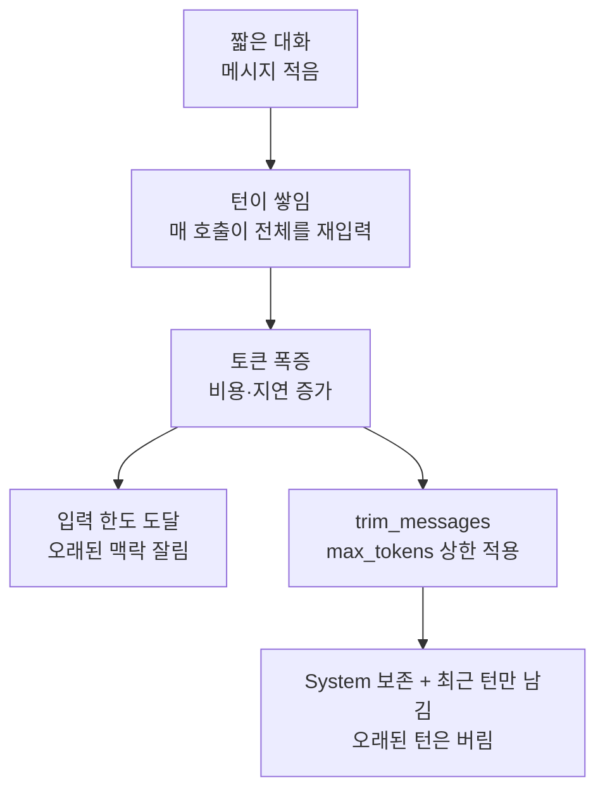

# 05. trim_messages로 토큰 다스리기 (자르기)

`05_trim_messages.py` 단독 학습 문서입니다.

## 무엇을 하는가

- 대화가 길어지면 왜 토큰이 폭증하는지 이해합니다.
- `trim_messages`로 토큰 상한에 맞춰 오래된 대화를 잘라 냅니다.
- 시스템 메시지(역할 지시)는 보존하면서 최근 대화를 우선 남깁니다.

`trim_messages`는 메시지 리스트를 받아 잘라 주는 순수 함수라 모델을 호출하지 않습니다. 그래서 이 예제는 키 없이도 끝까지 동작합니다.

## 왜 필요한가

checkpointer가 대화 상태를 통째로 저장한다고 했는데, 바로 그 "통째로"가 대화가 길어지면 새 문제를 만듭니다. 모델은 매 호출마다 그때까지의 대화 전체를 입력으로 다시 읽습니다. 사람처럼 "앞 내용은 머릿속에 있으니 생략"이 되지 않습니다. 그래서 10턴짜리 대화의 마지막 호출은 1턴 분량이 아니라 10턴 누적 분량을 입력으로 먹습니다. 토큰이 늘면 비용이 오르고, 응답이 느려지고, 컨텍스트 윈도 한도에 닿으면 오래된 맥락이 잘려 나갑니다.

## 설계·구동 원리

- **토큰은 계단처럼 불어납니다.** 대화가 길어질수록 한 번의 응답에 드는 입력 토큰이 누적됩니다. 비용·지연이 함께 오르고, 입력 한도를 넘으면 가장 오래된 메시지부터 모델이 보지 못하게 됩니다.
- **`trim_messages`는 순수 함수입니다.** 메시지 리스트와 상한을 받아 잘라 낸 리스트를 돌려줍니다. 모델 호출이 없어 빠르고 예측 가능합니다.
- **전략으로 무엇을 남길지 정합니다.** `strategy="last"`는 최근 쪽을 남기고 앞쪽을 버립니다. `include_system=True`는 역할 지시인 시스템 메시지를 항상 보존합니다. `start_on="human"`은 잘린 첫 메시지가 human부터 시작하도록 정렬해 대화 짝을 보존합니다.
- **토큰 카운터는 교체 가능합니다.** `count_tokens_approximately`는 tiktoken 없이 어림 계산하는 데모용 헬퍼입니다. 운영에서는 `token_counter`에 모델 객체를 넘겨 정확히 셉니다.
- **버린 정보는 돌아오지 않습니다.** 자르기는 손실 동작입니다. 핵심 정보가 잘리는 앞쪽에 있지 않은지 확인해야 합니다. 단발성 문의처럼 최근 맥락만 중요하면 자르기로 충분합니다.

## 구동 흐름 (다이어그램)

다음 다이어그램은 누적 대화의 토큰이 불어나는 구조와, `trim_messages`가 상한에 맞춰 잘라 내는 모습을 보여 줍니다.



**구동 원리.** 문제의 뿌리는 모델이 매 호출마다 누적된 대화 전체를 다시 읽는다는 데 있습니다. 그대로 두면 토큰이 계단처럼 불어나 비용·지연이 오르고, 끝내 입력 한도에 닿아 오래된 맥락이 잘려 나갑니다. `trim_messages`는 이 폭증을 우리가 통제하는 도구입니다. 메시지 리스트를 받아 `max_tokens` 상한 안으로 줄이되, `strategy="last"`로 최근 대화를 우선 남기고 오래된 쪽을 버립니다. 이때 `include_system=True`로 역할 지시인 시스템 메시지는 항상 지키고, `start_on="human"`으로 잘린 첫 메시지가 human부터 시작하게 정렬해 질문·답변 짝을 보존합니다. 예제에서는 11개 메시지(약 279 토큰)가 상한 120에 맞춰 시스템 1개 + 최근 두 턴(약 117 토큰)으로 줄어듭니다. 실전에서는 이 trim 로직을 에이전트 호출 직전에 끼워 입력 토큰을 다스립니다. 다만 버린 메시지는 복구되지 않으므로, 무엇을 남길지 의식적으로 정하는 것이 핵심입니다. 자르기로는 부족해 앞부분 맥락을 잃으면 안 되는 경우의 대안이 다음 예제의 요약입니다.

## 실행법

```bash
uv run python 07_short_memory/05_trim_messages.py
```

## 예상 출력

```
[참고] 이 예제는 모델을 호출하지 않아 키 없이도 동작합니다.

[자르기 전] 메시지 11 개, 토큰~ 279
[자른 후]  메시지 5 개, 토큰~ 117
[남은 종류] ['SystemMessage', 'HumanMessage', 'AIMessage', 'HumanMessage', 'AIMessage']
```

(어림 토큰 수라 실제 값은 조금 다를 수 있습니다.)

## 체크포인트

- 자른 후 토큰 수가 `max_tokens`(120) 이하로 줄면 성공입니다.
- 남은 종류 맨 앞에 `SystemMessage`가 그대로 있으면 역할 지시가 보존된 것입니다.

## 더 해보기

- `max_tokens`를 80, 60으로 줄이며 남는 메시지가 어떻게 달라지는지 관찰하십시오. 너무 줄이면 시스템 메시지만 남습니다.
- `strategy="last"`를 `"first"`로 바꿔, 최근이 아니라 앞쪽을 남기면 무엇이 달라지는지 비교하십시오.
- `include_system=False`로 두고 자른 뒤, 역할 지시가 사라지면 답의 태도가 어떻게 흔들릴지 생각해 보십시오.

## 다음 예제

`06_summarize_persist` — 자르는 대신 오래된 묶음을 요약으로 압축해 보존하고(`SummarizationMiddleware`), InMemorySaver를 재시작해도 남는 SqliteSaver로 갈아 끼웁니다.
