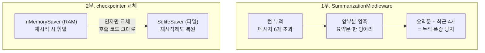

# 06. 요약 압축과 영속 저장으로 전환

`06_summarize_persist.py` 단독 학습 문서입니다. 토큰 통제의 두 번째 답(요약)과, 운영으로 가는 마지막 한 걸음(영속 저장)을 한 파일에서 다룹니다.

## 무엇을 하는가

- `SummarizationMiddleware`로 긴 대화의 앞부분을 자동 요약해 토큰을 통제합니다 (압축 보존).
- InMemorySaver(RAM, 휘발) 대신 SqliteSaver(파일, 영속)로 갈아 끼웁니다.
- 영속 saver로 바꿔도 Agent 코드는 그대로 두고 checkpointer 객체만 교체하면 됨을 확인합니다.

## 왜 필요한가

05 예제의 자르기는 오래된 메시지를 버립니다. 빠르고 단순하지만, 앞부분 맥락을 잃으면 안 되는 긴 상담에는 적합하지 않습니다. 요약은 오래된 묶음을 한두 문장으로 압축해 보존하는 다른 답입니다. 또 지금까지 쓴 InMemorySaver는 재시작하면 모든 대화가 사라집니다. 실제 서비스에서 서버가 죽거나 재배포될 때마다 사용자 대화가 날아가면 어시스턴트로 쓸 수 없습니다. 이 두 가지를 해결하면 학습용 구조가 운영용 뼈대로 이어집니다.

## 설계·구동 원리

- **요약은 압축해 보존합니다.** `SummarizationMiddleware`는 대화가 길어지면 앞부분 메시지 묶음을 모델로 한두 문장으로 압축해 그 자리에 대신 넣습니다. `trigger=("messages", 6)`는 메시지가 6개를 넘으면 요약을 발동하고, `keep=("messages", 4)`는 최근 4개를 원문으로 남기고 그 앞을 요약합니다. 그래서 여러 턴을 주고받아도 누적 메시지가 무한정 늘지 않습니다.
- **요약은 손실 압축입니다.** 요약하는 순간 그 묶음의 정확한 수치·부품 번호 같은 세부는 사라집니다. 다시 참조할 사실은 요약문에 명시하거나 장기 메모리에 따로 두는 편이 안전합니다(장기 메모리는 08 챕터).
- **자르기 vs 요약.** 단발성 문의처럼 최근 맥락만 중요하면 자르기로 충분하고, 앞부분 맥락을 잃으면 안 되면 요약을 씁니다. 둘 다 checkpointer에 누적된 메시지를 다루는 방법입니다.
- **영속 저장은 부품만 교체합니다.** `InMemorySaver`는 RAM에만 저장해 재시작하면 사라집니다. 운영에서는 `SqliteSaver`(파일) 또는 Postgres·Redis 기반으로 바꿉니다. 이때 `create_agent`에 넘기는 `checkpointer` 인자만 교체하고, `thread_id`를 다루는 호출 코드는 한 줄도 고치지 않습니다. 인터페이스가 같기 때문입니다.
- **SqliteSaver는 안전하게 가져옵니다.** 별도 패키지(`langgraph-checkpoint-sqlite`)라, 없으면 `try/except ImportError`로 그 부분만 건너뛰어 실습이 멈추지 않게 합니다. 연결은 `SqliteSaver.from_conn_string(db_path)` 컨텍스트 매니저로 열고 닫습니다.

## 구동 흐름 (다이어그램)

다음 다이어그램은 요약이 앞부분을 한 덩어리로 압축하는 모습과, 휘발성 saver를 영속 saver로 교체하는 모습을 보여 줍니다.



**구동 원리.** 1부에서 `SummarizationMiddleware`를 에이전트 파이프라인에 끼우면, 대화가 `trigger` 임계치(메시지 6개)를 넘는 순간 앞부분 묶음이 모델 요약문 한 덩어리로 대체됩니다. 최근 `keep`개(4개)는 원문으로 남으므로, 네 턴을 주고받아도 누적 메시지가 폭증하지 않고 모델은 요약문을 통해 앞 맥락을 유지합니다. 자르기가 버리는 자리에서 요약은 압축해 보존하는 셈인데, 손실 압축이라 무엇을 담을지가 품질을 좌우합니다. 2부에서는 같은 에이전트의 `checkpointer`만 `InMemorySaver`에서 `SqliteSaver`로 바꿉니다. SqliteSaver는 상태를 파일(`short_memory.sqlite`)에 쓰므로, 스크립트를 두 번째로 실행해도 같은 `thread_id`면 첫 실행의 대화를 복원해 이름을 기억합니다. 핵심은 `thread_id`를 다루는 호출 코드를 한 줄도 고치지 않았다는 점입니다. 인터페이스가 같기에 학습 단계에서 익힌 구조가 그대로 운영까지 이어집니다. 다음 장에서는 thread 안에 갇힌 단기 메모리를 넘어, 대화를 넘어 남는 장기 메모리(Store)로 확장합니다.

## 실행법

```bash
uv run python 07_short_memory/06_summarize_persist.py
```

영속 저장을 직접 해 보려면 별도 패키지를 설치합니다. 없으면 2부만 자동으로 건너뜁니다.

```bash
uv add langgraph-checkpoint-sqlite
```

## 예상 출력

```
=== 1부. 요약 미들웨어로 압축 ===
[에이전트] CompiledStateGraph (요약 미들웨어 부착 완료)
[요약 활용 답변] 앤디님은 서울에 사시고 취미는 등산이십니다.
[요약 후 누적 메시지 수] 6

=== 2부. SqliteSaver 영속 저장 ===
[저장] 네, 앤디님. 다음에도 기억하겠습니다.
[복원] 앤디님이십니다.
[영속] 대화가 'short_memory.sqlite' 파일에 저장되었습니다. 재실행해도 같은 thread_id면 이어집니다.
```

(패키지가 없으면 2부는 `[skip] ...` 안내만 출력됩니다.)

## 체크포인트

- 4턴을 주고받아도 누적 메시지가 폭증하지 않고 요약 답변이 나오면, 압축이 동작하는 것입니다.
- 스크립트를 한 번 더 실행했을 때 [복원]에서 이름을 기억하면, 영속 저장에 성공한 것입니다(영속 파일을 비우려면 `short_memory.sqlite`를 삭제).

## 더 해보기

- `trigger`·`keep` 값을 조정해 요약이 더 일찍/늦게 발동하게 만들고, 누적 메시지 수가 어떻게 변하는지 관찰하십시오.
- 1부에서 정확한 수치(예: "설비 진동 0.8mm")를 알려 준 뒤 요약을 발동시키고, 그 수치가 답변에 정확히 남는지 확인해 손실 압축의 한계를 느껴 보십시오.
- 2부를 두 번 실행해 영속이 동작하는지 확인하고, `short_memory.sqlite`를 삭제한 뒤 다시 실행해 초기화되는지 보십시오.

## 다음 장

`08_long_memory` — 단기 메모리(checkpointer)는 한 대화(thread) 안의 맥락만 붙듭니다. 다음 장에서는 대화를 넘어 남는 지식을 다룹니다. `thread_id`로 가르던 단기 메모리와 달리, namespace로 사용자·주제별 지식을 보존하는 Store를 붙여, 새 대화에서도 사용자의 이름·선호·이력을 회상하는 Agent를 만듭니다.
