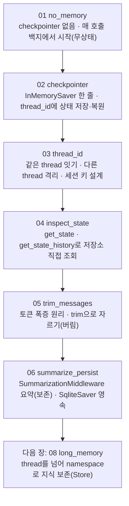

# 07. Agent 단기 메모리

기본 Agent는 호출마다 백지에서 시작합니다. "내 이름은 앤디야"라고 알려 준 다음 호출에서 "내 이름이 뭐였지?"라고 물으면, 두 호출이 서로 별개라서 모델은 답하지 못합니다. 이 장은 그 구멍을 메우는 단기 메모리를 한 예제씩 붙여 갑니다. checkpointer를 한 줄 더해 대화를 잇고, `thread_id`로 대화의 경계를 긋고, 저장된 상태를 직접 들여다보고, 대화가 길어질 때 토큰을 다스리고(자르기·요약), 마지막에는 재시작해도 기억이 남는 영속 저장으로 갈아 끼우는 것까지 따라 만듭니다.

이 장은 **하나의 주제마다 독립 실행 파일 하나**로 구성됩니다. 각 `NN_topic.py`는 자기완결이라 단독으로 실행되며, 짝이 되는 `NN_topic.md`가 그 예제만으로 혼자 학습할 수 있는 설계·구동 원리를 담습니다. 번호 순서대로 따라가면 메모리 없는 상태에서 영속 저장까지 개념이 점점 쌓입니다.

## 학습 목표

- 메모리가 없는 Agent가 왜 직전 대화도 잊는지 설명하고, checkpointer(`InMemorySaver`) 한 줄로 단기 메모리를 켤 수 있다.
- `thread_id`가 "어떤 호출들을 한 대화로 묶을지" 정하는 열쇠임을 이해하고, 같은 `thread_id`로는 대화를 잇고 다른 `thread_id`로는 기억을 격리할 수 있다.
- 실제 서비스의 세션 키처럼 사용자 ID와 대화방 ID를 조합해 `thread_id`를 설계할 수 있다.
- `get_state`·`get_state_history`로 특정 thread에 무엇이 쌓였는지 직접 조회할 수 있다.
- 대화가 길어질 때 토큰이 왜 폭증하는지 알고, `trim_messages`로 자르거나 `SummarizationMiddleware`로 요약 압축해 입력 토큰을 통제할 수 있다.
- `InMemorySaver`가 재시작 시 휘발됨을 이해하고, Agent 코드는 그대로 둔 채 `SqliteSaver`로 교체해 영속 저장으로 전환할 수 있다.

## 실행 방법

```bash
# 레포 루트(ai-agent-dev-lgens)에서
uv sync                       # 최초 1회 (의존성 설치)
cp .env.example .env          # 최초 1회, .env에 OPENAI_API_KEY 입력

# 예제는 하나씩 단독으로 실행합니다.
uv run python 07_short_memory/01_no_memory.py
uv run python 07_short_memory/02_checkpointer.py
# ... 06까지 같은 방식
```

각 파일은 상단에 `load_dotenv()`·`MODEL` 상수·필요한 import·자체 도구 정의를 모두 갖춰, 다른 파일에 의존하지 않습니다. 키가 없으면 안내만 출력하고 종료하므로 문법·import 점검은 키 없이도 됩니다(05는 모델을 호출하지 않아 키 없이도 끝까지 동작합니다). 공급사를 바꾸려면 각 파일 상단의 `MODEL` 상수만 교체하면 됩니다(기본 `openai:gpt-5.4-mini`).

영속 저장(06의 2부)에는 별도 패키지가 필요합니다. 없으면 그 부분만 자동으로 건너뜁니다.

```bash
uv add langgraph-checkpoint-sqlite
```

## 권장 학습 경로

번호 순서대로 보는 것을 권장합니다. 각 예제는 `NN_topic.py`(코드)와 `NN_topic.md`(설계·원리)가 짝을 이룹니다.

| 번호 | 예제 | 한 줄 요약 |
|------|------|-----------|
| 01 | `01_no_memory` | 메모리 없는 Agent는 같은 질문을 두 번 해도 앞 대화를 못 기억함 |
| 02 | `02_checkpointer` | `checkpointer=InMemorySaver()` 한 줄로 단기 메모리 켜기 |
| 03 | `03_thread_id` | 같은 `thread_id`는 잇고 다른 `thread_id`는 격리, 세션 키 설계 |
| 04 | `04_inspect_state` | `get_state`·`get_state_history`로 저장된 상태 직접 조회 |
| 05 | `05_trim_messages` | 토큰 폭증의 원리와 `trim_messages`로 자르기 (모델 호출 없음) |
| 06 | `06_summarize_persist` | `SummarizationMiddleware` 요약 압축 + `SqliteSaver` 영속 저장 |

01~04가 단기 메모리의 기본기(켜기·경계·조회), 05~06이 토큰 통제와 운영 전환(심화)입니다.

## 챕터 전체 흐름 (다이어그램)

번호를 따라가면 메모리 없는 상태 위에 켜기·경계·조회·토큰 통제·영속이 차례로 쌓입니다.



## 핵심 점검

이 장이 성공인지 가르는 한 가지 기준은 **02에서 같은 `thread_id`로 다시 물었을 때 모델이 "앤디"라고 답하는지**입니다. 01(메모리 없음)과 02(메모리 있음)는 같은 질문을 던지는데, 결과를 가른 것은 checkpointer 한 줄뿐입니다.

- **매 호출이 백지에서 시작함을 체감했는가.** 01에서 이름을 알려 줘도 다음 호출이 모른다고 답하는 것이 정상입니다. 호출 사이에 상태를 저장하는 부품(checkpointer)이 없기 때문입니다.
- **열쇠는 대화 내용이 아니라 `thread_id`다.** `thread_id`는 입력 메시지가 아니라 `{"configurable": {"thread_id": ...}}` 설정으로 넘깁니다. 같은 `thread_id`는 그 스레드의 마지막 상태를 복원해 대화를 잇고, 다른 `thread_id`는 백지에서 출발합니다. 대화의 경계를 긋는 주체는 모델이 아니라 `thread_id`를 정하는 우리입니다.
- **`thread_id`를 바꿔 기억이 사라지는 건 버그가 아니다.** 03에서 이름을 모른다고 답하는 것은 의도된 격리입니다. 한 사용자의 대화가 다른 사용자에게 새어 나가면 안 되기 때문입니다. 실제 서비스에서는 사용자 ID와 대화방 ID를 조합한 합성 키(예: `"emp-042:room-7"`)를 `thread_id`로 써서, 같은 사용자의 서로 다른 창구가 섞이지 않게 합니다.
- **토큰이 왜 늘어나는지 아는가.** 모델은 호출할 때마다 그때까지의 대화 전체를 입력으로 다시 읽습니다. 앞 내용을 생략하지 못하므로, 대화가 길어질수록 입력 토큰이 계단처럼 불어나 비용·지연이 함께 오르고, 컨텍스트 윈도 한도에 닿으면 오래된 맥락이 잘려 나갑니다. 05(자르기)와 06(요약)은 이 토큰 폭증에 대한 서로 다른 답입니다.
- **자르기와 요약의 차이를 구분하는가.** `trim_messages`는 오래된 메시지를 버리고, `SummarizationMiddleware`는 오래된 묶음을 한두 문장으로 압축해 보존합니다. 단발성 문의처럼 최근 맥락만 중요하면 자르기로 충분하고, 앞부분 맥락을 잃으면 안 되면 요약을 씁니다. 다만 요약은 손실 압축이라, 다시 참조할 사실(부품 코드·신고 번호 등)은 요약문에 명시하거나 장기 메모리에 따로 두는 편이 안전합니다.
- **InMemorySaver는 데모용임을 잊지 않았는가.** 이름 그대로 RAM에만 저장하므로 프로세스를 재시작하면 기억이 모두 사라집니다. 학습·프로토타입에는 충분하지만 운영에는 쓰지 않습니다. 06에서 본 것처럼 운영에서는 SqliteSaver(또는 Postgres·Redis 기반)로 갈아 끼우되, **Agent 코드는 그대로 두고 checkpointer 객체만 교체**하면 됩니다.

## 흔한 실수 (증상별 진단)

| 증상 | 원인 | 해결 |
|------|------|------|
| 같은 thread인데 앞 대화를 기억 못 한다 | checkpointer를 안 붙임 | `create_agent(..., checkpointer=InMemorySaver())` 추가 |
| 두 번째 호출이 첫 대화를 모른다 | `thread_id`가 매번 다르거나 빠짐 | 두 호출에 같은 `config`(같은 `thread_id`)를 넘김 |
| `thread_id`를 보냈는데도 안 이어진다 | `thread_id`를 messages 안에 넣음 | `{"configurable": {"thread_id": ...}}` 설정으로 넘김 |
| `thread_id`를 바꿨더니 기억이 사라졌다 | 의도된 격리(버그 아님) | 이어 가려면 같은 `thread_id`, 새 대화면 새 `thread_id` |
| 대화가 길어질수록 느려지고 비싸진다 | 누적 메시지를 매번 통째로 입력 | `trim_messages`로 자르거나 요약 미들웨어로 압축 |
| 자른 뒤 역할 지시가 사라진다 | 시스템 메시지까지 잘림 | `include_system=True`로 SystemMessage 보존 |
| 요약 후 정확한 수치·코드가 사라졌다 | 요약은 손실 압축 | 핵심 사실은 요약문에 명시하거나 장기 메모리에 저장 |
| 재시작했더니 대화가 전부 날아갔다 | InMemorySaver는 RAM 휘발 | SqliteSaver 등 영속 checkpointer로 교체 |

> 막힘은 대부분 모델 탓이 아니라 위 패턴입니다. 특히 "기억을 못 한다"는 증상의 십중팔구는 checkpointer를 안 붙였거나 `thread_id`가 어긋난 경우입니다. 더 큰 모델로 바꾸기 전에 증상을 표에서 역추적하십시오.

## 더 해보기

- 각 `NN_topic.md`의 "더 해보기" 항목을 따라, 예제를 조금씩 바꿔 가며 동작을 관찰하십시오.
- 02~03에서 `thread_id`를 사용자 ID와 대화방 ID를 합친 합성 키로 바꿔, 같은 사용자가 두 대화방을 열어도 맥락이 섞이지 않는지 확인하십시오.
- 05의 `max_tokens`·`strategy`를 바꿔 남는 메시지가 어떻게 달라지는지, 06의 `trigger`·`keep`을 바꿔 요약이 더 일찍/늦게 발동하는지 비교하십시오.
- 06을 두 번 실행해 영속이 동작하는지 확인하고, 초기화하려면 `short_memory.sqlite` 파일을 삭제하십시오.

## 다음 장

`08_long_memory` — 단기 메모리(checkpointer)는 한 대화(thread) 안의 맥락만 붙듭니다. 다음 장에서는 **대화를 넘어 남는 지식**을 다룹니다. `thread_id`로 가르던 단기 메모리와 달리, namespace로 사용자·주제별 지식을 보존하는 Store를 붙여, 새 대화에서도 사용자의 이름·선호·이력을 검색해 회상하는 Agent를 만듭니다.
