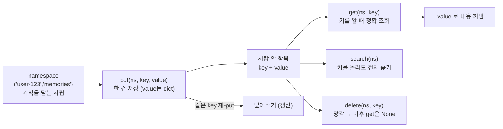

# 01. 장기 메모리 저장소(Store)의 네 연산

`01_store_basics.py` 단독 학습 문서입니다. 이 한 파일만으로 장기 메모리 저장소의 기본기를 익힐 수 있습니다.

## 무엇을 하는가

- `InMemoryStore`를 하나 만듭니다 (색인 없는 가장 단순한 키-값 저장소).
- `put(namespace, key, value)`로 기억 한 건을 저장합니다 (value는 dict).
- `get(namespace, key)`로 키를 정확히 알 때 한 건을 꺼냅니다.
- `search(namespace)`로 키를 몰라도 그 칸 전체를 훑습니다.
- 같은 키로 다시 `put`하면 덮어쓰기(갱신)이고, `delete`로 지웁니다(망각).

## 왜 필요한가

기본 Agent는 호출이 끝나면 맥락을 잊습니다. 앞 장에서 단기 메모리(checkpointer)로 한 대화 안의 흐름을 이었다면, 이 장은 대화를 넘어 사용자를 기억하는 장기 메모리를 다룹니다. 단기 메모리는 한 대화(thread) 안에서만 살아 있지만, Store는 thread와 무관한 별도 저장소라 어느 세션에서 저장하든 모든 세션이 함께 봅니다. 그 출발점이 사실 하나를 저장하고 정확히 꺼내는 네 연산입니다.

## 설계·구동 원리

- **네임스페이스는 서랍의 이름표입니다.** `namespace`는 기억을 담는 칸의 이름표로, `("user-123", "memories")`처럼 튜플로 계층을 만듭니다. 첫 칸은 사용자, 둘째 칸은 주제처럼 위에서 아래로 좁혀 가는 분류 체계입니다. 단기 메모리의 `thread_id`가 대화를 가르는 열쇠였다면, 장기 메모리의 `namespace`는 지식을 가르는 열쇠입니다.
- **세 연산이 언제 쓰이는지는 키를 아느냐가 가릅니다.** `put`은 쓰기와 갱신을 겸합니다(별도 수정 연산 없음). `get`은 키를 정확히 알 때 한 건을 콕 집어 꺼내고(가장 빠름), `search`는 키를 모를 때 그 칸을 둘러봅니다.
- **반환값은 dict가 아니라 항목 객체입니다.** `get`이 돌려주는 것은 항목 객체이고, 실제 내용은 `.value`에 있습니다. `search`가 돌려주는 각 항목도 `.key`와 `.value`를 가집니다. value는 dict이므로 `{"text": ..., "updated_at": ...}`처럼 필드를 더해 기억을 구조화해 둘 수 있습니다.
- **같은 키 재-put은 갱신입니다.** 같은 `key`로 다시 `put`하면 새 값이 옛 값을 덮어씁니다. 그래서 한 사실이 바뀌면 같은 키에 새 값을 `put`해 갱신합니다.

## 구동 흐름 (다이어그램)

네임스페이스라는 서랍 안에서, 키를 아느냐에 따라 `get`(정확 조회)과 `search`(둘러보기)가 갈립니다. `put`은 쓰기와 갱신을, `delete`는 망각을 맡습니다.



**구동 원리.** 먼저 `namespace`로 기억을 담을 서랍을 정합니다. 튜플의 첫 칸을 사용자 ID로 두면 사용자별로 칸이 나뉩니다. `put(ns, key, value)`는 그 서랍 아래 `key`로 값을 저장하며, 값은 반드시 dict입니다. 꺼낼 때는 키를 아느냐가 방법을 가릅니다. 키를 정확히 알면 `get(ns, key)`로 한 건을 집어 오고, 반환된 항목 객체의 `.value`에서 내용을 읽습니다. 키를 모르면 `search(ns)`로 그 서랍의 항목들을 둘러봅니다. 같은 키로 다시 `put`하면 값이 덮어써지므로 `put` 하나가 쓰기와 갱신을 겸하고, `delete(ns, key)`로 항목을 지우면 이후 같은 키의 `get`은 `None`을 돌려줍니다. 이 네 연산이 "키를 알 때 정확히 다루는" 구조형 기억의 기본기이며, 다음 예제에서 색인을 켜면 "키를 몰라도 의미로 회상"하는 길이 열립니다.

## 실행법

```bash
# 레포 루트(ai-agent-dev-lgens)에서
uv sync                       # 최초 1회 (의존성 설치)
uv run python 08_long_memory/01_store_basics.py
```

이 예제는 색인(시맨틱 검색)을 켜지 않아 임베딩 호출이 없으므로 **API 키 없이도 동작**합니다.

## 예상 출력

```
만든 Store: InMemoryStore
저장 완료: NS = ('user-123', 'memories') / key = fact-1
[get fact-1] .value = {'text': '앤디는 파이썬을 좋아한다'}
[search 전체]
  - fact-1 {'text': '앤디는 파이썬을 좋아한다'}
  - fact-2 {'text': '앤디는 매운 음식을 못 먹는다'}
  - fact-3 {'text': '앤디는 주말마다 등산을 간다'}
[갱신 전] fact-2 = {'text': '앤디는 매운 음식을 못 먹는다'}
[갱신 후] fact-2 = {'text': '앤디는 이제 매운 음식도 잘 먹는다'}
[delete 후] fact-1 = None
```

검색 항목의 순서는 저장 순서를 보장하지 않을 수 있습니다.

## 체크포인트

- Store 클래스 이름이 오류 없이 출력되면 저장소 준비가 끝난 것입니다.
- `get`이 `put`한 값을 `.value`로 그대로 돌려주면 키 조회를 이해한 것입니다.
- `search`가 넣은 항목을 모두 보여 주면 전체 훑기를 이해한 것입니다.
- 같은 키 재-`put`으로 값이 바뀌면 갱신을, `delete` 뒤 `get`이 `None`이면 망각을 이해한 것입니다.

## 더 해보기

- value에 `{"text": ..., "updated_at": "2026-06-15"}`처럼 메타데이터 필드를 더해 저장하고, `get`으로 그 필드를 꺼내 보십시오.
- `("user-123", "profile")`처럼 둘째 칸(주제)을 바꿔 같은 사용자 안에서 칸을 나눠 보십시오. 한 칸의 `search`에 다른 칸의 항목이 끼지 않음을 확인하십시오.
- 이 색인 없는 `search`에 `query="..."`를 줘 보십시오. 의미로 정렬되지 않음을 확인한 뒤, 다음 예제(02)에서 색인을 켜 차이를 비교하십시오.

## 다음 예제

`02_semantic_index` — 임베딩 색인을 켜서, 키를 몰라도 의미가 가까운 기억을 회상합니다.
