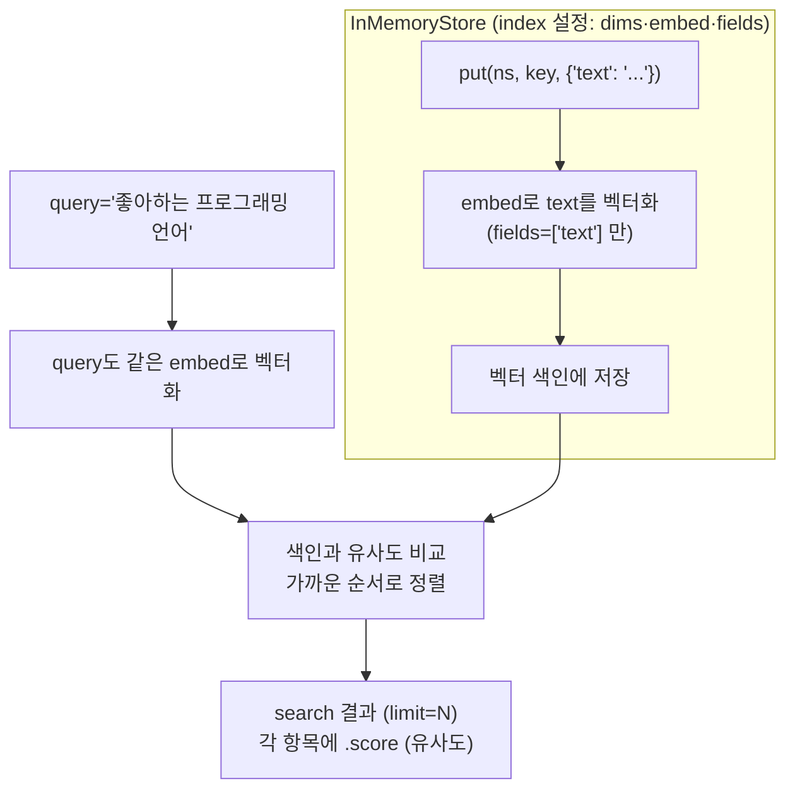

# 02. 시맨틱 인덱스로 의미 기반 회상

`02_semantic_index.py` 단독 학습 문서입니다.

## 무엇을 하는가

- `index={"dims", "embed", "fields"}`로 시맨틱 인덱스를 켠 Store를 만듭니다.
- `put`할 때 지정한 필드(`text`)의 글이 자동으로 벡터로 변환됩니다.
- `search`에 `query`를 주면 의미가 가까운 순서로 돌려줍니다 (단어가 안 겹쳐도).
- 결과의 `score`(유사도)와 `limit`(상위 N개)를 들여다봅니다.

## 왜 필요한가

01의 색인 없는 `InMemoryStore`는 `search`가 항목을 그대로 돌려줄 뿐, 의미로 정렬하지 못합니다. 그런데 실제 회상은 보통 "키를 모르는" 상황에서 일어납니다. 사용자가 "내가 좋아하는 프로그래밍 언어가 뭐였지?"라고 물을 때, 우리는 그 기억의 키를 알지 못합니다. 시맨틱 인덱스는 질문의 의미와 가까운 기억을 점수로 정렬해 꺼내 주어, 키 없이도 "비슷한 것"을 회상하게 합니다.

## 설계·구동 원리

- **색인을 켜야 의미 회상이 동작합니다.** `index` 설정은 세 칸으로 이뤄집니다. `dims`는 임베딩 벡터의 차원 수, `embed`는 텍스트를 벡터로 바꿀 임베딩 모델 객체, `fields`는 임베딩할 필드 이름 목록입니다. 셋을 모두 줘야 `put` 시점에 해당 필드가 벡터로 색인됩니다.
- **dims와 embed는 한 쌍으로 맞춰야 합니다.** `text-embedding-3-small`의 출력 차원은 1536이므로 `dims`도 1536입니다. 둘이 어긋나면 회상이 엉뚱하거나 비어 버립니다.
- **fields는 무엇을 벡터화할지 고릅니다.** `["text"]`로 두면 value의 `text` 필드만 벡터화하고, 나머지(예: `language`, `updated_at`)는 색인 대상이 아닌 조회용 메타데이터로 남습니다.
- **결과는 점수로 정렬됩니다.** `search(ns, query=..., limit=N)`은 query와 의미가 가까운 순서로 상위 N개를 돌려주고, 각 항목의 `.score`에 유사도가 담깁니다. 높을수록 가깝습니다.

## 구동 흐름 (다이어그램)

`put` 시점에 텍스트가 벡터로 색인되고, `search` 시점에 query도 벡터로 바뀌어 가까운 순서로 정렬됩니다. 단어가 겹치지 않아도 의미로 매칭됩니다.



**구동 원리.** 색인 없는 Store는 `search`가 항목을 그대로 돌려주는 데 그치지만, `index={"dims", "embed", "fields"}`로 임베딩 색인을 켜면 회상의 성격이 바뀝니다. `put` 시점에 `fields`로 지정한 필드(`text`)의 글이 `embed` 모델로 벡터(숫자 배열)로 변환되어 색인에 쌓입니다. `dims`는 그 벡터의 차원 수이며 임베딩 모델의 출력 차원과 같아야 합니다(1536). 회상할 때 `search(ns, query=...)`를 부르면, query 역시 같은 임베딩 모델로 벡터화되어 색인의 벡터들과 의미적 거리를 비교하고, 가까운 순서로 정렬해 상위 `limit`개를 돌려줍니다. 그래서 query에 '파이썬'이라는 단어가 없어도 "프로그래밍 언어"라는 의미가 파이썬 기억과 가까워 위로 올라옵니다. 각 결과의 `.score`는 그 유사도이며, 가장 관련 있는 기억이 가장 높은 점수로 맨 위에 옵니다. `limit`는 품질과 토큰의 트레이드오프라, 키우면 노이즈가 늘고 줄이면 회상이 빈약해집니다.

## 실행법

```bash
uv run python 08_long_memory/02_semantic_index.py
```

이 예제는 임베딩 호출을 사용하므로 `OPENAI_API_KEY`가 필요합니다. 키가 없으면 안내만 출력하고 종료합니다.

## 예상 출력

```
시맨틱 인덱스 켠 Store 준비 완료 (dims=1536, fields=['text'])
[query] 좋아하는 프로그래밍 언어
  - 앤디는 파이썬을 좋아한다
[query] 주말 취미 활동 (상위 2개, 점수 포함)
   0.41 앤디는 주말마다 등산을 간다
   0.18 앤디는 파이썬을 좋아한다
```

점수 값은 호출마다 조금씩 다를 수 있습니다. 가장 관련 있는 기억이 맨 위에 오는 순서가 핵심입니다.

## 체크포인트

- 인덱스 설정이 오류 없이 만들어지면 의미 기반 회상을 위한 Store가 준비된 것입니다.
- '프로그래밍 언어' 검색에서 파이썬 기억이 회상되면 시맨틱 검색을 이해한 것입니다.
- 가장 관련 있는 기억이 가장 높은 `score`로 맨 위에 오면 점수·정렬을 이해한 것입니다.

## 더 해보기

- `limit`를 1에서 3으로 키워, 덜 관련된 기억이 어떤 점수로 딸려 오는지 관찰하십시오.
- 단어가 전혀 겹치지 않는 query(예: "코딩할 때 쓰는 도구")로도 파이썬 기억이 회상되는지 확인하십시오.
- `dims`를 일부러 512로 바꿔 회상이 어떻게 깨지는지 보십시오(임베딩 모델 차원과 어긋남). 확인 후 1536으로 되돌리십시오.

## 다음 예제

`03_namespace` — 네임스페이스의 첫 칸을 사용자 ID로 나눠, 사용자별로 기억을 격리합니다.
