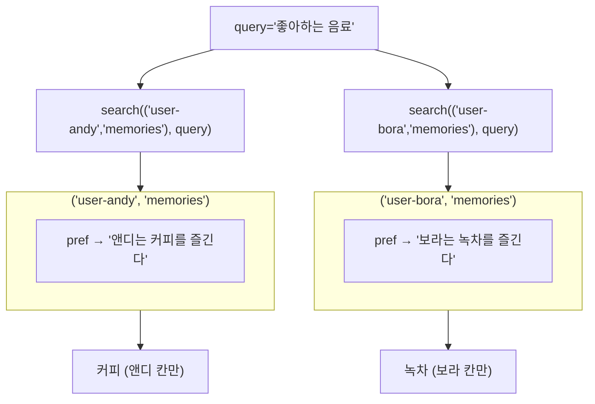

# 03. 네임스페이스로 사용자 분리

`03_namespace.py` 단독 학습 문서입니다.

## 무엇을 하는가

- `namespace`의 첫 칸을 사용자 ID로 써서, 사용자마다 칸을 나눕니다.
- 키가 같아도(예: `"pref"`) 칸이 다르면 완전히 별개의 기억임을 확인합니다.
- 같은 query라도 검색하는 네임스페이스에 따라 그 사용자의 기억만 돌려받습니다.
- 같은 사용자 안에서도 주제별 칸(`preferences`, `history`)으로 더 나눕니다.

## 왜 필요한가

여러 사용자를 한 Store에 담으면 기억이 섞일 위험이 있습니다. 사용자 정보가 다른 사용자에게 새어 나가면 안 되는 서비스에서, 이 격리는 선택이 아니라 필수입니다. `namespace`는 이 격리를 구조로 보장합니다. 단기 메모리의 `thread_id`가 대화를 가르는 열쇠였다면, 장기 메모리의 `namespace`는 지식을 가르는 열쇠입니다.

## 설계·구동 원리

- **첫 칸을 사용자 ID로 둡니다.** `("user-andy", "memories")`와 `("user-bora", "memories")`처럼 첫 칸을 사용자 ID로 나누면, 앤디의 기억을 검색할 때 보라의 것이 절대 섞이지 않습니다.
- **키가 같아도 칸이 다르면 별개입니다.** 두 사용자가 똑같이 `"pref"` 키를 써도, 네임스페이스가 다르면 서로 다른 항목입니다. 충돌하지 않습니다.
- **검색은 칸 단위로 격리됩니다.** `search`는 지정한 네임스페이스 안에서만 찾습니다. 같은 query라도 어느 칸을 검색하느냐에 따라 그 사용자의 기억만 돌려받습니다.
- **같은 사용자 안에서도 주제로 더 나눕니다.** `("user-andy", "preferences")`에는 취향을, `("user-andy", "history")`에는 이력을 두면, 취향만 검색할 때 이력이 딸려 오지 않습니다. 파일 시스템의 폴더 경로처럼 한 칸씩 내려갈수록 자리가 좁아집니다.

## 구동 흐름 (다이어그램)

같은 query·같은 키라도, 검색하는 네임스페이스가 다르면 다른 사용자의 기억만 돌아옵니다.



**구동 원리.** `namespace`는 기억을 담는 서랍의 이름표이고, 튜플로 계층을 만듭니다. 첫 칸을 사용자 ID로 두면 사용자별로 서랍이 갈립니다. 앤디의 기억은 `("user-andy", "memories")` 아래에, 보라의 기억은 `("user-bora", "memories")` 아래에 두면, 두 사람이 똑같이 `"pref"` 키를 써도 서랍이 달라 충돌하지 않습니다. `search`는 지정한 서랍 안에서만 찾으므로, "좋아하는 음료"라는 같은 query라도 앤디 칸을 검색하면 커피가, 보라 칸을 검색하면 녹차가 돌아옵니다. 한 사용자 안에서도 둘째 칸(주제)을 `preferences`·`history`로 더 나누면 분류가 촘촘해져, 취향만 찾고 싶을 때 이력이 끼어들지 않습니다. `thread_id`로 대화를 격리하던 사고를 그대로 `namespace`로 옮기면 장기 메모리의 설계가 자연스럽게 풀립니다.

## 실행법

```bash
uv run python 08_long_memory/03_namespace.py
```

이 예제는 시맨틱 검색을 쓰므로 `OPENAI_API_KEY`가 필요합니다. 키가 없으면 안내만 출력하고 종료합니다.

## 예상 출력

```
[andy] 좋아하는 음료:
  - 앤디는 커피를 즐긴다
[bora] 좋아하는 음료:
  - 보라는 녹차를 즐긴다
[andy/preferences] 답변 말투 취향:
  - 앤디는 격식체 답변을 선호한다
```

## 체크포인트

- 같은 키(`pref`)·같은 query인데 앤디 칸과 보라 칸 결과가 다르면, 사용자 격리가 된 것입니다.
- 주제 칸(`preferences`/`history`)을 더 나눠 취향만 검색되면, 계층 분류를 이해한 것입니다.

## 더 해보기

- 앤디 칸으로 보라의 음료를 검색해 보십시오. 보라의 녹차가 끼지 않음을 확인하십시오.
- `("user-andy", "history")`에 이력을 더 넣고 "답변 말투 취향"을 `preferences` 칸에서만 검색해, 이력이 딸려 오지 않는지 보십시오.
- 사용자 ID를 변수로 받아 네임스페이스를 동적으로 구성하면, 실제 멀티 사용자 서비스에 어떻게 확장될지 그려 보십시오.

## 다음 예제

`04_structured_vs_semantic` — 구조형 기억(키로 정확 조회)과 시맨틱 기억(자연어로 근사 회상)을 나란히 비교합니다.
