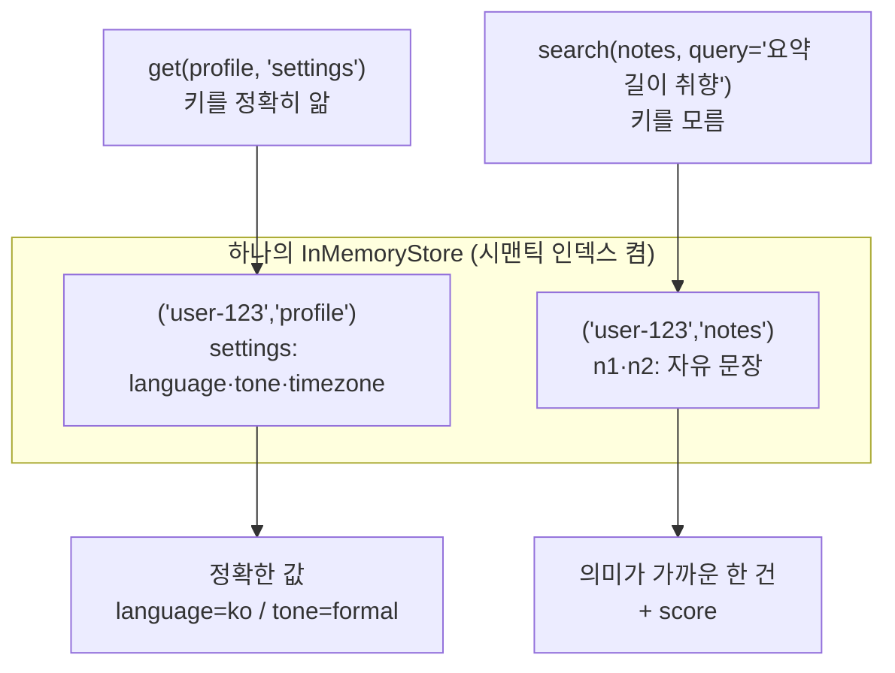

# 04. 구조형 기억 vs 시맨틱 기억

`04_structured_vs_semantic.py` 단독 학습 문서입니다.

## 무엇을 하는가

- 구조형 기억: 분명한 키·필드로 저장하고, 키로 정확히 꺼냅니다(`get`).
- 시맨틱 기억: 자유 문장으로 저장하고, 자연어 query로 근사 회상합니다(`search`).
- 두 방식의 쓰임을 구분해, 상황에 맞게 골라 씁니다.

## 왜 필요한가

같은 Store를 쓰더라도 회상 방식은 둘로 갈립니다. 환경설정·프로필처럼 값이 명확한 정보는 키로 정확히 꺼내야 하고(결정적), 대화 중 알게 된 흐릿한 취향은 자연어로 비슷한 것을 찾아야 합니다(확률적). 둘을 섞으면 정확해야 할 조회가 점수에 흔들리거나, 유연해야 할 회상이 키를 몰라 막힙니다. 어느 정보를 어느 방식으로 다룰지 가르는 감각이 이 예제의 핵심입니다.

## 설계·구동 원리

- **구조형은 키와 필드로 결정적으로 다룹니다.** `("user-123", "profile")` 아래 `settings` 키에 `language`·`tone`·`timezone` 같은 필드를 나눠 저장하고, 키를 알므로 `get`으로 정확히 꺼냅니다. 갱신도 같은 키에 덮어써 한 항목만 바꿉니다(`{**settings, "tone": "casual"}`). 결정적이고 빠르지만, 묻는 쪽이 키를 알아야 합니다.
- **시맨틱은 자유 문장과 자연어 검색으로 다룹니다.** `("user-123", "notes")` 아래 자유 문장을 저장하고, "요약 길이 취향" 같은 자연어 query로 의미가 가까운 것을 찾습니다. 키를 몰라도 회상하고 표현이 달라도 매칭되지만, 점수 기반이라 결과가 확률적입니다.
- **text 외 필드는 색인 대상이 아닙니다.** 구조형 항목의 `language`·`tone` 같은 필드는 `fields=["text"]` 설정상 벡터화되지 않습니다. 검색이 아니라 `get`으로 꺼내 쓰는 메타데이터로 남습니다.
- **실무에서는 둘을 함께 씁니다.** 확정값은 구조형으로, 흐릿한 맥락은 시맨틱으로. 한 Store 안에서 네임스페이스만 달리해 공존시킵니다.

## 구동 흐름 (다이어그램)

같은 Store 안에서, 키를 아는 정보는 `get`으로 정확히, 키를 모르는 맥락은 `search`로 의미에 따라 꺼냅니다.



**구동 원리.** 구조형 기억은 의미가 분명한 키와 필드로 값을 정확히 저장하고 키로 정확히 꺼냅니다. `profile` 칸의 `settings` 키에 `language`·`tone`을 나눠 두면, 키를 알므로 `get`으로 결정적으로 조회하고 같은 키에 덮어써 한 필드만 정확히 갱신합니다. 빠르고 예측 가능하지만 키를 알아야 한다는 제약이 있고, "비슷한 것"을 찾지는 못합니다. 시맨틱 기억은 정반대 자리를 채웁니다. `notes` 칸에 자유 문장을 저장하면 그 텍스트가 벡터로 색인되고, "요약 길이 취향" 같은 자연어 query로 단어가 겹치지 않아도 의미가 가까운 기억을 점수와 함께 회상합니다. 키를 몰라도 되고 표현이 달라도 매칭되지만, 점수 기반이라 결과가 확률적이고 정확한 한 건을 보장하지는 못합니다. 그래서 둘은 경쟁이 아니라 역할 분담입니다. 값이 명확한 환경설정·프로필·권한은 구조형으로, 대화 중 알게 된 흐릿한 취향·일화는 시맨틱으로 다루고, 한 Store 안에서 네임스페이스만 달리해 함께 씁니다.

## 실행법

```bash
uv run python 08_long_memory/04_structured_vs_semantic.py
```

이 예제는 시맨틱 검색을 쓰므로 `OPENAI_API_KEY`가 필요합니다. 키가 없으면 안내만 출력하고 종료합니다.

## 예상 출력

```
=== 구조형 기억 (키로 정확 조회·갱신) ===
[구조형] language = ko / tone = formal
[구조형] 갱신 후 tone = casual

=== 시맨틱 기억 (자연어로 근사 회상) ===
[시맨틱] '요약 길이 취향' 검색:
  - 0.36 앤디는 회의 요약을 짧게 받는 걸 선호한다

=== 정리 ===
구조형: 정해진 키/필드 → 정확·결정적 조회·갱신 (환경설정·프로필·권한)
시맨틱: 자유 문장 + 자연어 검색 → 유연·근사 회상 (대화 중 알게 된 취향·일화)
실무: 확정값은 구조형, 흐릿한 맥락은 시맨틱으로 함께 씀
```

점수 값은 호출마다 조금씩 다를 수 있습니다.

## 체크포인트

- 키로 정확히 같은 값을 꺼내고, 한 필드만 정확히 갱신되면 구조형을 이해한 것입니다.
- 단어가 겹치지 않아도 의미로 회상되면 시맨틱 기억을 이해한 것입니다.

## 더 해보기

- 구조형 `settings`에 없는 필드를 `get` 후 `value["없는키"]`로 꺼내 보고, 왜 `search`가 아니라 `get`이 구조형에 맞는지 체감하십시오.
- 시맨틱 `notes`에 비슷한 문장을 여러 건 넣고, 같은 query에 어느 것이 더 높은 점수로 오는지 비교하십시오.
- "사용자의 알림 시간 선호"를 구조형으로 둘지 시맨틱으로 둘지 골라 보고, 그 근거를 한 줄로 적어 보십시오.

## 다음 예제

`05_in_graph_recall` — 그래프 노드가 직접 `store.search`로 회상하는 In-graph 방식을 만듭니다.
