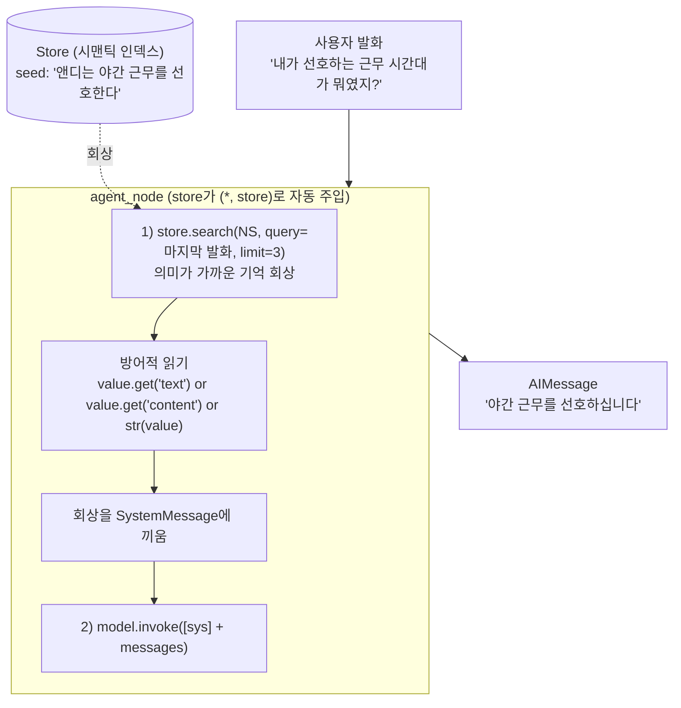

# 05. In-graph 회상 (노드가 직접 store.search)

`05_in_graph_recall.py` 단독 학습 문서입니다.

## 무엇을 하는가

- 그래프 노드가 `store.search(...)`를 직접 불러 장기 기억을 회상합니다.
- 회상한 기억을 `SystemMessage`에 끼워 넣어 모델이 답할 때 참고하게 합니다.
- `compile(store=...)`로 넘긴 Store가 노드 인자 `(*, store)`로 자동 주입됩니다.
- 회상 값을 방어적으로 읽습니다 (직접 `put`한 dict와 도구가 저장한 dict가 섞일 수 있음).

## 왜 필요한가

장기 메모리를 Agent에 붙이는 방식은 둘입니다. 하나는 개발자 코드가 회상·저장을 직접 제어하는 In-graph 방식이고, 다른 하나는 모델이 도구로 스스로 다루는 Tool-call 방식입니다(06). In-graph는 "언제·무엇을·몇 개 회상해 어떻게 프롬프트에 넣을지"를 코드로 100% 결정하므로, 동작이 예측 가능하고 검증이 쉽습니다. 정확성과 제어가 중요한 자리에서 먼저 손이 가는 방식입니다.

## 설계·구동 원리

- **Store가 노드에 자동 주입됩니다.** 그래프를 `compile(store=store)`로 만들면, 노드 함수의 키워드 전용 인자 `(*, store: BaseStore)`에 그 Store가 런타임에 자동으로 채워집니다. 노드는 이 `store`로 직접 `search`/`put`을 부릅니다.
- **회상은 노드의 첫 단계입니다.** 노드는 마지막 사용자 발화(`state["messages"][-1].content`)를 query로 삼아 `store.search(NS, query=last, limit=3)`로 의미가 가까운 기억 상위 3개를 가져옵니다. 몇 개를, 어떤 query로 가져올지가 모두 코드에 고정됩니다.
- **회상을 시스템 프롬프트에 끼웁니다.** 회상한 사실들을 한 덩어리 텍스트로 묶어 `SystemMessage`에 넣고, 그 시스템 메시지를 대화 앞에 붙여 모델을 호출합니다. 모델은 회상을 참고하되 질문과 어긋나면 무시하도록 지시받습니다.
- **회상 값은 방어적으로 읽습니다.** 같은 Store에는 우리가 직접 `put`한 `{"text": ...}`와, langmem 도구(06)가 저장한 다른 형태(`{"content": ...}` 등)가 섞일 수 있습니다. 그래서 `value.get("text") or value.get("content") or str(value)` 순서로 안전하게 텍스트를 꺼냅니다. 이를 `r.value["text"]` 같은 직접 접근으로 되돌리면, `text` 키가 없는 항목에서 `KeyError`가 납니다.

## 구동 흐름 (다이어그램)

한 턴 안에서 노드가 먼저 회상하고, 회상을 시스템 프롬프트에 끼워 모델을 부릅니다. 저장·회상의 주체는 개발자 코드입니다.



**구동 원리.** 그래프를 `compile(checkpointer=..., store=store)`로 만들면 단기(checkpointer)와 장기(store)가 함께 장착되고, 장기 Store는 노드의 키워드 전용 인자 `(*, store)`로 자동 주입됩니다. 한 턴이 들어오면 노드는 먼저 마지막 사용자 발화를 query로 `store.search`를 직접 불러, 의미가 가까운 기억 상위 몇 개를 회상합니다. 몇 개를 어떤 query로 가져올지가 코드에 분명히 적혀 있어 동작이 예측 가능합니다. 회상한 값은 형태가 섞일 수 있으므로 `text → content → 통째 문자열화` 순의 방어적 읽기로 텍스트만 안전하게 꺼내고, 이를 `SystemMessage`에 끼워 대화 앞에 붙입니다. 모델은 이 시스템 메시지로 회상을 참고하되 질문과 어긋나면 무시하도록 지시받습니다. 그래서 In-graph 방식은 회상·저장의 주체가 개발자 코드라 제어가 강한 대신, 저장·회상 시점이 코드에 고정되어 모델이 "지금 기억할 만하다"고 스스로 판단하지는 못합니다. 그 자율을 모델에 넘기는 것이 다음 예제(06)의 Tool-call 방식입니다.

## 실행법

```bash
uv run python 08_long_memory/05_in_graph_recall.py
```

이 예제는 모델·임베딩 호출을 사용하므로 `OPENAI_API_KEY`가 필요합니다. 키가 없으면 안내만 출력하고 종료합니다.

## 예상 출력

```
[In-graph] 야간 근무를 선호한다고 기억하고 있습니다.
```

모델 표현은 호출마다 달라질 수 있으나, 코드가 심은 seed(`야간 근무`)를 회상해 답하는 것이 핵심입니다.

## 체크포인트

- 코드가 직접 `search`한 seed 기억으로 '야간'을 답하면 In-graph 회상을 이해한 것입니다.
- 노드 인자 `(*, store)`가 오류 없이 채워지면, `compile(store=...)`의 자동 주입을 이해한 것입니다.
- 방어적 읽기를 `r.value["text"]`로 바꾸지 않았는지 확인하십시오(섞인 형태에서 `KeyError` 방지).

## 더 해보기

- `limit`를 1로 줄이거나 5로 키워, 회상 개수가 답의 정확성과 토큰에 어떤 영향을 주는지 보십시오.
- seed를 여러 건 넣고 서로 다른 질문을 던져, 노드가 매번 질문과 가까운 기억만 회상하는지 확인하십시오.
- `SystemMessage` 문구에서 "어긋나면 무시하라"를 빼고, 엉뚱한 회상이 답을 흐리는지 비교하십시오.

## 다음 예제

`06_tool_call_memory` — langmem 도구와 `create_agent`로 모델이 스스로 저장·회상하는 Tool-call 방식을 만듭니다.
