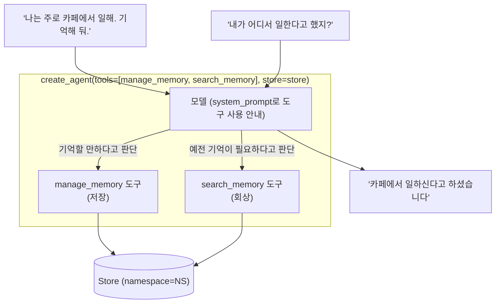

# 06. Tool-call 메모리 (langmem 도구 + create_agent)

`06_tool_call_memory.py` 단독 학습 문서입니다.

## 무엇을 하는가

- langmem의 `create_manage_memory_tool`로 기억하는 도구를 만듭니다(저장 담당, 도구 이름 `manage_memory`).
- langmem의 `create_search_memory_tool`로 회상하는 도구를 만듭니다(검색 담당, 도구 이름 `search_memory`).
- `create_agent`(v1 표준)로 두 도구·단기·장기 메모리를 한 번에 장착합니다.
- 같은 thread에서 먼저 사실을 알려 모델이 저장하게 하고, 이어 물어 회상하게 합니다.

## 왜 필요한가

In-graph 방식(05)은 회상·저장 시점이 코드에 고정됩니다. 하지만 "이건 기억해 둘 만하다", "이 질문엔 예전 기억이 필요하다"를 매번 코드로 정하기는 번거롭습니다. Tool-call 방식은 그 판단을 모델에 맡깁니다. 저장·회상 도구를 붙여 두면 모델이 도구 설명을 보고 스스로 부를 때를 정하므로, 노드 코드가 단순해지고 대화 흐름에 유연하게 반응합니다.

## 설계·구동 원리

- **도구를 두 갈래로 둡니다.** 하나는 새 사실을 저장하는 도구, 다른 하나는 답하기 전에 회상하는 도구입니다. langmem이 `create_manage_memory_tool`(저장)과 `create_search_memory_tool`(검색)로 이 두 갈래를 만들어 줍니다.
- **namespace만 주면 Store는 런타임에 연결됩니다.** 도구 생성 시 `namespace=NS`만 지정하면, 도구가 실행될 때 `create_agent`에 넘긴 `store`를 런타임에서 자동으로 찾아 씁니다. 도구 정의와 Store 인스턴스가 느슨하게 묶여 있어 재사용이 쉽습니다.
- **`create_agent`로 한 번에 장착합니다.** v1 표준 `create_agent(model, tools=..., system_prompt=..., checkpointer=..., store=...)`로 도구·단기·장기 메모리를 모두 답니다. (`create_react_agent`가 아니라 `create_agent`를 씁니다.)
- **모델이 저장·회상의 주체입니다.** 시스템 프롬프트로 "기억할 만하면 `manage_memory`로 저장하고, 답하기 전 필요하면 `search_memory`로 검색하라"고 안내하면, 모델이 대화 중 스스로 도구를 호출합니다. 그래서 같은 thread에서 사실을 알려 두면 저장하고, 이어 물으면 검색해 답합니다.

## 구동 흐름 (다이어그램)

모델이 도구 설명을 보고 저장할 때와 회상할 때를 스스로 정합니다. 저장·회상의 주체는 모델입니다.



**구동 원리.** Store를 만들었다고 모델이 알아서 쓰지는 않습니다. 모델이 장기 메모리를 읽고 쓰는 통로를 도구로 열어 줘야 합니다. langmem의 `create_manage_memory_tool`과 `create_search_memory_tool`이 저장·회상 두 도구를 만들어 주고, 생성 시 `namespace`만 지정하면 도구가 실행될 때 `create_agent`에 넘긴 `store`를 런타임에서 자동으로 찾아 씁니다. `create_agent`(v1 표준)는 이 두 도구와 단기(checkpointer)·장기(store) 메모리를 한 번에 장착합니다. 핵심은 판단의 주체가 모델이라는 점입니다. 시스템 프롬프트로 "기억할 만하면 저장하고 필요하면 검색하라"고 안내하면, 사용자가 "나는 카페에서 일해"라고 말할 때 모델이 기억해 둘 만한 사실임을 알아채 `manage_memory`를 부르고, 다음에 "어디서 일한다고 했지?"라고 물으면 예전 기억이 필요한 질문임을 알아채 `search_memory`를 먼저 부른 뒤 답합니다. 이 자율의 대가로 호출 여부·시점을 모델이 정하므로 제어가 약하고 토큰·지연이 늘 수 있습니다. 그래서 정확·예측 가능성이 중요하면 In-graph(05), 유연·자율이 중요하면 Tool-call을 고릅니다.

## 실행법

```bash
uv run python 08_long_memory/06_tool_call_memory.py
```

이 예제는 모델·임베딩 호출을 사용하므로 `OPENAI_API_KEY`가 필요합니다. 키가 없으면 안내만 출력하고 종료합니다.

## 예상 출력

```
[Tool-call] 모델이 'manage_memory' 도구로 사실을 저장했습니다 (저장 주체는 모델).
[Tool-call] 카페에서 일하신다고 말씀하셨습니다.
```

모델 표현은 호출마다 달라질 수 있으나, 모델이 스스로 저장·회상해 '카페'를 답하는 것이 핵심입니다.

## 체크포인트

- 저장도 회상도 모델이 주도해 '카페'를 답하면 Tool-call 방식을 이해한 것입니다.
- `create_agent`로 두 도구·단기·장기가 한 번에 장착되면, v1 표준 Agent 구성을 이해한 것입니다.
- 도구 이름이 `manage_memory`·`search_memory`로 만들어지면, langmem 도구 생성을 이해한 것입니다.

## 더 해보기

- 시스템 프롬프트에서 "저장하라" 지시를 빼고, 모델이 그래도 저장하는지 비교하십시오. docstring·프롬프트가 도구 호출을 어떻게 유도하는지 체감할 수 있습니다.
- 05의 In-graph 예제와 같은 질문을 던져, 어느 쪽이 언제 저장·회상하는지 직접 비교하십시오.
- 응답에 도구 호출 단계가 더해지면서 토큰·지연이 어떻게 늘어나는지 가늠해 보십시오(자율의 비용).

## 다음 예제

`07_short_plus_long` — 단기(checkpointer)와 장기(Store)를 한 Agent에 함께 장착해, 같은 thread에서 직전 대화를 잇습니다.
