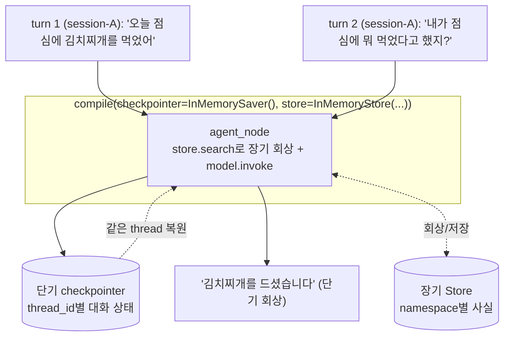

# 07. 단기 + 장기 메모리 결합

`07_short_plus_long.py` 단독 학습 문서입니다.

## 무엇을 하는가

- 한 Agent에 단기 메모리(`InMemorySaver`)와 장기 메모리(`InMemoryStore`)를 함께 답니다.
- 같은 thread에서는 단기 메모리로 직전 대화를 회상합니다(`thread_id`로 대화 잇기).
- 두 메모리가 같은 그래프 안에서 어떻게 협력하는지 봅니다.

## 왜 필요한가

단기와 장기는 경쟁하는 대안이 아니라 시간 축이 다른 두 일입니다. 진행 중인 대화의 흐름은 단기 메모리로 잇고, 대화를 넘어 떠올려야 할 사용자 정보는 장기 메모리에 둡니다. 개인화가 중요한 어시스턴트는 보통 둘을 함께 답니다. 이 예제는 둘을 함께 단 Agent를 만들고, 우선 같은 thread 안에서 단기 회상이 동작하는 것부터 확인합니다.

## 설계·구동 원리

- **두 메모리를 함께 장착합니다.** 그래프를 `compile(checkpointer=InMemorySaver(), store=store)`로 만들면 단기와 장기가 한 그래프에 동시에 붙습니다. 노드는 둘 다 쓸 수 있습니다.
- **저장 단위와 회상 방식이 다릅니다.** Checkpointer는 한 대화의 상태를 통째로 저장했다 `thread_id`로 통째로 복원합니다. Store는 골라낸 사실 하나를 저장했다 `namespace`에서 검색으로 회상합니다.
- **같은 thread에서 단기가 대화를 잇습니다.** 같은 `thread_id`로 이어 부르면 마지막 체크포인트가 복원되어, 직전 발화를 모델이 기억합니다. "오늘 점심에 김치찌개를 먹었어" 다음 "내가 점심에 뭐 먹었다고 했지?"에 단기 메모리만으로 답합니다.
- **종합 실습은 In-graph로 구성합니다.** 회상 시점을 코드로 분명히 제어하는 In-graph 방식이 검증에 유리하므로, 노드가 직접 `store.search`로 회상하고 그 결과를 시스템 프롬프트에 끼웁니다. 회상 값은 05와 같이 방어적으로 읽습니다.

## 구동 흐름 (다이어그램)

한 Agent에 단기·장기가 함께 달리고, 같은 thread에서는 단기 메모리가 직전 대화를 복원해 잇습니다.



**구동 원리.** 그래프를 `compile`할 때 `checkpointer`와 `store`를 함께 넘기면, 단기와 장기 메모리가 한 그래프에 동시에 붙습니다. 둘은 저장 단위와 회상 방식이 다릅니다. Checkpointer는 한 대화의 상태 전체를 사진 찍듯 저장했다 같은 `thread_id`로 부르면 그대로 복원하고, Store는 추려 낸 사실 하나를 `namespace`에 저장했다 검색으로 꺼냅니다. 이 예제는 우선 단기의 동작을 봅니다. `session-A` thread에서 "김치찌개를 먹었어"를 한 차례 말하면 그 상태가 체크포인트로 저장되고, 같은 thread로 이어 "뭐 먹었다고 했지?"를 물으면 마지막 체크포인트가 복원되어 모델이 직전 발화를 기억해 답합니다. 장기 Store도 함께 달려 있어 노드가 매 턴 `search`로 회상할 수 있지만(05와 같은 방식), 같은 thread 안의 직전 대화는 단기 메모리만으로 충분히 이어집니다. 이렇게 둘을 함께 단 Agent가, thread 경계를 넘었을 때 어떻게 갈라지는지가 다음 예제(08)의 교차 세션 회상입니다.

## 실행법

```bash
uv run python 08_long_memory/07_short_plus_long.py
```

이 예제는 모델·임베딩 호출을 사용하므로 `OPENAI_API_KEY`가 필요합니다. 키가 없으면 안내만 출력하고 종료합니다.

## 예상 출력

```
[A 단기] 점심에 김치찌개를 드셨다고 하셨습니다.
```

모델 표현은 호출마다 달라질 수 있으나, 같은 thread라 직전 발화(`김치찌개`)를 단기로 회상하는 것이 핵심입니다.

## 체크포인트

- 같은 thread에서 직전 발화('김치찌개')를 회상하면, 단기 메모리(checkpointer)를 이해한 것입니다.
- 단기와 장기가 한 그래프에 함께 달려 있고, 노드가 그 둘을 모두 쓸 수 있음을 확인한 것입니다.

## 더 해보기

- 두 번째 질문을 다른 `thread_id`로 보내, 단기 회상이 끊기는지 미리 확인해 보십시오(08의 예고편).
- 노드에 `store.put`을 더해 매 턴 사실을 장기에 쌓고, `store.search` 회상이 어떻게 풍부해지는지 보십시오.
- `InMemorySaver`·`InMemoryStore`를 운영용(`PostgresSaver`·`PostgresStore`)으로 바꾸려면 어떤 설정이 더 필요한지 공식 문서로 확인하십시오.

## 다음 예제

`08_cross_session_recall` — 새 thread는 직전 대화를 모르지만 장기 기억은 떠올리는 교차 세션 회상을 확인합니다.
