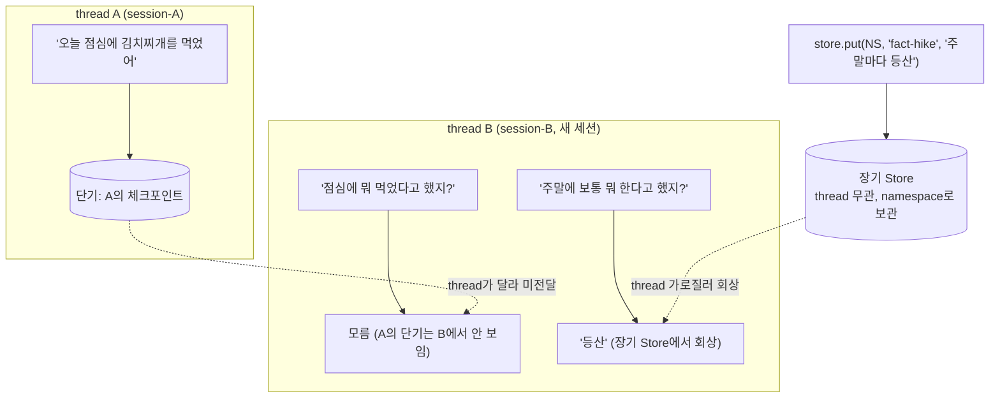

# 08. 교차 세션 회상

`08_cross_session_recall.py` 단독 학습 문서입니다. 이 장의 핵심 점검을 담은 종합 예제입니다.

## 무엇을 하는가

- thread A에 쌓은 단기 대화가 thread B(새 세션)에서 보이지 않음을 확인합니다(단기는 thread별 격리).
- 그래도 Store에 저장한 장기 기억은 thread를 가로질러 회상됨을 확인합니다(교차 세션 회상).
- "단기는 `thread_id`로 대화를 가르고, 장기는 `namespace`로 지식을 가른다"를 몸으로 확인합니다.

## 왜 필요한가

단기와 장기의 차이는 말로 들으면 쉬워 보여도, 실제로 새 세션에서 무엇이 떠오르고 무엇이 사라지는지 보기 전까지는 헷갈립니다. 이 예제는 같은 Agent에 단기·장기를 함께 달고, 새 thread에서 직전 점심 대화(단기)는 모르면서 등산 선호(장기)는 떠올리는 장면을 직접 만들어, 두 메모리의 경계를 또렷이 드러냅니다.

## 설계·구동 원리

- **단기는 thread별로 격리됩니다.** Checkpointer는 `thread_id`별로 대화 상태를 따로 저장합니다. thread A에서 말한 "김치찌개"는 A의 체크포인트에만 있으므로, 새 thread B로 물으면 단기 메모리가 비어 알지 못합니다.
- **장기는 thread를 가로지릅니다.** Store는 `thread_id`와 무관하게 `namespace`로 사실을 보관합니다. 그래서 어느 thread에서 저장하든, 다른 thread에서도 같은 Store를 검색해 회상합니다.
- **같은 store 객체에 직접 저장합니다.** Agent에 장착한 바로 그 `store`에 `put`하면(컴파일 시 넘긴 것과 같은 객체), 이후 어느 thread의 노드든 그 사실을 `search`로 꺼낼 수 있습니다.
- **이 대비가 이 장의 성공 기준입니다.** 새 thread B에서 점심(단기)은 모르고 등산(장기)은 회상하면, 단기와 장기를 저장 단위·회상 방식으로 구분해 종합적으로 이해한 것입니다.

## 구동 흐름 (다이어그램)

새 thread B는 thread A의 단기 대화를 보지 못하지만, thread를 가로지르는 장기 Store의 기억은 회상합니다.



**구동 원리.** 같은 Agent에 단기(checkpointer)와 장기(store)를 함께 달면, 둘은 서로 다른 경계를 가집니다. 단기 메모리는 `thread_id`별로 대화 상태를 따로 저장하므로, thread A에서 말한 점심 메뉴는 A의 체크포인트 안에만 있습니다. thread B는 완전히 새 세션이라 단기 메모리가 비어 있어, "점심에 뭐 먹었지?"라고 물어도 A의 대화를 알지 못합니다. 반면 장기 Store는 `thread_id`와 무관하게 `namespace`로 사실을 보관합니다. Agent에 장착한 바로 그 store 객체에 "주말마다 등산"을 `put`해 두면, 그 사실은 어느 thread에도 묶이지 않고 Store에 영속합니다. 그래서 thread B의 노드가 "주말에 뭐 하지?"를 query로 `store.search`를 부르면, thread 경계를 가로질러 등산 기억을 회상해 답합니다. 직전 점심(단기)은 모르면서 등산 선호(장기)는 떠올리는 이 대비가, 단기와 장기를 가르는 기준 — 저장 단위(대화 상태 전체 대 사실 하나)와 회상 방식(`thread_id` 복원 대 `namespace` 검색) — 을 한 장면에 담습니다. 다만 `InMemorySaver`·`InMemoryStore`는 프로세스 메모리에 저장되어 재시작 시 사라지므로, 운영에서는 `PostgresSaver`·`PostgresStore` 같은 영속 백엔드로 교체합니다.

## 실행법

```bash
uv run python 08_long_memory/08_cross_session_recall.py
```

이 예제는 모델·임베딩 호출을 사용하므로 `OPENAI_API_KEY`가 필요합니다. 키가 없으면 안내만 출력하고 종료합니다.

## 예상 출력

```
[B 단기] 점심에 무엇을 드셨는지에 대한 기록은 없습니다.
[B 장기] 주말마다 등산을 가신다고 하셨습니다.
```

모델 표현은 호출마다 달라질 수 있으나, B에서 점심은 모르고 등산은 회상하는 대비가 핵심입니다.

## 체크포인트

- 새 thread(B)에서 직전 점심 대화를 모르면, 단기 메모리가 thread별 격리임을 이해한 것입니다.
- 그런데도 등산을 회상하면, 단기와 장기 메모리의 차이를 종합적으로 이해한 것입니다.

## 더 해보기

- thread B에서 점심을 물은 뒤, thread A로 돌아가 같은 질문을 던져 A의 단기가 그대로 살아 있는지 확인하십시오.
- 장기에 사실을 여러 건 쌓고 새 thread에서 서로 다른 질문을 던져, 매번 질문에 맞는 기억만 회상되는지 보십시오.
- 운영 이행을 가정해 인메모리 백엔드를 Postgres 기반으로 바꾸면 교차 세션 회상이 재시작 후에도 유지됨을 설계로 그려 보십시오.

## 다음 단계

이 예제로 챕터의 종합 흐름이 끝납니다. 회상 전략의 심화(짧으면 보존·길어지면 요약·넘나들면 검색)와 운영 이행(인메모리 → Postgres)으로 학습을 이어 갈 수 있습니다. 챕터 전체 정리는 `README.md`를 참고하십시오.
